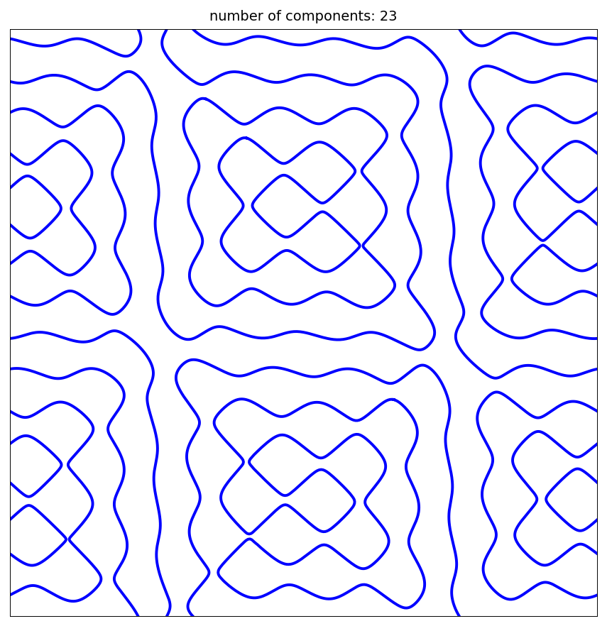
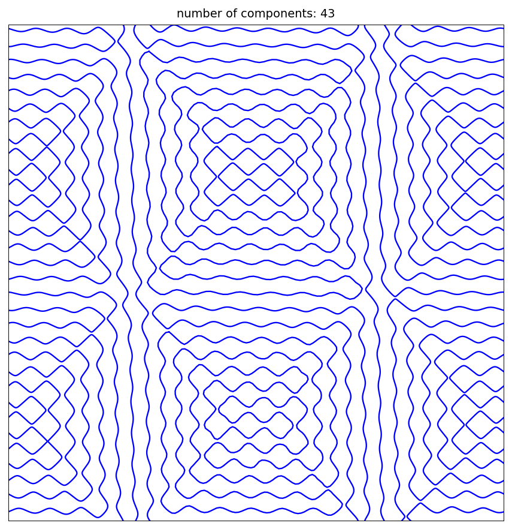
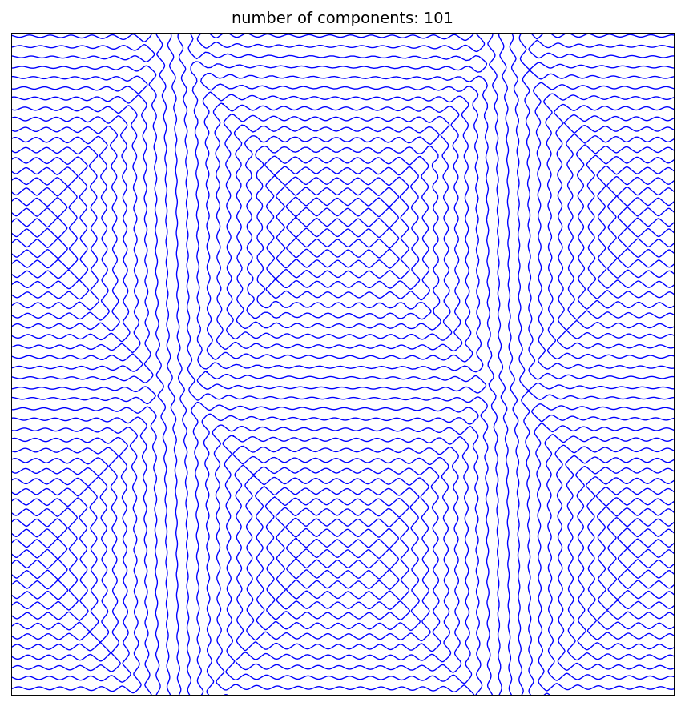

# 2D zero set example of Dmitry Belyaev

[Original MATLAB Chebfun example](https://www.chebfun.org/examples/approx2/Belyaev.html)

(Chebfun example approx2/Belyaev.m — Nick Trefethen, July 2019)

Dmitry Belyaev at Oxford is an expert on zero sets of functions
composed from random plane waves. Here is an example he has looked
at, a random combination of four plane waves at wavenumber $k$
(the coefficients `a` are the exact values of MATLAB's `rng(1)`
stream, dumped from MATLAB R2025b, so these are the same curves as
the published example):



Chebfun2 `roots` picks out the distinct components of the zero set
in the unit square — 23 components, exactly as published:

```text
ans =
   Inf    23
```

The arc lengths of the pieces, sorted from smallest to largest:

```text
ans =
   0.461891608559964
   0.469593883449476
   0.471345069143548
   0.485442713230438
   0.491247964279055
   0.512513541254509
   0.533473811745962
   0.716366950181700
   1.049330158811736
   1.050713240790831
   1.081859272762564
   1.270740175884729
   1.337881083689508
   1.425147569397931
   1.534588679412661
   1.541985307665604
   1.792378844537622
   2.446479402028281
   2.471983551311798
   2.734862188275452
   2.872347702439097
   4.280542454342990
   5.347242442702585
```

Several components agree with MATLAB's published lengths to 12–15
digits (e.g. `0.512513541254509`, `1.270740175884…`,
`4.28054245…`) and the rest to 3–6 digits — as the original notes,
"computations with `roots` in Chebfun2 are delicate, and the number
of components does not always come out right, nor are the curves
always accurate. Here we seem to be doing well." The component count
is right at every wavenumber. With $k = 16$:



And with $k = 32$:



Total time for this example (MATLAB published 13.5 s; our
marching-squares + Newton `roots` is slower):

```text
Elapsed time is 278.528859 seconds.
```

---

*Replica script: [`examples/approx2/belyaev_replica.py`](https://github.com/ma-gilles/chebfunjax/blob/main/examples/approx2/belyaev_replica.py).
Original example copyright by The University of Oxford and The Chebfun
Developers.*
