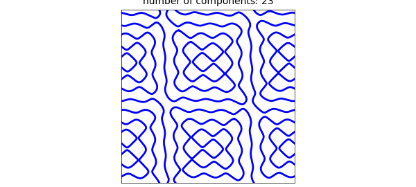
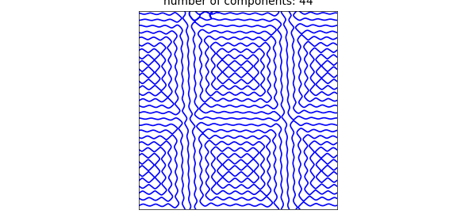
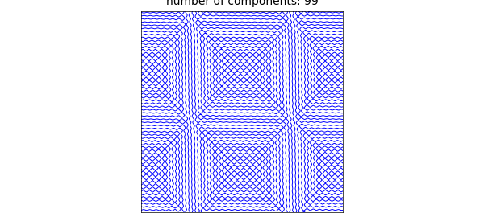

# 2D zero set example of Dmitry Belyaev

*Nick Trefethen, July 2019*

[Original MATLAB Chebfun example](https://www.chebfun.org/examples/approx2/Belyaev.html)

Python translation: [`examples/approx2/belyaev.py`](https://github.com/ma-gilles/chebfunjax/blob/main/examples/approx2/belyaev.py)

Dmitry Belyaev at Oxford is an expert on zero sets of functions composed form random plane waves and related problems. Here is an example he has looked at:

```matlab
tic
LW = 'linewidth'; XT = 'xtick'; YT = 'ytick';
rng(1); a = randn(1,4) + 1i*rand(1,4);
cheb.xy
wave = @(k) real(a(1)*exp(i*pi*(k*x-y)) + a(2)*exp(i*pi*(k*x+y)) ...
               + a(3)*exp(i*pi*(k*y-x)) + a(4)*exp(i*pi*(k*y+x)));
r = roots(wave(8));
plot(r, LW, 2)
axis([-1 1 -1 1]), axis square, set(gca,XT,[],YT,[])
title(['number of components: ' int2str(size(r,2))])
```



The Chebfun2 `roots` command has picked out the distinct components of the zero set in the unit square: the result is a quasimatrix with 23 columns:

```matlab
size(r)
```

```text
ans =
   Inf    23
```

Here are the arc lengths of the pieces, sorted from smallest to largest:

```matlab
arclength = @(f) norm(diff(f),1);
np = size(r,2);
al = zeros(np,1);
for k = 1:np
    al(k) = arclength(r(:,k));
end
sort(al)
```

```text
ans =
   0.461891608472885
   0.469593883449591
   0.471345069143686
   0.485442708633263
   0.491248060966380
   0.512513541254509
   0.533473811745962
   0.716366951641634
   1.049330158810603
   1.050713240790847
   1.081859275490485
   1.270740175884728
   1.337880567109839
   1.425147569397931
   1.534588679412662
   1.541985307665603
   1.792378844180071
   2.446479402028011
   2.472063991969861
   2.734862188171634
   2.872468147080940
   4.280542705507592
   5.347712926548818
```

Computations with `roots` in Chebfun2 are delicate, and the number of components does not always come out right, nor are the curves always accurate. Here we seem to be doing well, though. We repeat the computation with $k=16$:

```matlab
r = roots(wave(16));
plot(r, LW, 1.2)
axis([-1 1 -1 1]), axis square, set(gca,XT,[],YT,[])
title(['number of components: ' int2str(size(r,2))])
```



And with $k=32$:

```matlab
r = roots(wave(32));
plot(r, LW, .7)
axis([-1 1 -1 1]), axis square, set(gca,XT,[],YT,[])
title(['number of components: ' int2str(size(r,2))])
```



Total time for this example:

```matlab
toc
```

```text
Elapsed time is 145.436624 seconds.
```

---

*Translated with [chebfunjax](https://github.com/ma-gilles/chebfunjax); prose and MATLAB code from the original example, copyright The University of Oxford and The Chebfun Developers.  Printed outputs and figures are chebfunjax's.*
