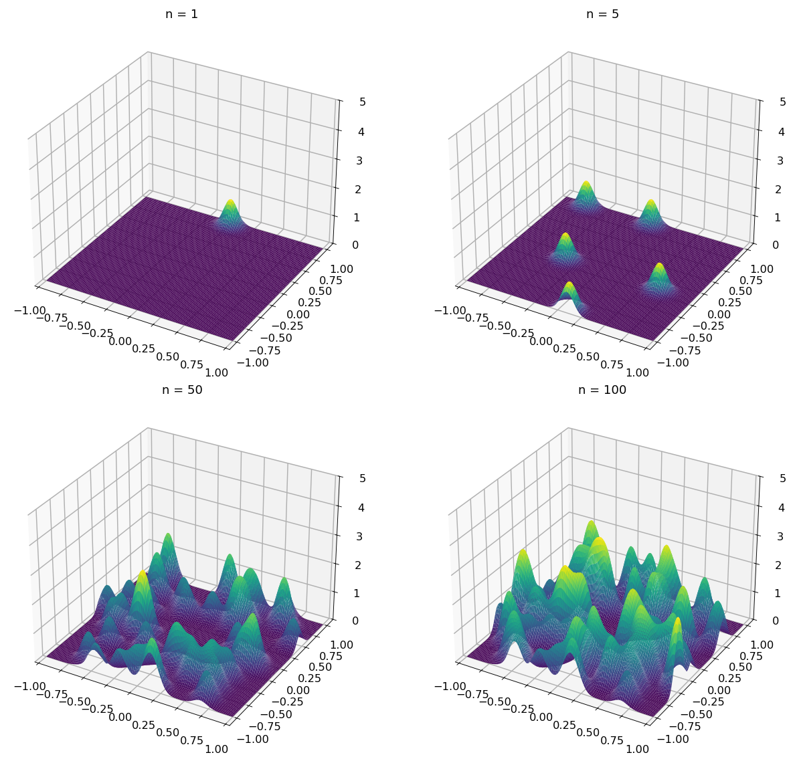
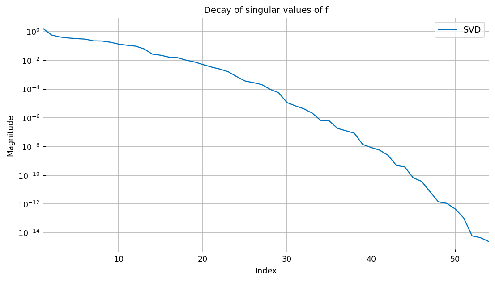
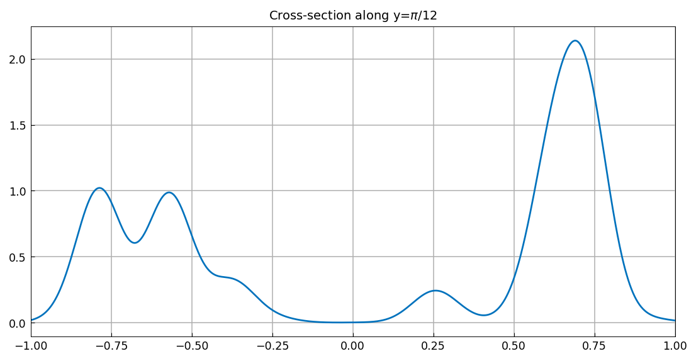
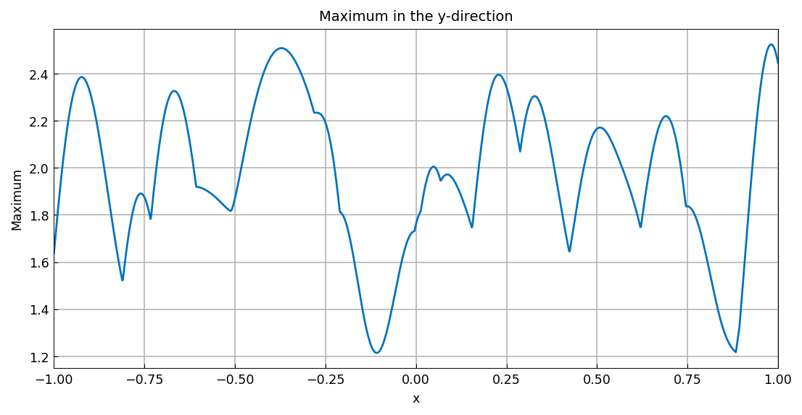

# The low-rank structure of a sum of bump functions

[Original MATLAB Chebfun example](https://www.chebfun.org/examples/approx2/BumpFunction.html)

(Chebfun example approx2/BumpFunction.m)

A sum of 100 Gaussian bumps
$\sum_j e^{-\gamma((x-x_j)^2 + (y-y_j)^2)}$ with random centers
$(x_j, y_j)$ in $[-1,1]^2$ and $\gamma = 100$ has numerical rank far
below 100 — the example's point about low-rank structure in smooth
2D functions. (Bump centers use a seeded numpy stream; MATLAB's
`rng(1)` values are not reproducible outside MATLAB, and the rank
and decay behavior are the sample-robust content.)

Growth of the sum at $n = 1, 5, 50, 100$ bumps:



The rank of the 100-bump function (MATLAB publishes 56 for its
sample; the value is sample-dependent):

```text
Rank of function is 54
```

The singular values decay geometrically:



A cross-section along $y = \pi/12$ and the maximum in the
$y$-direction:




The global maximum of our sample:

```text
max2: 2.524604 at (0.9809, -0.4756)
```

---

*Replica script: [`examples/approx2/bumpfunction_replica.py`](https://github.com/ma-gilles/chebfunjax/blob/main/examples/approx2/bumpfunction_replica.py).
Original example copyright by The University of Oxford and The Chebfun
Developers.*
