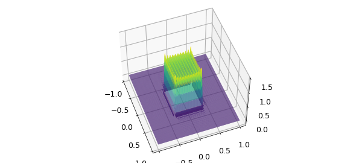
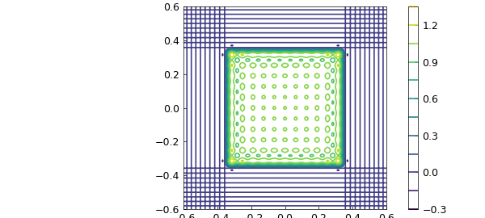
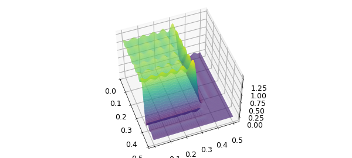
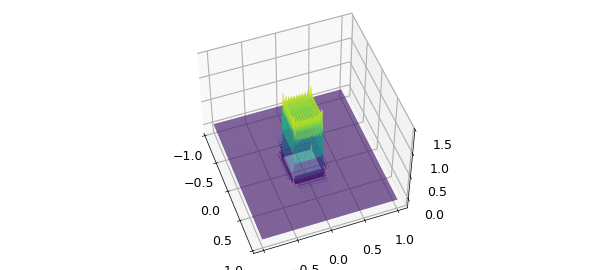
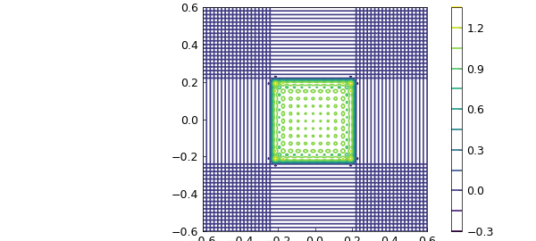
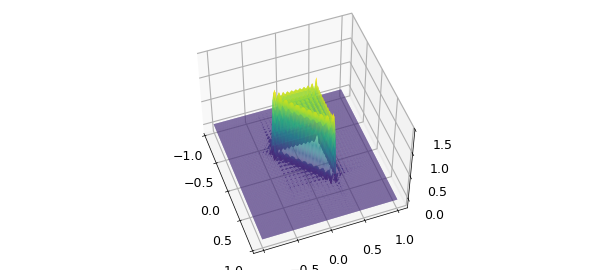
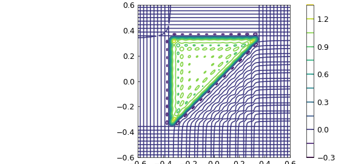
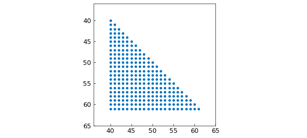

# The Gibbs phenomenon in 2D

*Andre Uschmajew and Nick Trefethen, February 2017*

[Original MATLAB Chebfun example](https://www.chebfun.org/examples/approx2/Gibbs2D.html)

Python translation: [`examples/approx2/gibbs2d.py`](https://github.com/ma-gilles/chebfunjax/blob/main/examples/approx2/gibbs2d.py)

## 1. Chebyshev 2D Gibbs effect

Here is an illustration of the Gibbs phenomenon in 2D:

```matlab
A = zeros(100); A(40:61,40:61) = 1;
p = chebfun2(A); plot(p)
zlim([-.2 1.5]), view(-20,50), camlight left, camlight left
```



A contour plot may also be interesting:

```matlab
contour(p), axis([-.6 .6 -.6 .6]), axis square, colorbar
```



What's going on is that Chebfun has constructed a bivariate polynomial interpolant $p(x,y)$ to data at $100^2$ 2D Chebshev points, zero on most of the domain and 1 on a square in the middle.

How big is the overshoot?

```matlab
max2(p)
```

```text
ans =
   1.320316254042389
```

This is big! -- about twice what we are used to with a 1D Gibbs effect:

```matlab
a = zeros(100,1); a(40:61) = 1;
p1 = chebfun(a); max(p1)
```

```text
ans =
   1.149050152970874
```

(In the limit of an infinite grid this would converge to $1.14114\dots;$ see equation (9.1) of [1].) The reason is that the overshoot at the corner is especially large, as we can see by zooming in:

```matlab
pzoom = p{0,.5,0,.5}; plot(pzoom)
zlim([-.2 1.5]), view(-20,50), camlight left
```



Intuitively, we can think of the overshoot at the corner as being composed of one overshoot coming from the discontinuity in $x$ plus another coming from the discontinuity in $y$. The undershoot, by contrast, is of a more usual size:

```matlab
min2(p)
```

```text
ans =
  -0.153785123606236
```

## 2. Fourier 2D Gibbs effect

A Fourier analogue can be produced by including the 'periodic' flag:

```matlab
t = chebfun2(A,'periodic'); plot(t)
zlim([-.2 1.5]), view(-20,50), camlight, camlight, snapnow
contour(t), axis([-.6 .6 -.6 .6]), axis square, colorbar
```





The extrema are similar:

```matlab
max2(t), min2(t)
```

```text
ans =
   1.316297664943336
```

## 3. A triangular island

For fun we can change from a square to a triangle:

```matlab
A2 = tril(A);
p2 = chebfun2(A2); plot(p2{-.5,.5,-.5,.5})
zlim([-.2 1.5]), view(-20,50), camlight left
max2(p2), min2(p2), snapnow
contour(p2), axis([-.6 .6 -.6 .6]), axis square, colorbar
```

```text
ans =
  -0.155566549488913
```





## 4. Low rank?

Our first two examples, being perfectly aligned with the axes, have rank 1:

```matlab
length(p)
length(t)
```

```text
ans =
   1.294875501773878
```

The triangle example, because of is diagonal edge, has a bigger rank:

```matlab
length(p2)
```

```text
ans =
  -0.228957699300768
```

Usually in Chebfun2, the rank one observes is a numerical rank due to approximation to 6 digits, but in this case of a chebfun2 constructed by interpolation of discrete data, the rank is identical to that of the underlying matrix:

```matlab
rank(A2)
```

```text
ans =
     1
ans =
     22
ans =
    22
```

This rank is determined simply by the sparsity structure, which shows a $22\times 22$ triangle.

```matlab
spy(A2), axis([36 65 36 65])
```



## 5. Reference

1. L. N. Trefethen, *Approximation Theory and Approximation Practice*, SIAM, 2013.

---

*Translated with [chebfunjax](https://github.com/ma-gilles/chebfunjax); prose and MATLAB code from the original example, copyright The University of Oxford and The Chebfun Developers.  Printed outputs and figures are chebfunjax's.*
