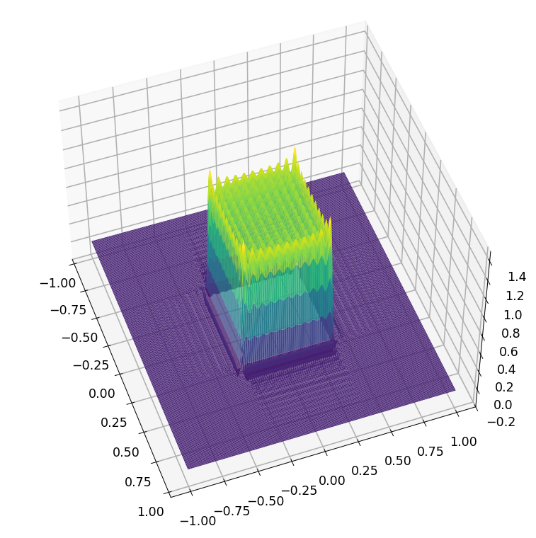
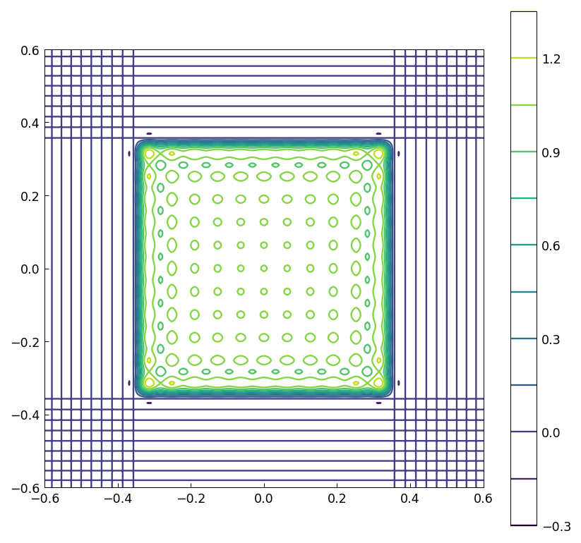
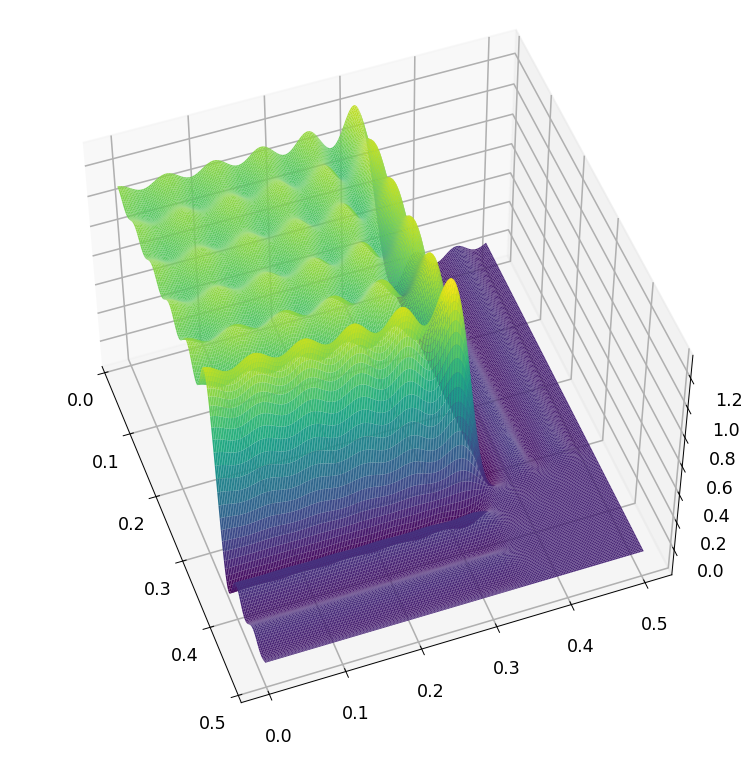
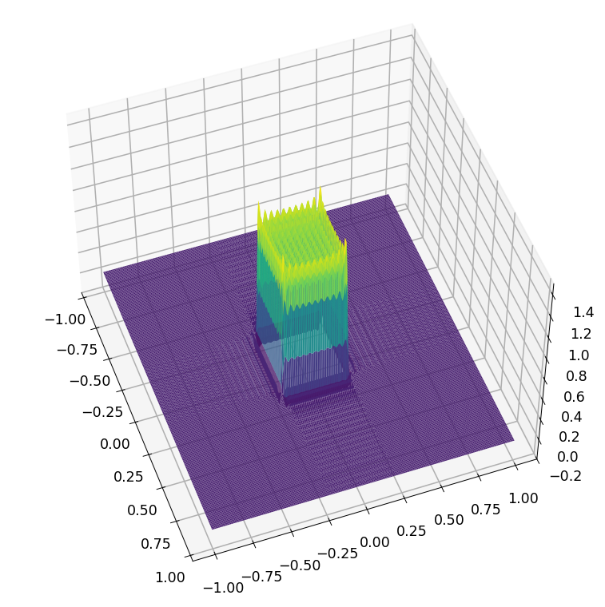
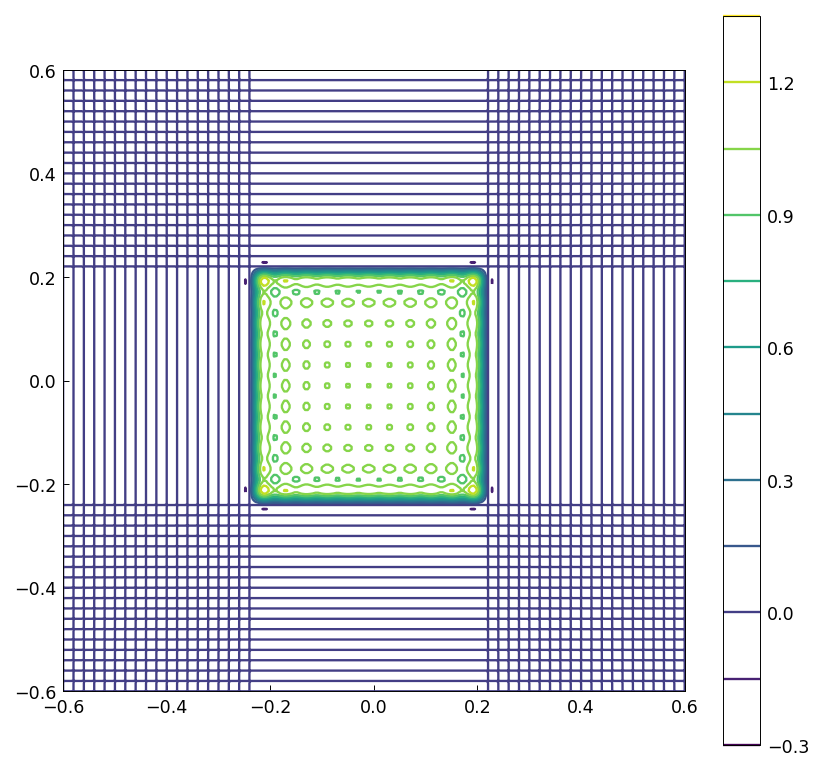
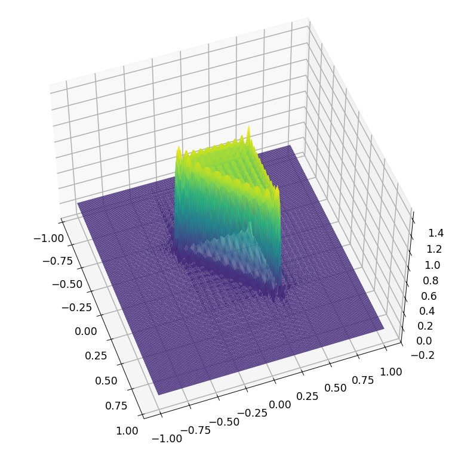
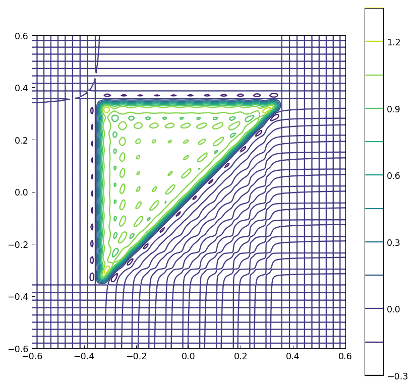

# Gibbs phenomenon in 2D

[Original MATLAB Chebfun example](https://www.chebfun.org/examples/approx2/Gibbs2D.html)

(Chebfun example approx2/Gibbs2D.m)

A 100×100 matrix `A` that is 1 on a centered square block and 0
elsewhere, interpolated as a bivariate polynomial through the values
at the 2nd-kind Chebyshev tensor grid (`chebfun2(A)`), exhibits the
two-dimensional Gibbs phenomenon:




The maximum overshoot (published value `1.320316254042390`):

```text
ans =
   1.320316254042389
```

This is close to the square of the 1D Gibbs maximum: the 1D
interpolant through the corresponding vector data has maximum
(published `1.149050152970874` — ours agrees to all digits):

```text
ans =
   1.149050152970874
```

Zooming near a corner of the block:



The undershoot (published `-0.153785123606236`):

```text
ans =
  -0.153785123606236
```

## Periodic interpolation

Interpreting the same data as values on a uniform 2D grid and
interpolating by a bivariate trigonometric polynomial
(`chebfun2(A,'periodic')`) gives a slightly different overshoot and
undershoot (published `1.316297664943330` and `-0.155566549488912`):




```text
ans =
   1.316297664943336
ans =
  -0.155566549488913
```

## A triangular block

With the lower-triangular part `A2 = tril(A)`, the diagonal edge is
not axis-aligned, and the Chebyshev interpolant overshoots more
(published `1.294875501773784` and `-0.228957699300502`):




```text
ans =
   1.294875501773878
ans =
  -0.228957699300768
```

The square-block interpolant has rank 1 (its data matrix is an outer
product of 1D indicators), while the triangular block is full rank:

```text
ans =
     1
ans =
     22
ans =
    22
```

(`rank(p) = 1`, `rank(p2) = 22`, `rank(A2) = 22`, matching MATLAB's
`length(p) = 1`, `length(p2) = 22`, `rank(A2) = 22`.)

---

*Replica script: [`examples/approx2/gibbs2d_replica.py`](https://github.com/ma-gilles/chebfunjax/blob/main/examples/approx2/gibbs2d_replica.py).
Original example copyright by The University of Oxford and The Chebfun
Developers.*
