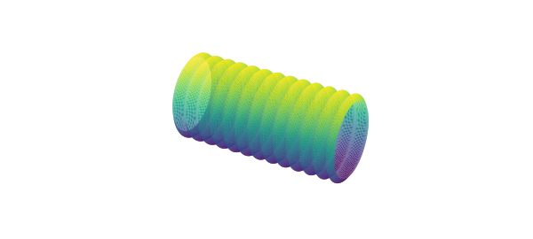
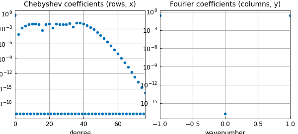
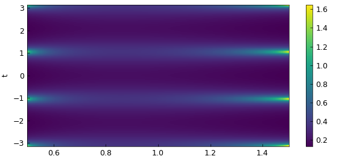
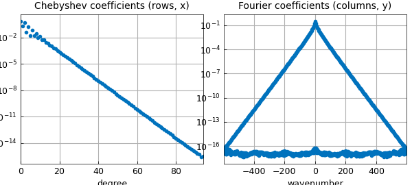

# Combining Chebyshev and trigonometric

*Nick Trefehen, November 2019*

[Original MATLAB Chebfun example](https://www.chebfun.org/examples/approx2/Hosepipe.html)

Python translation: [`examples/approx2/hosepipe.py`](https://github.com/ma-gilles/chebfunjax/blob/main/examples/approx2/hosepipe.py)

## 1. Hosepipe

Here is a surface you might find on your vacuum cleaner or under the hood of your car:

```matlab
r = chebfun(@(x) .5+.04*cos(40*x));
F = chebfun2(@(x,phi) 2*x, 'trigy');
G = chebfun2(@(x,phi) r(x).*cos(pi*phi), 'trigy');
H = chebfun2(@(x,phi) r(x).*sin(pi*phi), 'trigy');
surf(F,G,H), axis equal off, camlight
```



Viewed as a surface, we see that this is periodic in the $\phi$ direction and nonperiodic in the $x$ direction. What's interesting is that its representation as a trio of chebfun2 objects shares this property: each of them is nonperiodic in the first variable and periodic in the second, because the flag `'trigy'` has been specified.

Until recently, a chebfun2 representation had to be Chebyshev in both variables or, if `'trig'` was specified, trigonometric in both directions. The ability to mix the two with `'trigx'` or `'trigy'` is new. Here we see some details of the three chebfun2 objects:

```matlab
F, G, H
```

```text
F =
   chebfun2 object  (trig in y)
       domain                 rank       corner values
[  -1,   1] x [  -1,   1]        1     [  -2    2   -2    2]
vertical scale =   2
G =
   chebfun2 object  (trig in y)
       domain                 rank       corner values
[  -1,   1] x [  -1,   1]        1     [-0.47 -0.47 -0.47 -0.47]
vertical scale = 0.54
H =
   chebfun2 object  (trig in y)
       domain                 rank       corner values
[  -1,   1] x [  -1,   1]        1     [-8.1e-17 -8.1e-17 3.5e-17 3.5e-17]
vertical scale = 0.5
```

The `F` chebfun2 is trivial, but `G` is interesting. The command `plotcoeffs` shows how it mixes different representations in the two directions. The `H` chebfun2 looks much the same.

```matlab
plotcoeffs(G)
```



One reason for representing a periodic function periodically is that it is somewhat more efficient. More important in practice is that its derivatives may retain their smoothness and accuracy at the wraparound point.

## 2. Annulus

The hosepipe example is relatively complicated. A simpler illustration of the Cheb/trig combination is the discretization of a function defined in an annulus: periodic in the angular direction, nonperiodic in the radial direction. For example, the analytic function $f(z) = (1+4/z^3)^{-1} (z^3+0.1)^{-1}$ has three poles outside the unit disk and three inside. For $1/2 \le |z| \le 3/2$ it is analytic, however, so its abolute value $F(r,t) = |f(re^{i t})|$ is smooth:

```matlab
f = @(z) (1+4./z.^3).^-1.*(z.^3+.1).^-1;
F = @(r,t) abs(f(r.*exp(1i*t)));
```

Here we make a cheb/trig chebfun2 of $F$:

```matlab
Fc = chebfun2(@(r,t) F(r,t),[.5 1.5 -pi pi],'trigy');
```

```matlab
clf, plot(Fc), colorbar
xlabel r, ylabel t
```



(I am not sure if Chebfun offers an elegant way to plot this in an annulus.) Here are the Chebyshev and Fourier expansion coefficients:

```matlab
plotcoeffs(Fc)
```



---

*Translated with [chebfunjax](https://github.com/ma-gilles/chebfunjax); prose and MATLAB code from the original example, copyright The University of Oxford and The Chebfun Developers.  Printed outputs and figures are chebfunjax's.*
