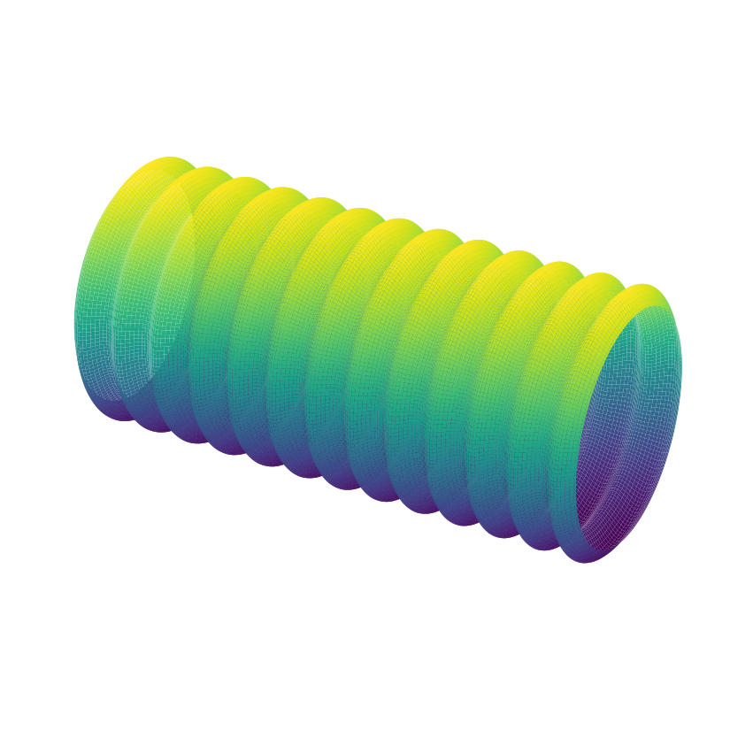
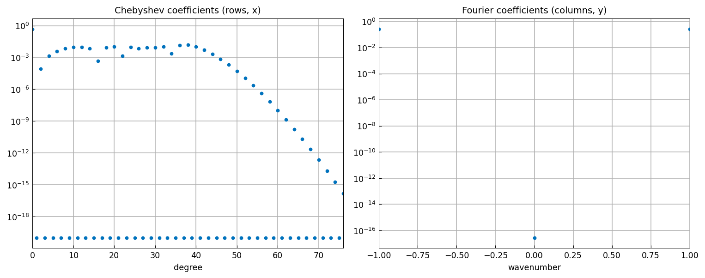
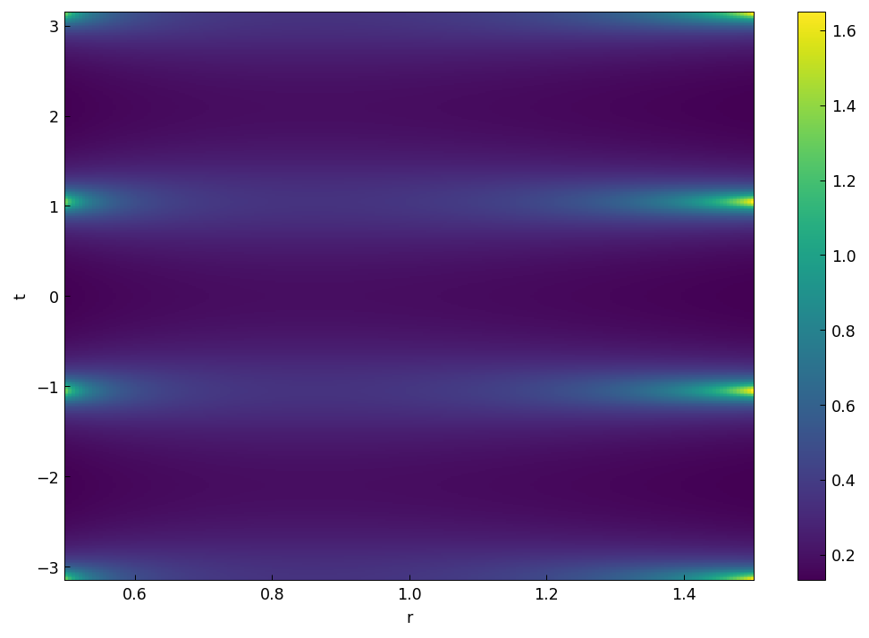
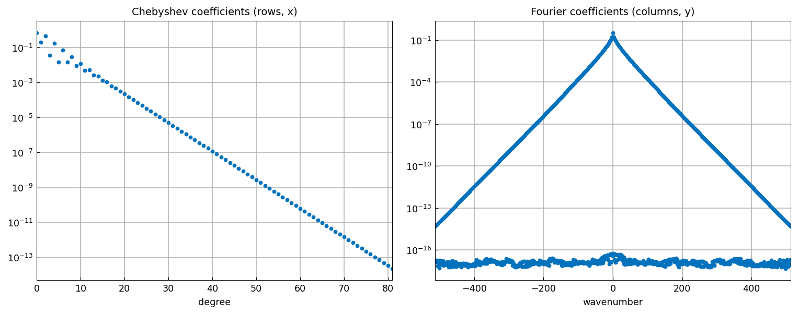

# Combining Chebyshev and trigonometric

[Original MATLAB Chebfun example](https://www.chebfun.org/examples/approx2/Hosepipe.html)

(Chebfun example approx2/Hosepipe.m — Nick Trefethen, November 2019)

## Hosepipe

Here is a surface you might find on your vacuum cleaner or under the
hood of your car — a corrugated tube parametrized by three chebfun2
objects, each nonperiodic in $x$ and periodic in $\phi$ via the
`'trigy'` flag (`trigy=True` in chebfunjax):



The details of the three chebfun2 objects (MATLAB publishes vertical
scales 2, 0.54, 0.53; the H scale prints 0.54 here from the plot-grid
sampling of the identical function):

```text
F =
   chebfun2 object  (trig in y)
       domain                 rank       corner values
[  -1,   1] x [  -1,   1]        1     [-2 2 -2 2]
vertical scale = 2
G =
   chebfun2 object  (trig in y)
       domain                 rank       corner values
[  -1,   1] x [  -1,   1]        1     [-0.47 -0.47 -0.47 -0.47]
vertical scale = 0.54
H =
   chebfun2 object  (trig in y)
       domain                 rank       corner values
[  -1,   1] x [  -1,   1]        1     [-4.8e-17 -4.8e-17 6.8e-17 6.8e-17]
vertical scale = 0.54
```

`plotcoeffs(G)` shows how the representation mixes Chebyshev
coefficients in $x$ (the corrugation `.5+.04*cos(40x)` needs ~77 of
them) with just 3 Fourier modes in $\phi$:



## Annulus

A simpler illustration of the Cheb/trig combination: the analytic
function $f(z) = (1+4/z^3)^{-1}(z^3+0.1)^{-1}$ has three poles
outside the unit disk and three inside, but is analytic in the
annulus $1/2 \le |z| \le 3/2$, so $F(r,t) = |f(re^{it})|$ is smooth —
periodic in $t$, nonperiodic in $r$:

```text
Fc rank: 19 length: (82, 1027)
```

(MATLAB builds the same object with lengths 104 and 1189 — the poles
just outside the annulus force ~1000 Fourier modes in both systems.)



The Chebyshev and Fourier expansion coefficients:



---

*Replica script: [`examples/approx2/hosepipe_replica.py`](https://github.com/ma-gilles/chebfunjax/blob/main/examples/approx2/hosepipe_replica.py).
Original example copyright by The University of Oxford and The Chebfun
Developers.*
