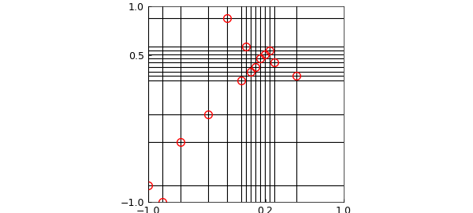
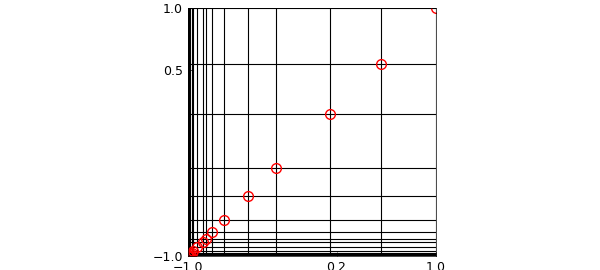

# Low-rank approximation and localized singularities

*Nick Trefethen, April 2016*

[Original MATLAB Chebfun example](https://www.chebfun.org/examples/approx2/Localization.html)

Python translation: [`examples/approx2/localization.py`](https://github.com/ma-gilles/chebfunjax/blob/main/examples/approx2/localization.py)

## 1. Introduction

This example is a companion to "Low-rank approximation and alignment with axes" [3]. Here, we look at another property of a function that the low-rank algorithms of Chebfun2 and Chebfun3 can take advantage of: localized singularities or near-singularities. Again the presentation follows the discussion of [2].

## 2. Complex singularity near the middle of the domain

For example, here is a bivariate Runge function with a broad spike, which we approximate to about ten digits. The rank is a bit smaller than the length, so we are getting some data compression.

```matlab
ep = 1e-10;
f = chebfun2(@(x,y) 1./(1+(x-.2).^2+(y-.5).^2),'eps',ep);
r = rank(f), [m,n] = length(f)
```

```text
r =
     7
m =
    28
n =
    27
```

If we change $1$ to $0.001$ in the denominator, the spike becomes much more localized. Now there is a dramatic difference between the rank and the length, showing excellent compression.

```matlab
f = chebfun2(@(x,y) 1./(0.001+(x-.2).^2+(y-.5).^2),'eps',ep);
r = rank(f), [m,n] = length(f)
```

```text
r =
    14
m =
   666
n =
   640
```

Let's make a plot. Each red circle shows a pivot value chosen by Chebfun2's approximation to Gaussian elimination with complete pivoting, in which at each step, a rank-1 cross is subtracted corresponding to the largest function value still remaining. For a full explanation, see [1].

```matlab
p = f.pivotValues; a = f.pivotLocations;
x = a(:,1); y = a(:,2); n = length(p)
x = x(1:n); y = y(1:n);
for j = 1:n
  plot([-1 1],y(j)*[1 1],'-k'), hold on
  plot(x(j)*[1 1],[-1 1],'-k')
end
plot(x,y,'or')
set(gca,'xtick',[-1 0.2 1],'ytick',[-1 0.5 1])
axis([-1 1 -1 1]), axis square, hold off
```

```text
n =
    14
```



## 3. Real singularity outside a corner of the domain

Here is another example. This time, the singularity is located outside the domain, near one corner. When the singularity is not very close to the corner, there is not much compression:

```matlab
g = chebfun2(@(x,y) 1./((x+1.2).^2 + (y+1.2).^2),'eps',ep);
r = rank(g), [m,n] = length(g)
```

```text
r =
    14
m =
    34
n =
    34
```

Changing 1.2 to 1.02 makes the compression striking:

```matlab
g = chebfun2(@(x,y) 1./((x+1.02).^2 + (y+1.02).^2),'eps',ep);
r = rank(g), [m,n] = length(g)
```

```text
r =
    17
m =
   112
n =
   112
```

Here is the analogous picture:

```matlab
p = g.pivotValues; a = g.pivotLocations;
x = a(:,1); y = a(:,2); n = length(p)
x = x(1:n); y = y(1:n);
for j = 1:n
  plot([-1 1],y(j)*[1 1],'-k'), hold on
  plot(x(j)*[1 1],[-1 1],'-k')
end
plot(x,y,'or')
set(gca,'xtick',[-1 0.2 1],'ytick',[-1 0.5 1])
axis([-1 1 -1 1]), axis square, hold off
```

```text
n =
    17
```



## References

1. A. Townsend and L. N. Trefethen, An extension of Chebfun to two dimensions, *SIAM Journal on Scientific Computing*, 35 (2013), C495-C518.
2. L. N. Trefethen, Cubature, approximation, and isotropy in the hypercube, manuscript, March 2016.
3. L. N. Trefethen, Low-rank approximation and alignment with axes, Chebfun example, [http://www.chebfun.org/examples/approx2/Alignment.html](Alignment.md).

---

*Translated with [chebfunjax](https://github.com/ma-gilles/chebfunjax); prose and MATLAB code from the original example, copyright The University of Oxford and The Chebfun Developers.  Printed outputs and figures are chebfunjax's.*
