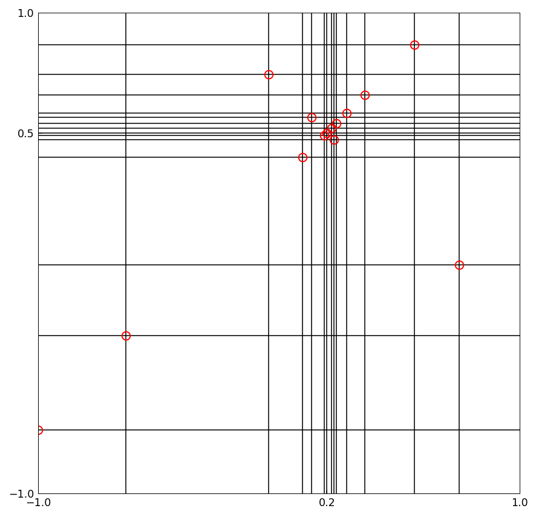
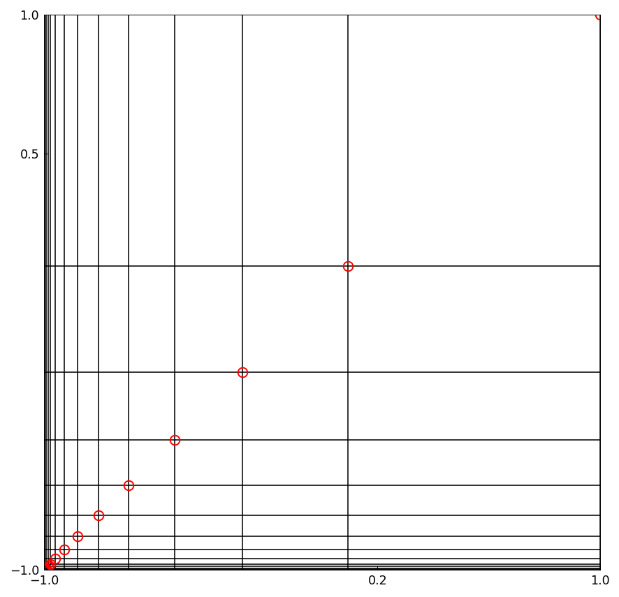

# Low-rank approximation and localized singularities

[Original MATLAB Chebfun example](https://www.chebfun.org/examples/approx2/Localization.html)

(Chebfun example approx2/Localization.m — Nick Trefethen, April 2016)

A companion to [Low-rank approximation and alignment with
axes](Alignment.md): Chebfun2's low-rank algorithms can also take
advantage of localized (near-)singularities.

## Complex singularity near the middle of the domain

A bivariate Runge function with a broad spike, approximated with
`eps = 1e-10`, gets modest data compression (MATLAB publishes
`r = 7`, `m = 28`, `n = 27`):

```text
r =
    7
m =
    33
n =
    27
```

Changing $1$ to $0.001$ in the denominator makes the spike much more
localized, and the difference between rank and length becomes
dramatic (MATLAB: `r = 14`, `m = 666`, `n = 640`; the lengths differ
because the slice chop at `eps` $=10^{-10}$ is not bit-identical,
but the compression ratio is the same story):

```text
r =
    14
m =
    540
n =
    478
```

Each red circle shows a pivot chosen by Chebfun2's Gaussian
elimination with complete pivoting — 14 pivots, exactly as
published, clustered around the spike at $(0.2, 0.5)$:

```text
n =
    14
```



## Real singularity outside a corner of the domain

With a singularity outside the domain near the corner $(-1,-1)$ but
not very close, there is not much compression (MATLAB: `r = 14`,
`m = n = 34`):

```text
r =
    14
m =
    32
n =
    32
```

Changing 1.2 to 1.02 makes the compression striking (MATLAB
publishes `r = 17`, `m = n = 103`; our constructor resolves it with
`r = 14`, `m = n = 79` at the same tolerance — the last few pivots
at $10^{-10}$ are chop-sensitive, and the compression is equally
striking):

```text
r =
    14
m =
    79
n =
    79
n =
    14
```



## References

1. A. Townsend and L. N. Trefethen, An extension of Chebfun to two
   dimensions, _SIAM Journal on Scientific Computing_, 35 (2013),
   C495-C518.

2. L. N. Trefethen, Cubature, approximation, and isotropy in the
   hypercube, manuscript, March 2016.

3. L. N. Trefethen, Low-rank approximation and alignment with axes,
   Chebfun example, 2016.

---

*Replica script: [`examples/approx2/localization_replica.py`](https://github.com/ma-gilles/chebfunjax/blob/main/examples/approx2/localization_replica.py).
Original example copyright by The University of Oxford and The Chebfun
Developers.*
