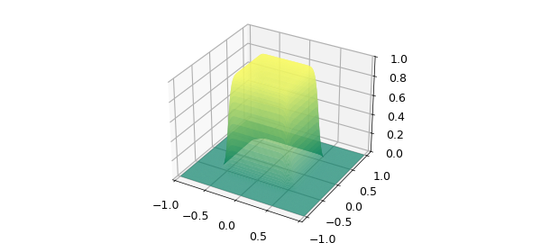
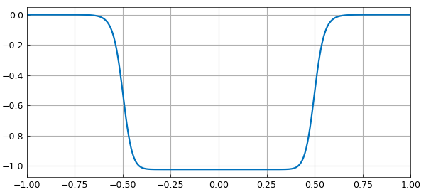
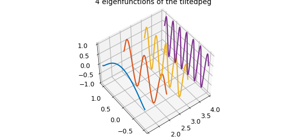
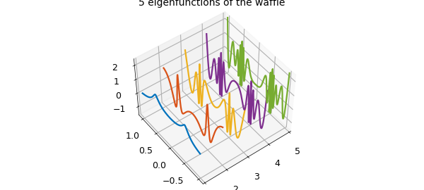
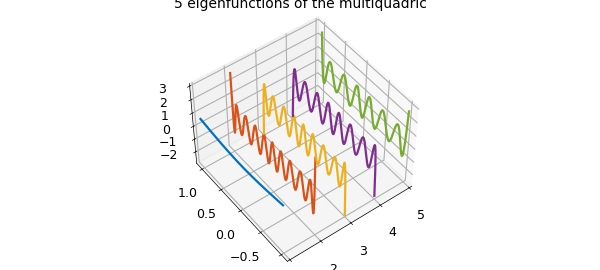

# Maximum trace problems

*Behnam Hashemi, August 2016*

[Original MATLAB Chebfun example](https://www.chebfun.org/examples/approx2/MaxTrace.html)

Python translation: [`examples/approx2/maxtrace.py`](https://github.com/ma-gilles/chebfunjax/blob/main/examples/approx2/maxtrace.py)

```matlab
function MaxTrace()
```

## 1. Introduction

Suppose $f(x,y)$ is a symmetric function of two variables defined on a square $[a, b] \times [a, b]$. We consider the problem of maximizing $$ trace(G^T \kern -2pt f \kern 1pt G) ,\ \ \ \ \ (1) $$ over all $\infty \times k$ quasimatrices $G$ defined on $[a, b]$ with orthonormal columns, i.e., $$ G^T \kern -1pt G = I_k, $$ where $I_k$ is the $k \times k$ identity matrix.

We can solve this problem via the spectral decomposition $$ f(x,y) = \sum_{i=1}^{\infty} \lambda_i \, q_i(x)\,q_i(y), $$ where $\lambda_1 \geq \lambda_2 \geq \dots$ are eigenvalues and $q_1, q_2, \dots$ are orthonormal eigenfunctions of $f$ when viewed as a the kernel of an integral operator. A solution to the maximum trace problem consists of the eigenfunctions corresponding to the $k$ largest eigenvalues of $f$, $$ G(x) = [~q_1(x)\ | \ q_2(x) \ | \ \cdots \ | \ q_k(x)~]. $$ This is a continuous analogue of the maximum trace problem for symmetric matrices [1], which can be solved via the Courant-Fischer eigenvalue characterization [3].

For illustration, we look at four symmetric bivariate functions in Chebfun. The function `U = ev(f, k)` in the following computes eigenvectors corresponding to the first $k$ (algebraically) largest eigenvalues of the symmetric chebfun2 object `f`. In order to compute the spectral decomposition of a symmetric function with a finite numerical rank, we apply the trick used in [2].

## 2. Example: square peg

This is the approximate characteristic function of a square.

```matlab
f = cheb.gallery2('squarepeg')
```

```text
f =
   chebfun2 object
       domain                 rank       corner values
[  -1,   1] x [  -1,   1]        1     [9.1e-13 9.1e-13 9.1e-13 9.1e-13]
vertical scale =   1
```

Since $f$ is a symmetric rank 1 function, it only makes sense to solve (1) for $k = 1$. We plot the 2D function $f$

```matlab
k = 1;
U = ev(f, k);
plot(f), colormap(summer), zlim([0 1])
```



We also plot the 1D function $U$ which solves (1).

```matlab
plot(U)
```



## 3. Example: tilted peg

Next, we try a tilted variant of the square peg with rank 100. This is like the function `cheb.gallery2('tiltedpeg')`, except with the tilting angle modified to make $f$ symmetric. We solve (1) for $k = 4$ and plot the four columns of our solution.

```matlab
ff = @(x,y)1./((1+(x+y).^20).*(1+(y-x).^20))
f = chebfun2(ff);
k = 4;
U = ev(f, k);
clf, plot(U)

x = chebfun('x'); one = 1 + 0*x;
for j = 1:k
    plot3(j*one, x, U(:,j),'linewidth',1.6), hold on
end
title('4 eigenfunctions of the tiltedpeg'), axis tight
view([-43 48]), hold off, box on
```

```text
ff =
    @(x,y)1./((1+(x+y).^20).*(1+(y-x).^20))
```



## 4. Example: waffle

This is another symmetric function. It has horizontal and vertical ridges and we solve (1) for $k = 5$.

```matlab
[f, ff] = cheb.gallery2('waffle')
k = 5;
U = ev(f, k);
for j = 1:k
    plot3(j*one, x, U(:,j),'linewidth',1.6), hold on
end
title('5 eigenfunctions of the waffle'), axis tight
view([-37 59]), hold off, box on
```

```text
f =
   chebfun2 object
       domain                 rank       corner values
[  -1,   1] x [  -1,   1]       29     [0.0032 0.0032 0.0032 0.0032]
vertical scale =   1
ff =
    @(x,y)1./(1+1e3*((x.^2-.25).^2.*(y.^2-.25).^2))
```



## 5. Example: multiquadric

Our last test case is a multiquadric kernel for $k = 5$.

```matlab
c = 0.6;
mq = @(x,y) sqrt((x.^2+y.^2) + c^2);
f = chebfun2(mq)
k = 5;
U = ev(f, k);
for j = 1:k
    plot3(j*one, x, U(:,j),'linewidth',1.6), hold on
end
title('5 eigenfunctions of the multiquadric'), axis tight
view([-37 59]), hold off, box on
```

```text
f =
   chebfun2 object
       domain                 rank       corner values
[  -1,   1] x [  -1,   1]       11     [ 1.5  1.5  1.5  1.5]
vertical scale = 1.5
```



Let's compare the optimal solution to (1) for our multiquadric with the value of the objective function for another orthonormal quasimatrix $U2$, the first 5 Legendre polynomials computed via QR factorization of the Vandermonde quasimatrix:

```matlab
optimal = trace(U'*f*U)
U2 = qr(x.^(1:k));
leg_trace = trace(U2'*f*U2)
```

```text
optimal =
   2.024827967723152
leg_trace =
   1.596796281773411
```

```matlab
function U = ev(f, k)
%   U = EV(F, K) returns eigenfunctions corresponding to K algebraically
%   largest eigenvalues of a symmetric chebfun2 object F.
[U,S,V] = svd(f);
s = zeros(size(U,2),1);
for i=1:size(U,2)
    s(i) = U(:,i)'*V(:,i); % inner product of eigenfunctions
end
Lambda = sign(s).*diag(S); % eigenvalues of f
[~, idx] = sort(Lambda);
ind = flip(idx(end-k+1:end)); % indices of the k largest eigenvals
U = U(:, ind);                % corresponding eigenfunctions
end
```

## References

1. S. Boyd, Low rank approximation and extremal gain problems, Lecture notes for Introduction to Linear Dynamical Systems, Stanford University, 2015.
2. B. Hashemi, Nearest positive semidefinite kernel, Chebfun Example, Feb. 2016. [http://www.chebfun.org/examples/approx2/NearestPSDKernel.html](NearestPSDKernel.md)
3. E. Kokiopoulou, J. Chen, and Y. Saad, Trace optimization and eigenproblems in dimension reduction problems, *Numerical Linear Algebra with Applications* 18 (2011) 565-602.

```matlab
end
```

---

*Translated with [chebfunjax](https://github.com/ma-gilles/chebfunjax); prose and MATLAB code from the original example, copyright The University of Oxford and The Chebfun Developers.  Printed outputs and figures are chebfunjax's.*
