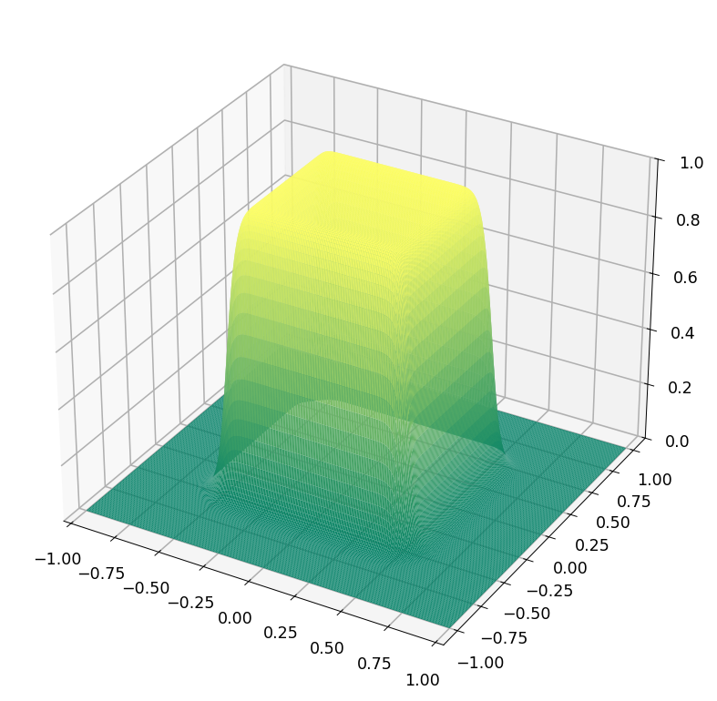
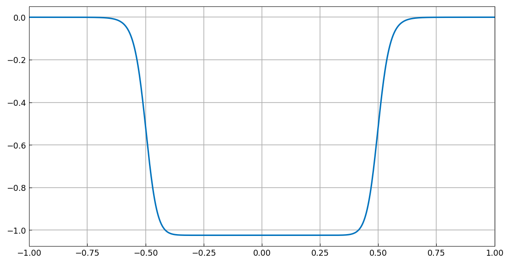
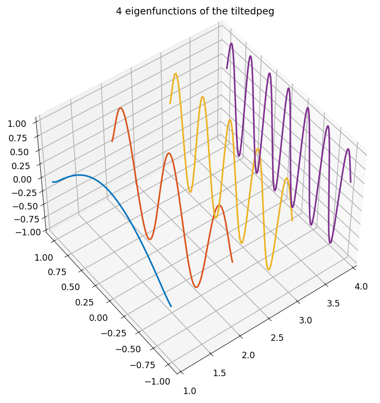
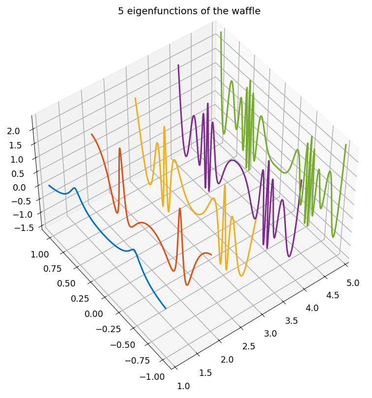
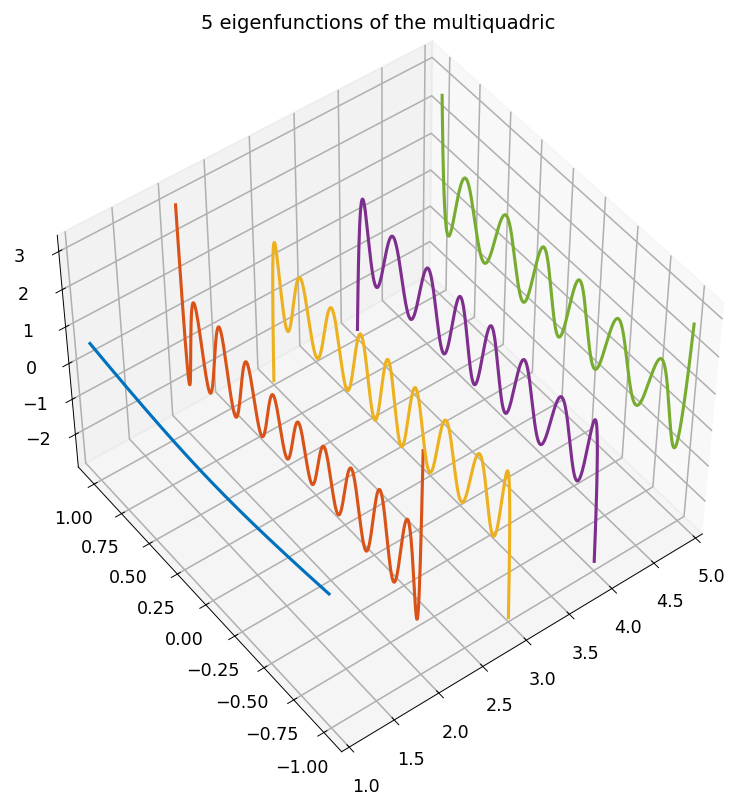

# Maximum trace problems

[Original MATLAB Chebfun example](https://www.chebfun.org/examples/approx2/MaxTrace.html)

(Chebfun Example approx2/MaxTrace.m — Behnam Hashemi, August 2016)

Suppose $f(x,y)$ is a symmetric function on a square. We maximize
$\mathrm{trace}(G^T f G)$ over all $\infty\times k$ quasimatrices $G$
with orthonormal columns. Via the spectral expansion
$f = \sum_i \lambda_i q_i(x) q_i(y)$, a solution consists of the
eigenfunctions of the $k$ largest eigenvalues, obtained from the
chebfun2 SVD (`svd(f, full=True)` in chebfunjax) with the sign trick
$\lambda_i = \mathrm{sign}(\langle u_i, v_i\rangle)\,\sigma_i$ from
the [NearestPSDKernel](NearestPSDKernel.md) example.

## Square peg

The approximate characteristic function of a square
(`cheb.gallery2('squarepeg')`) is symmetric of rank 1, so only
$k = 1$ makes sense:

```text
f =
   chebfun2 object
       domain                 rank       corner values
[  -1,   1] x [  -1,   1]        1     [9.1e-13 9.1e-13 9.1e-13 9.1e-13]
vertical scale = 1
```




## Tilted peg

A symmetric tilted variant, $1/((1+(x+y)^{20})(1+(y-x)^{20}))$, has
high rank; the four dominant eigenfunctions:



## Waffle

`cheb.gallery2('waffle')` has horizontal and vertical ridges; we
solve with $k = 5$:



## Multiquadric

The multiquadric kernel $\sqrt{x^2+y^2+c^2}$ with $c = 0.6$
(display matches MATLAB's rank 11, corner values 1.5, vertical
scale 1.5 exactly):

```text
f =
   chebfun2 object
       domain                 rank       corner values
[  -1,   1] x [  -1,   1]       11     [1.5 1.5 1.5 1.5]
vertical scale = 1.5
```



Comparing the optimal value of the trace with the value for the
first 5 Legendre polynomials (published values `2.024827967723096`
and `1.596796281773389` — ours agree to 13 digits):

```text
optimal =
   2.024827967723150
leg_trace =
   1.596796281773411
```

## References

1. S. Boyd, Low rank approximation and extremal gain problems,
   Stanford University, 2015.

2. B. Hashemi, Nearest positive semidefinite kernel, Chebfun
   Example, 2016.

3. E. Kokiopoulou, J. Chen, and Y. Saad, Trace optimization and
   eigenproblems in dimension reduction problems, _Numerical Linear
   Algebra with Applications_ 18 (2011) 565-602.

---

*Replica script: [`examples/approx2/maxtrace_replica.py`](https://github.com/ma-gilles/chebfunjax/blob/main/examples/approx2/maxtrace_replica.py).
Original example copyright by The University of Oxford and The Chebfun
Developers.*
