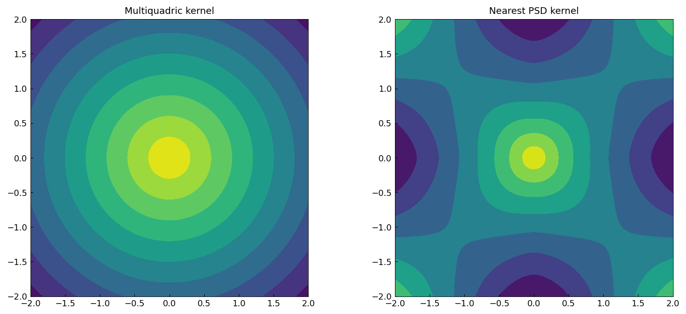
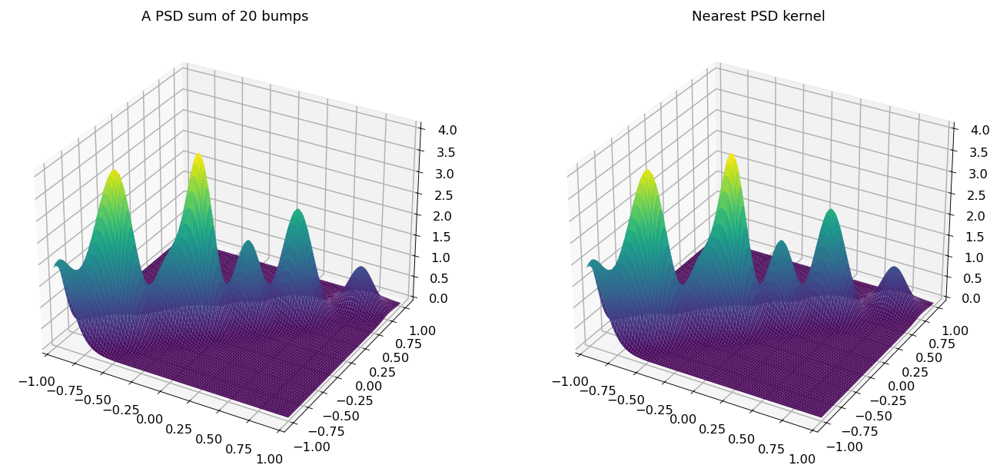
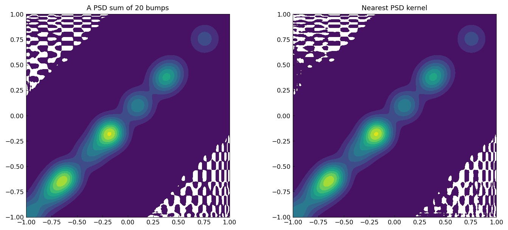
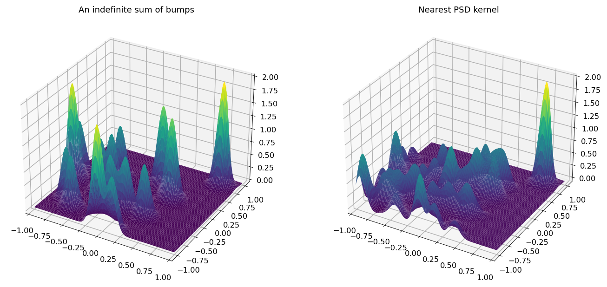
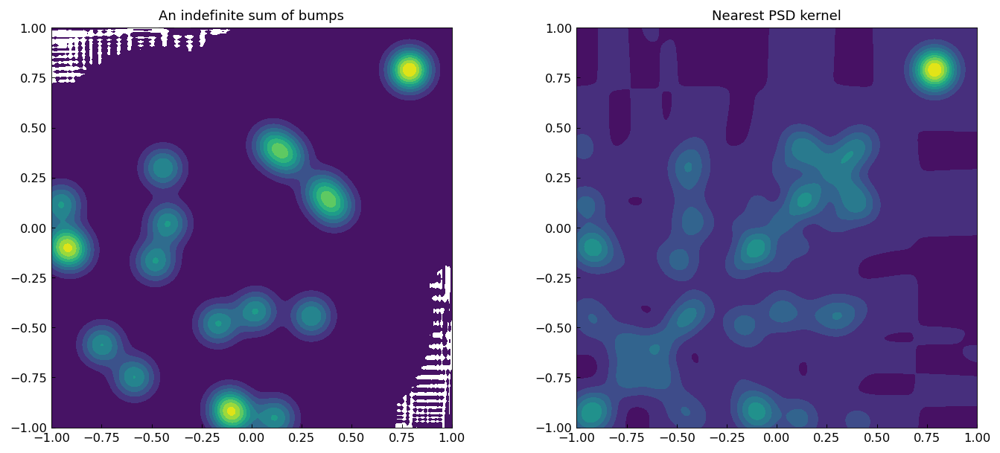
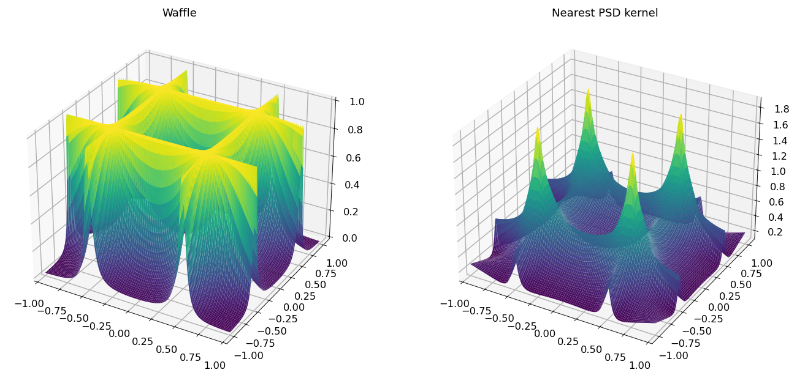
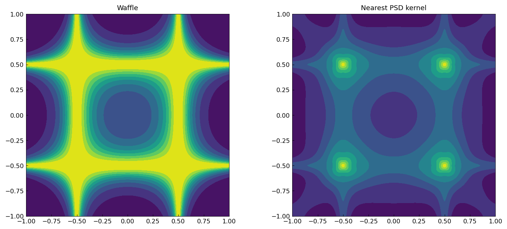

# Nearest positive semidefinite kernel

[Original MATLAB Chebfun example](https://www.chebfun.org/examples/approx2/NearestPSDKernel.html)

(Chebfun Example approx2/NearestPSDKernel.m — Behnam Hashemi,
February 2016)

A symmetric kernel $K(x,y)$ has a spectral expansion
$K = \sum_i \lambda_i q_i(x) q_i(y)$; the nearest symmetric positive
semidefinite kernel $\hat K$ is obtained by dropping the terms with
negative eigenvalues. Although Chebfun2 has no `eig`, the SVD
$K = U\Sigma V^T$ gives the spectral expansion via
$\lambda_i = \mathrm{sign}(\langle u_i,v_i\rangle)\sigma_i$
(`svd(full=True)` in chebfunjax, with $\hat K$ assembled directly in
CDR form). The Gaussian-bump kernels use the exact `rng(1)`/`rng(3)`
center streams dumped from MATLAB R2025b, so all ranks below match
the published values.

## A multiquadric kernel

$-\sqrt{x^2+y^2+c^2}$ with $c = 0.01$ is conditionally positive
definite — exactly one negative eigenvalue is removed
(published ranks 29 → 28, matched):

```text
K =
   chebfun2 object
       domain                 rank       corner values
[  -2,   2] x [  -2,   2]       29     [-2.8 -2.8 -2.8 -2.8]
vertical scale = 2.8
KHat =
   chebfun2 object
       domain                 rank       corner values
[  -2,   2] x [  -2,   2]       28     [0.41 0.41 0.41 0.41]
vertical scale = 0.74
```



## A symmetric PSD kernel of Gaussian bumps

20 bumps centered on the diagonal make a PSD kernel, so $\hat K = K$
(published ranks 20 → 20; the Frobenius difference is at roundoff):




```text
ans =
     3e-14  (fro-norm of K - KHat at plot precision)
```

## A symmetric indefinite kernel of Gaussian bumps

20 bumps in off-diagonal symmetric pairs give an indefinite kernel;
half the eigenvalues are negative (published ranks 20 → 10, matched):

```text
K =
   chebfun2 object
[  -1,   1] x [  -1,   1]       20     [1.3e-10 1.4e-16 7.2e-17 0.00028]
KHat =
[  -1,   1] x [  -1,   1]       10     [0.4 -1.1e-06 -1.1e-06 0.00028]
```




## A function with horizontal and vertical ridges

For the waffle kernel, 14 negative eigenvalues are removed
(published ranks 29 → 15, matched):




---

*Replica script: [`examples/approx2/nearestpsdkernel_replica.py`](https://github.com/ma-gilles/chebfunjax/blob/main/examples/approx2/nearestpsdkernel_replica.py).
Original example copyright by The University of Oxford and The Chebfun
Developers.*
