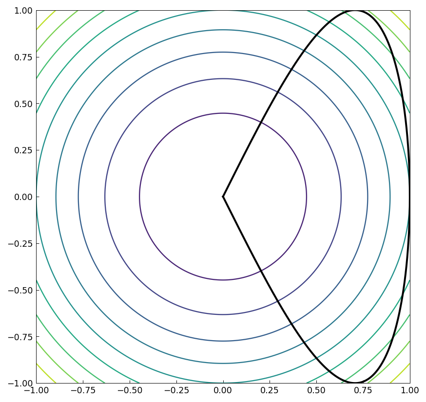
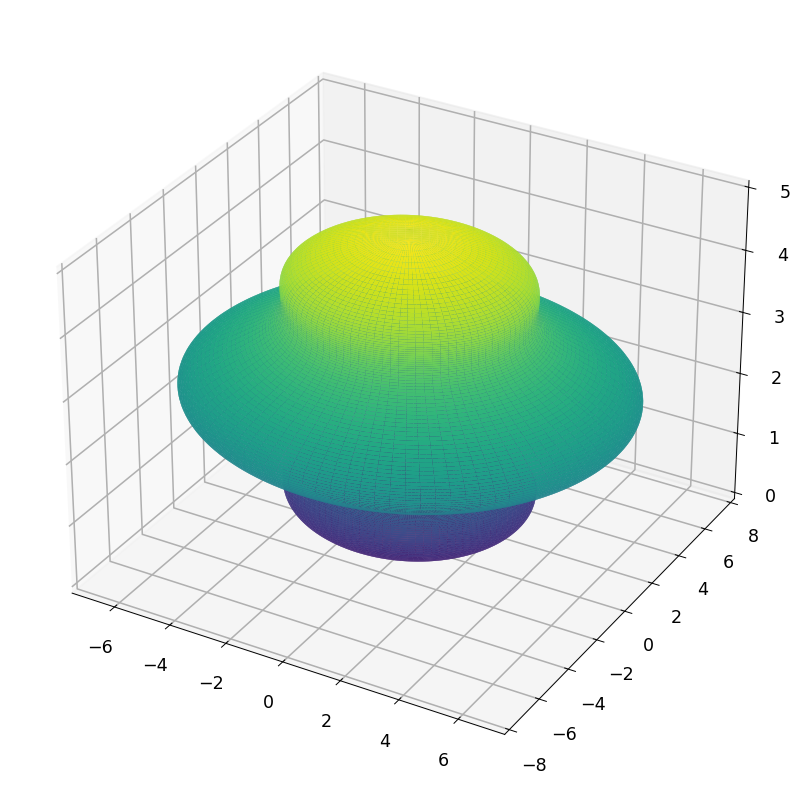
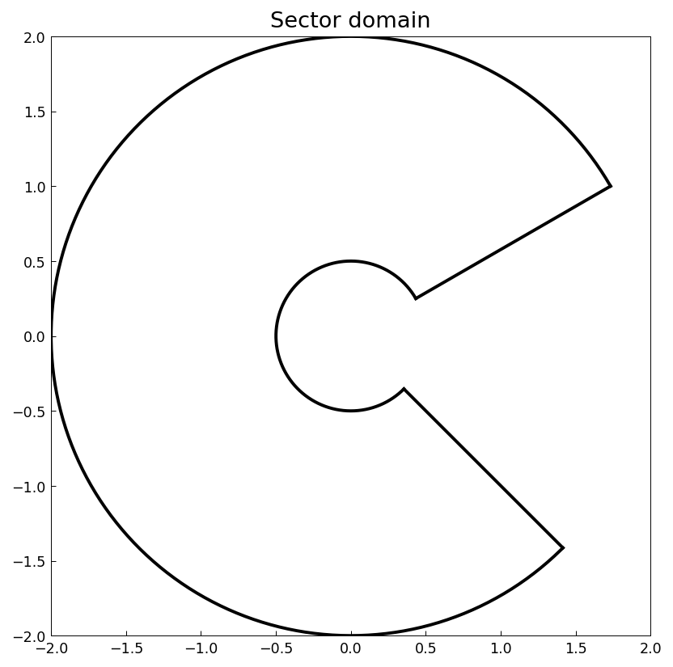
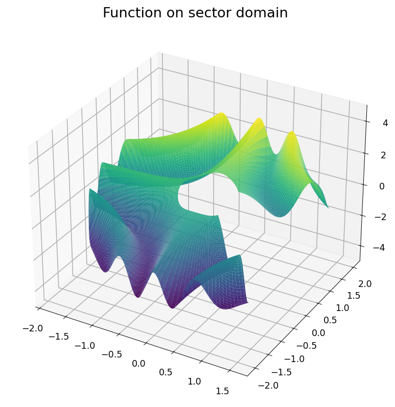
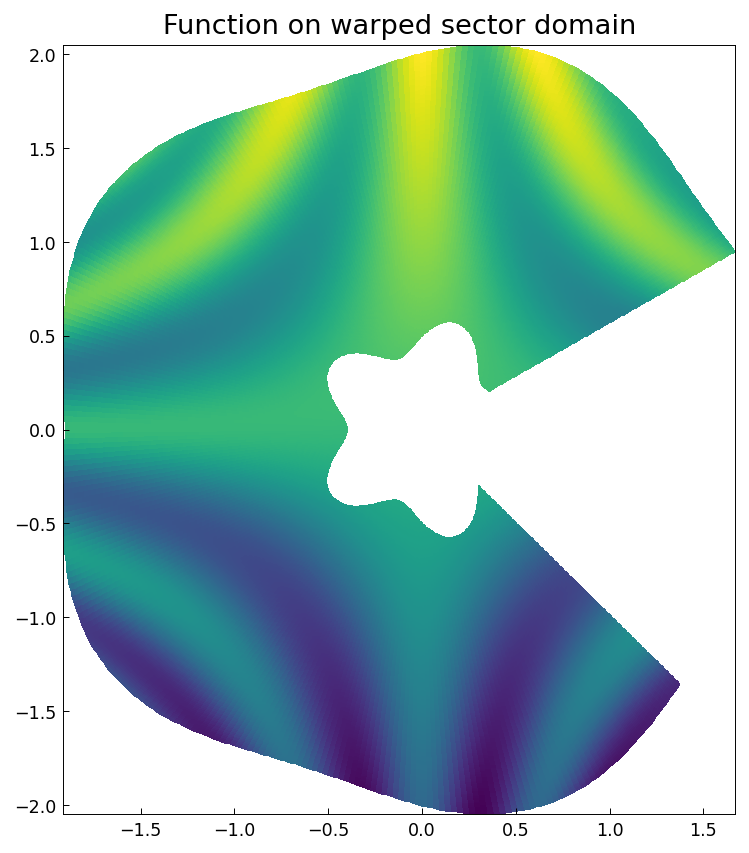
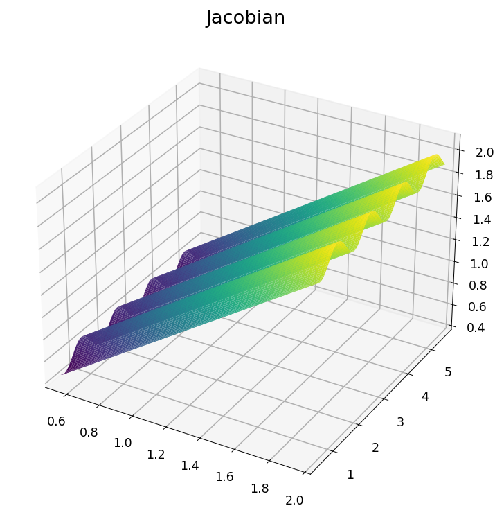
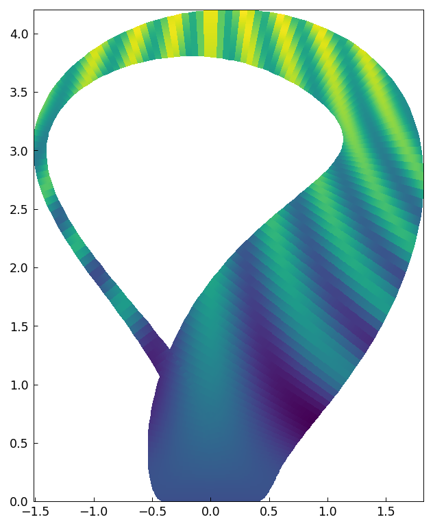
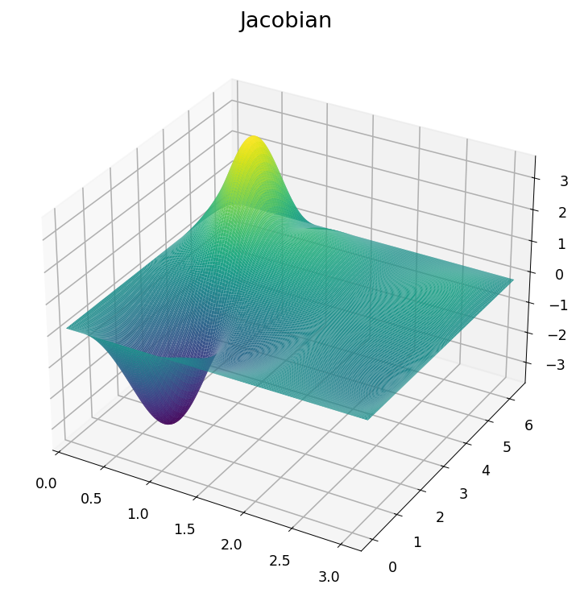

# Chebfun2 objects on non-rectangular domains

[Original MATLAB Chebfun example](https://www.chebfun.org/examples/approx2/Other2DDomains.html)

(Chebfun2 example approx2/Other2DDomains.m — Alex Townsend, June 2013)

The Chebfun2 constructor is inherently tied to sampling on tensor
grids, but functions on non-rectangular domains can still be
represented by employing mappings.

## What can Chebfun2 do already?

Chebfun2 can calculate the volume of a function over an arbitrary
region with prescribed boundary — `integral2(f, c)` applies Green's
theorem along the complex curve `c` (published value 0.838, matched
exactly):



```text
Volume enclosed by curve = 0.838
```

Chebfun2v objects can also represent surfaces, for example a chebfun
revolved around the z-axis:



## Sector domain

Sector-shaped domains are rectangular in polar coordinates
$r_1\le r\le r_2$, $\theta_1\le\theta\le\theta_2$:




The Jacobian of the change of variables is well behaved, so the
integral of $f$ over the sector is (MATLAB publishes
`0.816092631378351` — 14-digit agreement):

```text
ans =
   0.816092631378356
```

## Warping the sector domain

More general domains, like a warped sector, work the same way; the
Jacobian remains nonzero everywhere:




## Shadow of a Klein bottle

The same function on the shadow of the 3D immersion of the Klein
bottle — here the Jacobian becomes singular and most operations on
the rectangular domain become meaningless:




---

*Replica script: [`examples/approx2/other2ddomains_replica.py`](https://github.com/ma-gilles/chebfunjax/blob/main/examples/approx2/other2ddomains_replica.py).
Original example copyright by The University of Oxford and The Chebfun
Developers.*
