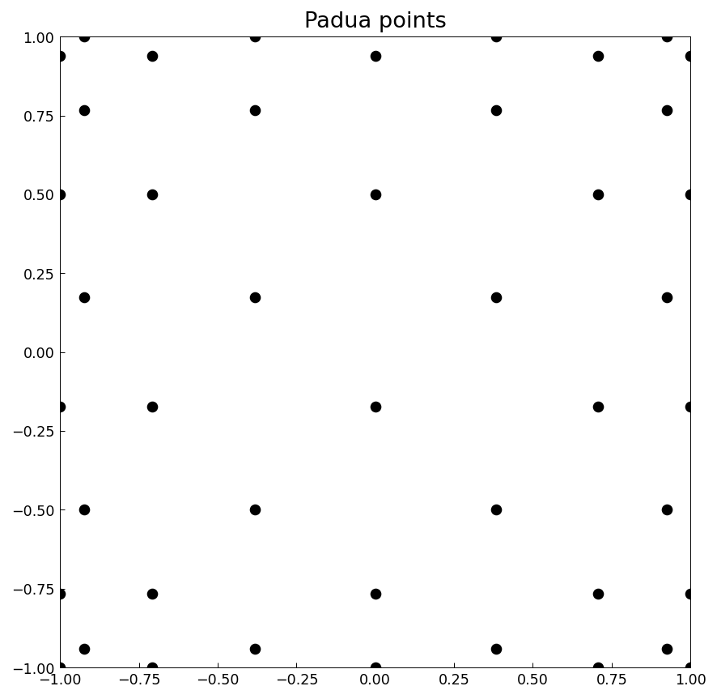
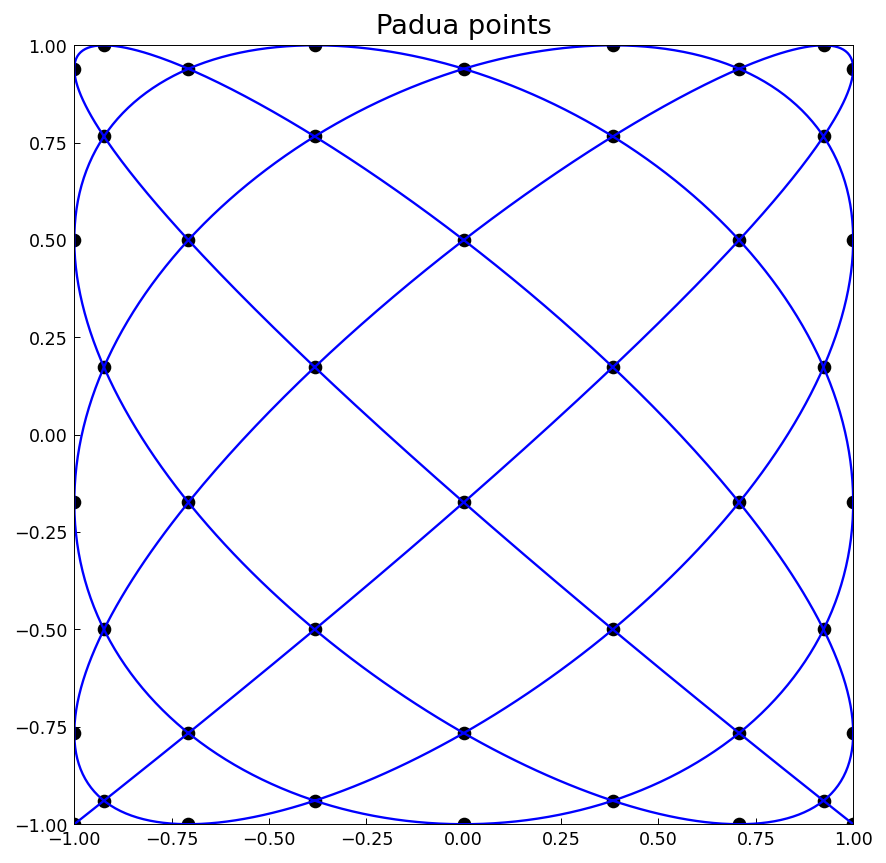
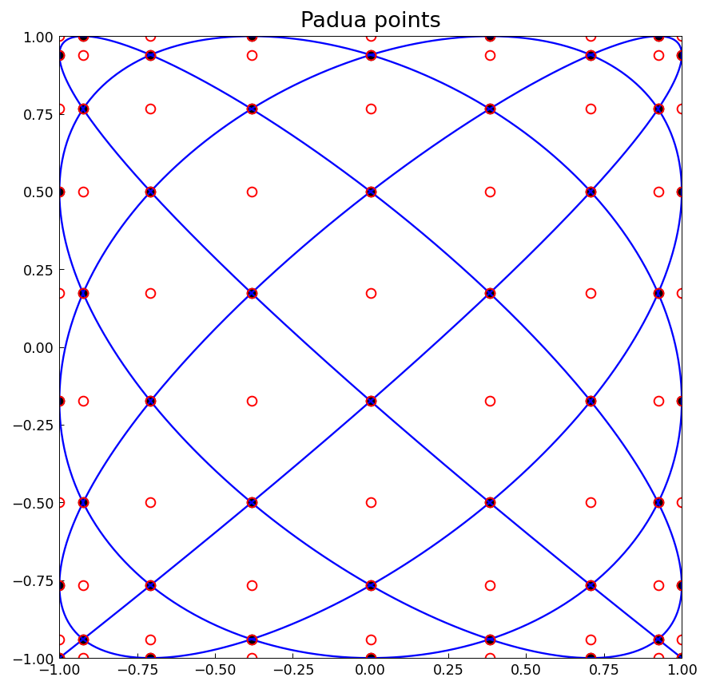
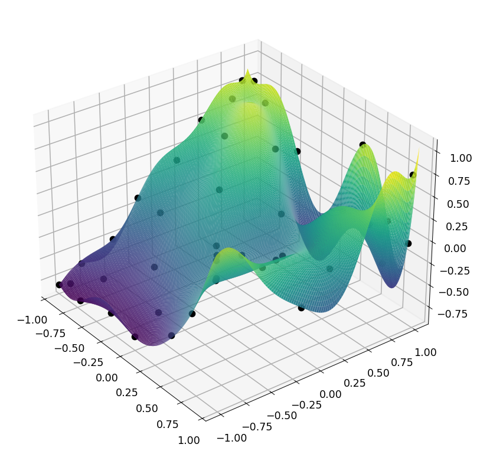
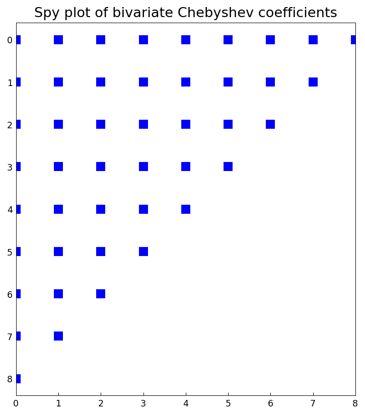

# Padua points in Chebfun2

[Original MATLAB Chebfun example](https://www.chebfun.org/examples/approx2/PaduaPoints.html)

(Chebfun example approx2/PaduaPoints.m — Nick Hale and Alex Townsend,
July 2014)

Padua points (named after the University of Padua, where they were
discovered in 2005 [1]) are the first known example of a unisolvent
point set over bivariate polynomials with provably minimal growth
$O(\log^2 n)$ of the Lebesgue constant — sometimes referred to as
"the Chebyshev points in 2D". They are available through the
`paduapts` method. Here is the Padua grid for $n = 8$:



One characterization is as the self-intersections and boundary
intersections of the Lissajous curve
$L(t) = -\cos((n+1)t) - i\cos(nt)$, $t \in [0, \pi]$:



Another is as every other point from an $(n+1)\times(n+2)$ tensor
product Chebyshev grid:



With the `'padua'` flag (here `Chebfun2.from_padua`), the
constructor treats supplied values as data on a Padua grid and
returns the bivariate polynomial interpolant. For
$f(x,y) = \cos(e^{2x+y})\sin(y)$:



```text
max interpolation error on the Padua grid: 2.00e-15
```

The Padua interpolant is a bivariate Chebyshev polynomial of total
degree $n$ (the degrees in $x$ and $y$ sum to at most $n$), as the
spy plot of its Chebyshev coefficients confirms:



```text
coefficient matrix shape: (9, 9); nonzeros on/below anti-diagonal only: True
```

## References

1. M. Caliari, S. De Marchi, and M. Vianello, "Bivariate polynomial
   interpolation on the square at new nodal sets", _Applied
   Mathematics and Computation_, 165 (2005), 261-274.

2. Chebfun Example: geom/Lissajous.

---

*Replica script: [`examples/approx2/paduapoints_replica.py`](https://github.com/ma-gilles/chebfunjax/blob/main/examples/approx2/paduapoints_replica.py).
Original example copyright by The University of Oxford and The Chebfun
Developers.*
