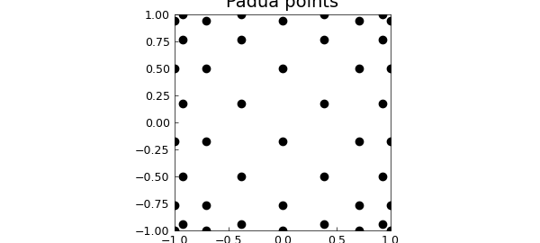
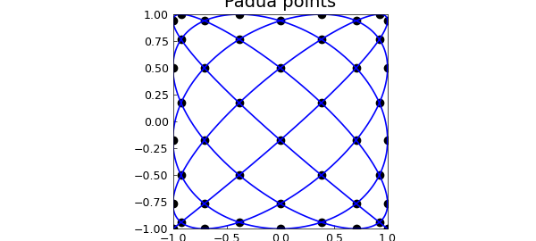
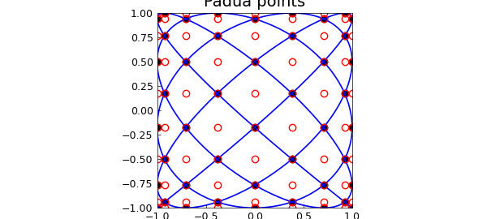
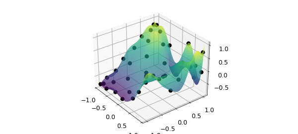
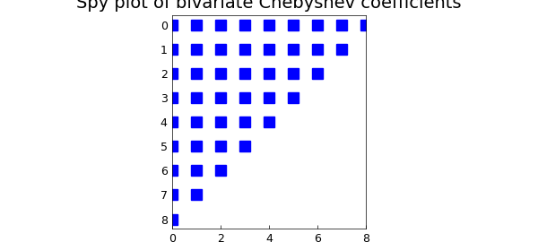

# Padua points in Chebfun2

*Nick Hale and Alex Townsend, July 2014*

[Original MATLAB Chebfun example](https://www.chebfun.org/examples/approx2/PaduaPoints.html)

Python translation: [`examples/approx2/paduapoints.py`](https://github.com/ma-gilles/chebfunjax/blob/main/examples/approx2/paduapoints.py)

Padua points (named after the University of Padua, where they were discovered in 2005 [1]) are the first known example of a unisolvent point set over bivariate polynomials which have a provably minimal growth in Lebesgue constant of $O(\log^2 n)$. They are sometimes refered to as the "Chebyshev points in 2D" [1].

It seemed only natural to include these points in Chebfun, and they are now available through the `paduapts` method. For example, here is the Padua grid corresponding to $n = 8$:

```matlab
n = 8;
x = paduapts( n );
plot(x(:,1), x(:,2), 'ok', 'MarkerFaceColor', 'k')
axis equal, axis([-1 1 -1 1]), hold on
FS = 'FontSize';
title('Padua points', FS, 14), set(gca, FS, 12)
```



There are a number of characterizations of Padua points. One is as the intersection of a certain Lissajous curve [2] with itself and the boundary of $[-1,1]\times[-1,1]$:

```matlab
t = chebfun('t', [0 pi]);
L = -cos((n + 1)*t) - 1i*cos(n*t);        % Lissajous curve
plot(L, 'b')
```



Another is as every other point from an $(n+1)\times(n+2)$ tensor product Chebyshev grid:

```matlab
x1 = chebpts(n + 1);
x2 = chebpts(n + 2);
[X, Y] = meshgrid(x1, x2);
plot(X, Y, 'or'), hold off
```



If a matrix rather than a bivariate function is supplied as an input, Chebfun2 normally assumes that its values correspond to data on a Chebyshev tensor product grid. However, if the `'padua'` flag is supplied, the constructor assumes the values are data on a Padua grid and returns a bivariate polynomial that interpolates the prescribed data. For example:

```matlab
f = @(x,y) cos(exp(2*x+y)).*sin(y);
fx = f(x(:,1), x(:,2));                   % Samples from Padua grid
F = chebfun2(fx, [-1 1 -1 1], 'padua');   % Construct Chebfun2 from samples
plot(F), hold on
plot3(x(:,1), x(:,2), F(x(:,1), x(:,2)), 'ok', 'MarkerFaceColor', 'k'), hold off
```



The corresponding Padua interpolant is a bivariate Chebyshev polynomial of total degree $n$ (i.e. the degrees in $x$ and $y$ sum to at most $n$). We can verify this by looking at the coefficients of the interpolant:

```matlab
C = chebcoeffs2(F);
C(abs(C) < 1e-10) = 0;
spy(C), shg
title('Spy plot of bivariate Chebyshev coefficients',FS,14)
```



We hope this addition will make it easy to explore Padua interpolants in Chebfun2!

## References

1. M. Caliari, S. De Marchi, and M. Vianello, "Bivariate polynomial interpolation on the square at new nodal sets", *Applied Mathematics and Computation*, 165 (2005), 261-274.
2. Chebfun Example: [geom/Lissajous](../geom/Lissajous.md)

---

*Translated with [chebfunjax](https://github.com/ma-gilles/chebfunjax); prose and MATLAB code from the original example, copyright The University of Oxford and The Chebfun Developers.  Printed outputs and figures are chebfunjax's.*
