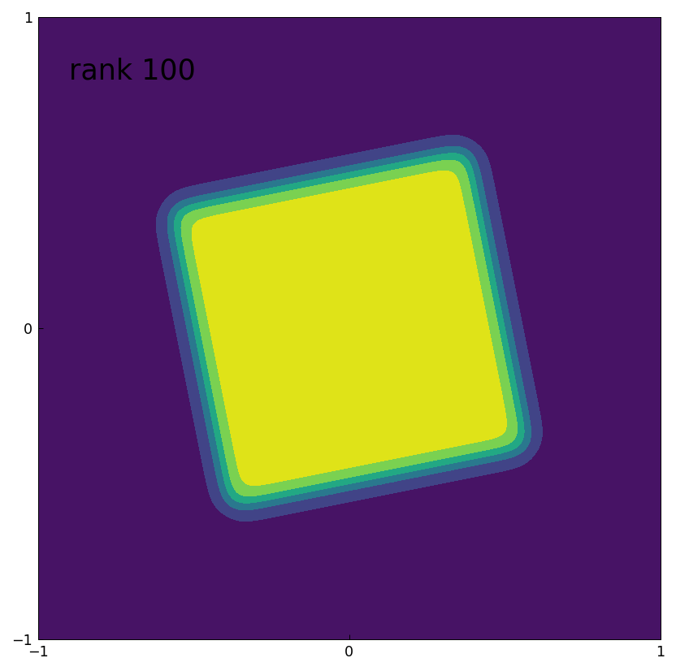
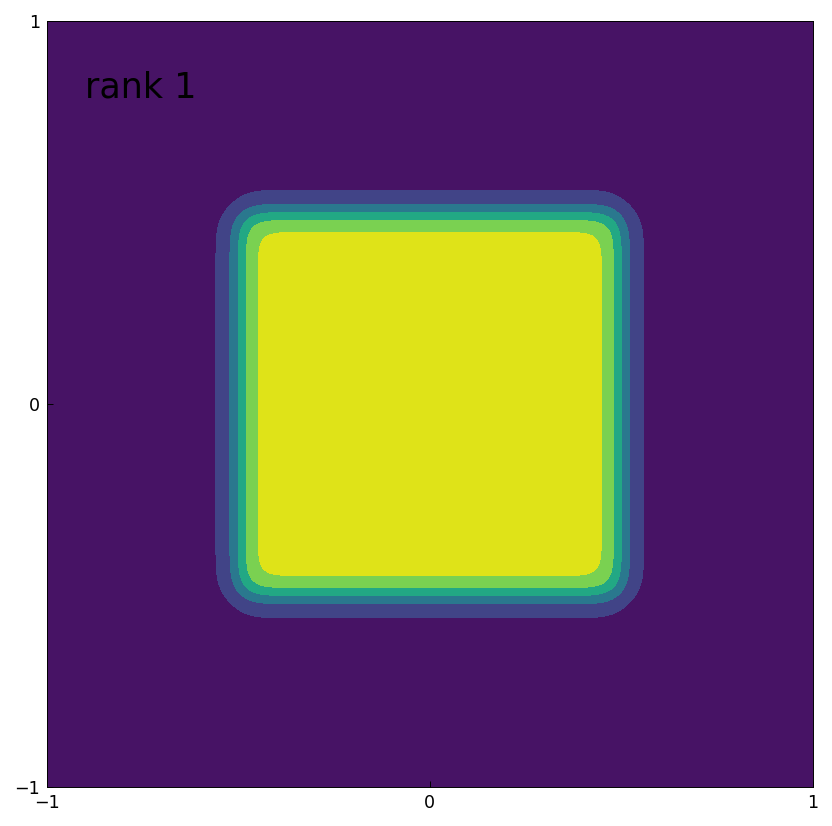
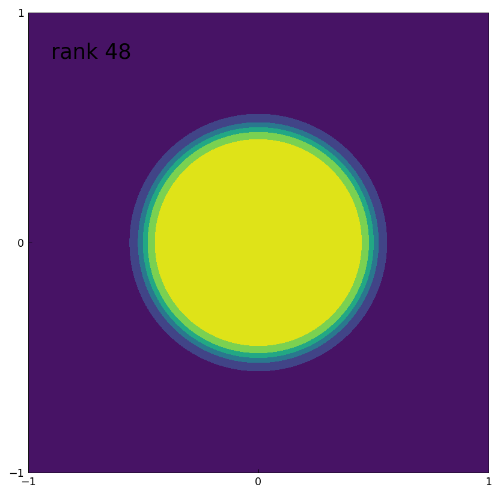

# Low-rank compression of square and round pegs

[Original MATLAB Chebfun example](https://www.chebfun.org/examples/approx2/Pegs.html)

(Chebfun example approx2/Pegs.m — Nick Trefethen, June 2016)

A companion to [Low-rank approximation and alignment with
axes](Alignment.md), looking at three functions from `cheb.gallery2`.

The "tilted peg" — a smoothed characteristic function of a tilted
square — has rank 100 (matching MATLAB exactly):

```text
fa =
    @(x,y)1./((1+(2*x+.4*y).^20).*(1+(2*y-.4*x).^20))
rank 100
```



If the peg is aligned with the axes it is separable, hence rank 1:

```text
fa =
    @(x,y)1./((1+(2*x).^20).*(1+(2*y).^20))
rank 1
```



A round peg has an in-between rank (MATLAB computes 45; our
constructor 48 — the last few pivots at machine tolerance are
chop-sensitive):

```text
fa =
    @(x,y)1./(1+((2*x).^2+(2*y).^2).^10)
rank 48
```



As the original discusses, these functions are motivated by the
rational filter $b(z) = 1/(1+z^n)$ of Austin, Kravanja & Trefethen;
in the Diskfun gallery the situation reverses (the round peg has
rank 1 there, and translation rather than tilting matters).

## References

1. A. P. Austin, P. Kravanja, and L. N. Trefethen, Numerical
   algorithms based on analytic function values at roots of unity,
   _SIAM J. Numer. Anal._ 52 (2014), 1795-1821.

2. L. N. Trefethen, Cubature, approximation, and isotropy in the
   hypercube, _SIAM Review_, 39 (2017), 469-491.

---

*Replica script: [`examples/approx2/pegs_replica.py`](https://github.com/ma-gilles/chebfunjax/blob/main/examples/approx2/pegs_replica.py).
Original example copyright by The University of Oxford and The Chebfun
Developers.*
