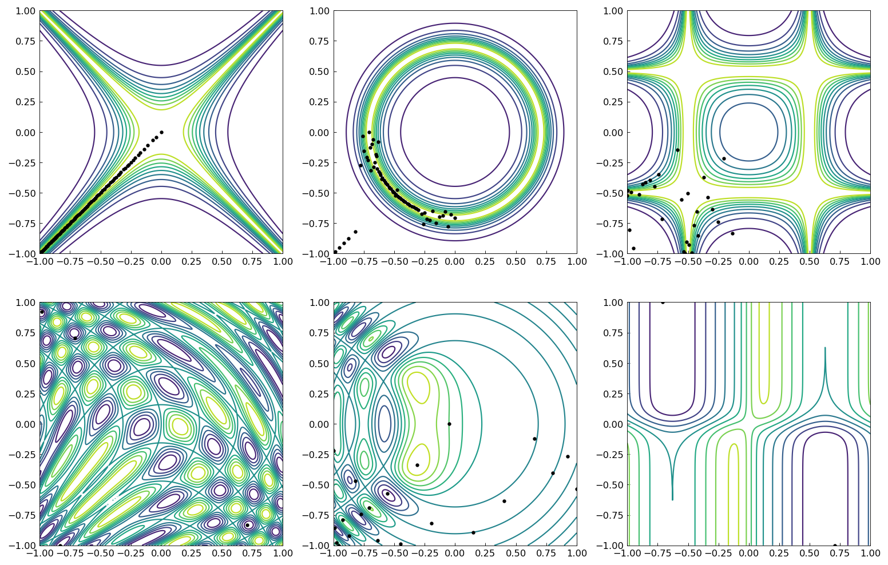
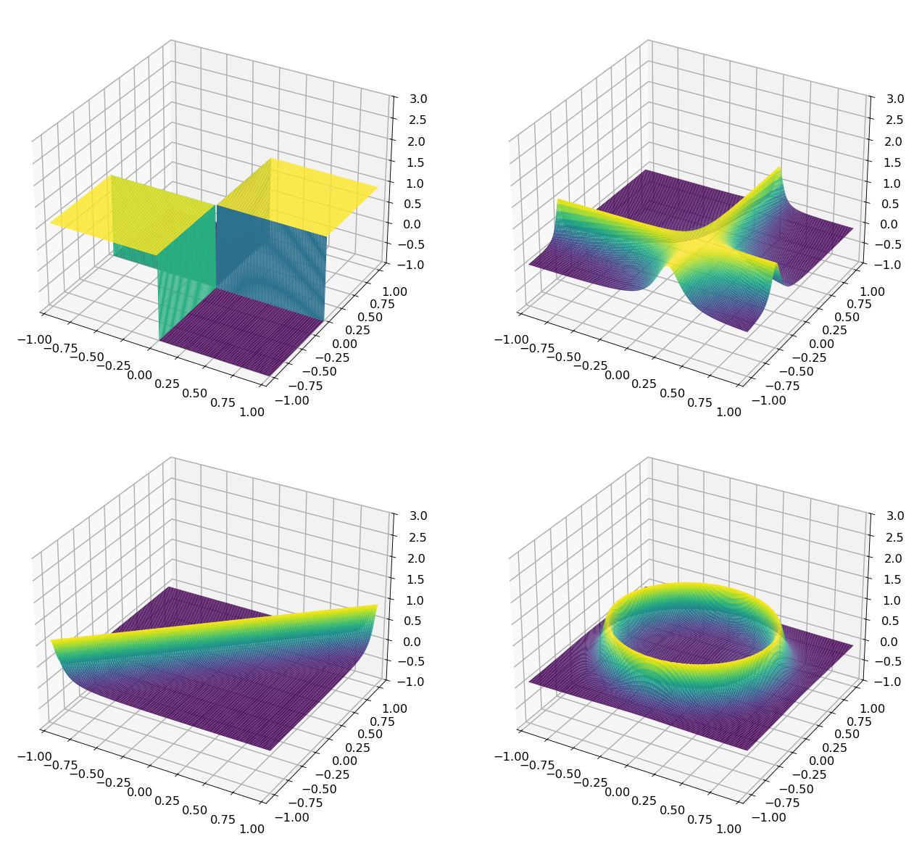
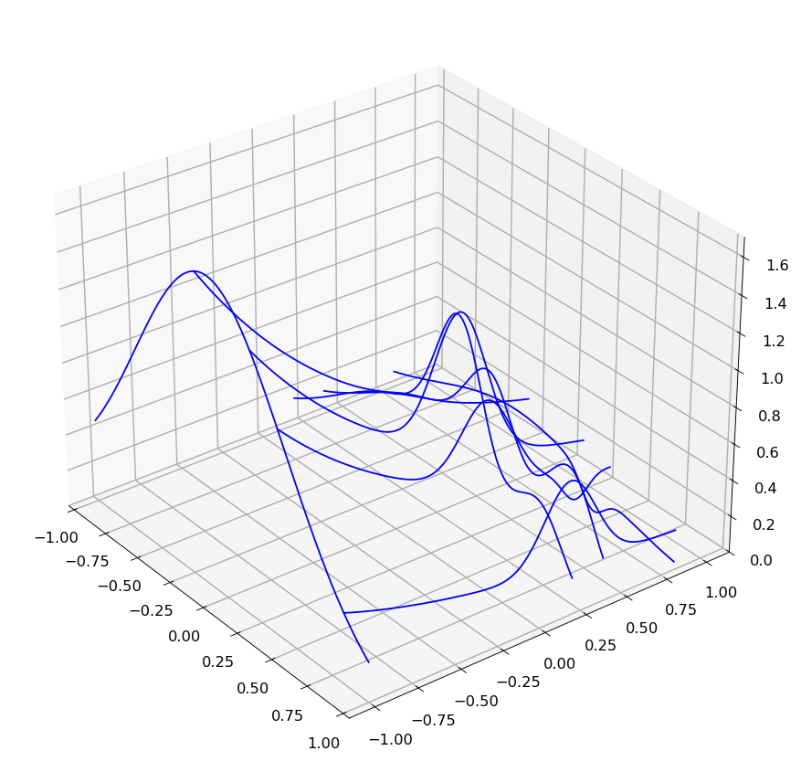

# Pretty functions approximated by Chebfun2

[Original MATLAB Chebfun example](https://www.chebfun.org/examples/approx2/PrettyFunctions.html)

(Chebfun2 example approx2/PrettyFunctions.m — Alex Townsend, March
2013)

Chebfun2 has half a dozen plotting commands such as `plot`, `plot3`,
`surf`, `surfc`, `mesh`, and `waterfall`. In this example we use some
of them to make pretty pictures.

## Contour and pivot plots

The `contour` command displays level curves, and the pivot plot
(`plot(f,'.')`) displays the pivot locations chosen during the
Gaussian-elimination construction — their number equals the rank.
Six pretty functions with their contours and pivots:

## The plot command

Surfaces of four chebfun2 objects:

## The waterfall command

The `waterfall` command displays the lines on which the function was
sampled by the adaptive construction process — here Franke's
function, whose Chebfun2 approximation has rank 4:

## Phase portraits

For plots of complex valued functions see the
[Phase portraits](https://www.chebfun.org/examples/complex/PhasePortraits.html)
example and Section 1.7 of the Chebfun2 guide.

---

*Replica script: [`examples/approx2/prettyfunctions_replica.py`](https://github.com/ma-gilles/chebfunjax/blob/main/examples/approx2/prettyfunctions_replica.py).
Original example copyright by The University of Oxford and The Chebfun
Developers.*
