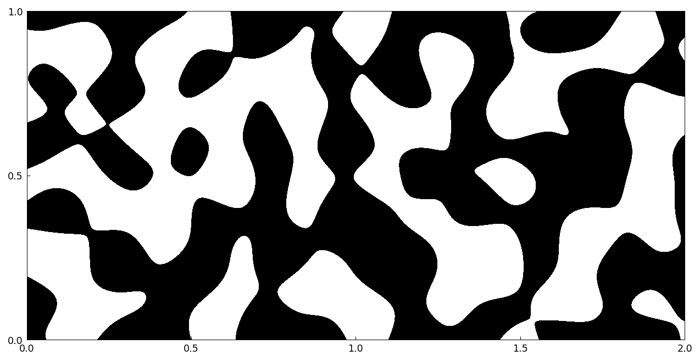
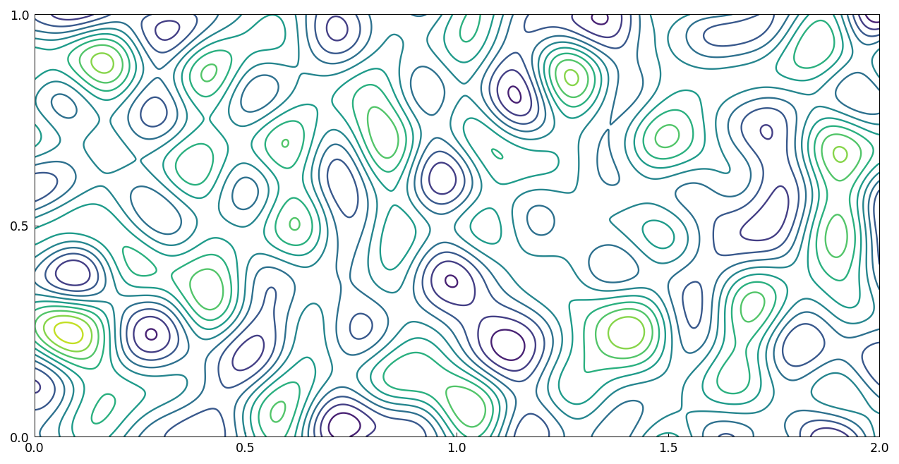
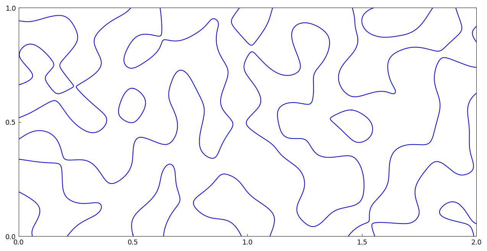
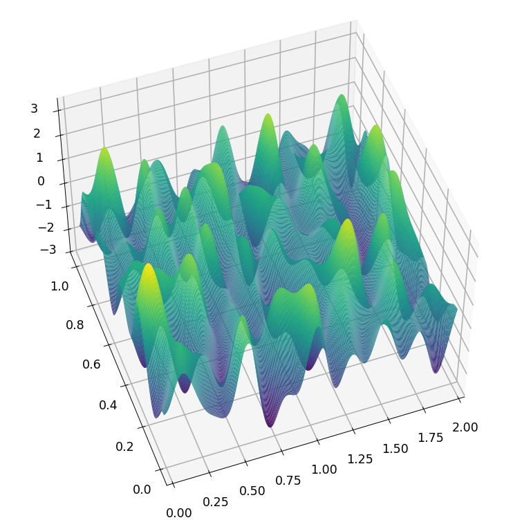
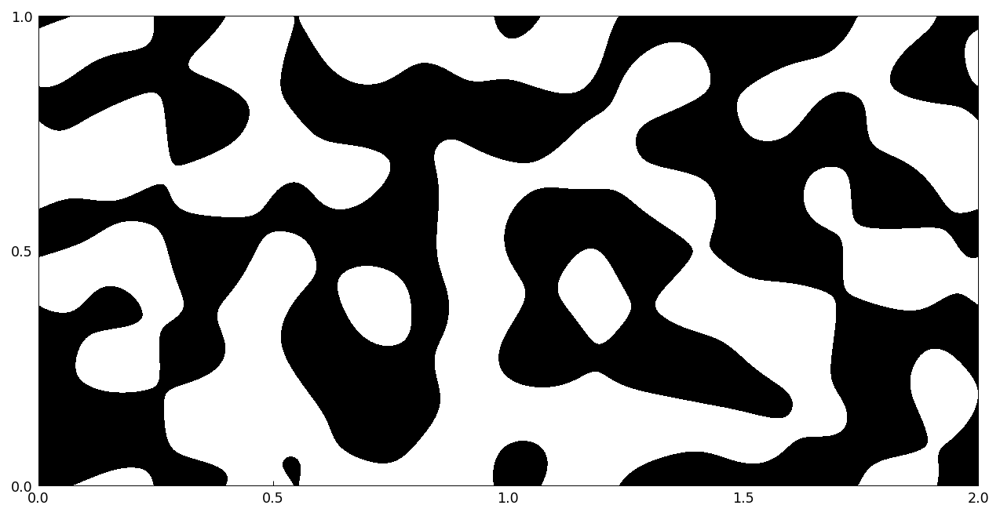
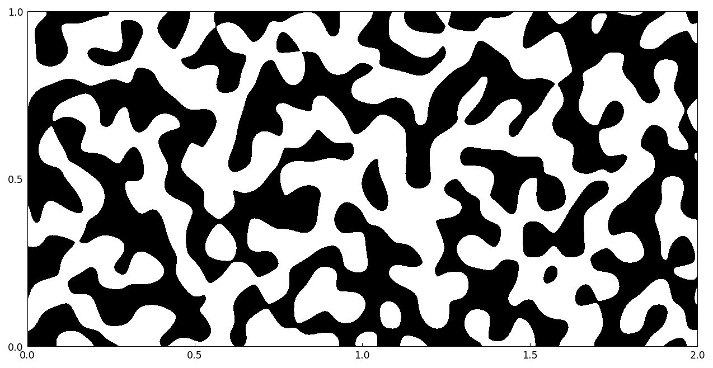
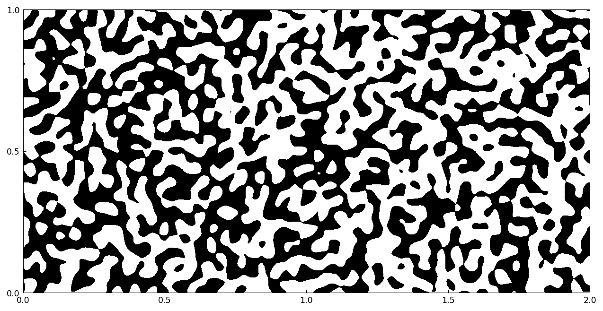

# Random functions in 2D

[Original MATLAB Chebfun example](https://www.chebfun.org/examples/approx2/Random2D.html)

(Chebfun example approx2/Random2D.m — Nick Trefethen, April 2017)

`randnfun2` constructs smooth random functions in 2D — continuous
analogues of `randn` built from finite Fourier series with
independent normally distributed random coefficients, with a space
scale parameter $\lambda$ (wave numbers up to about $2\pi/\lambda$).
(Draws here use seeded numpy streams; MATLAB's `rng(0)` stream is
not reproducible outside MATLAB.)

A random function with $\lambda = 0.2$ on a $2\times 1$ rectangle,
negative values black and positive white:

A contour plot shows more:

To isolate the zero contours to high accuracy (though it takes
longer), one can use `roots`:

Here's a 3D plot:

For comparison, a periodic random function (`'trig'`):

And random functions with $\lambda = 0.1$:

and with $\lambda = 0.05$:

## Reference

1. S. Filip, A. Javeed, and L. N. Trefethen, Smooth random
   functions, random ODEs, and Gaussian processes, _SIAM Review_,
   61 (2019), 185-205.

---

*Replica script: [`examples/approx2/random2d_replica.py`](https://github.com/ma-gilles/chebfunjax/blob/main/examples/approx2/random2d_replica.py).
Original example copyright by The University of Oxford and The Chebfun
Developers.*
