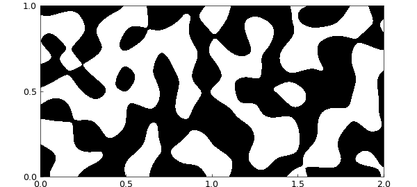
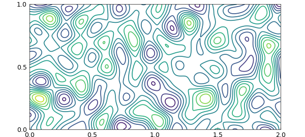
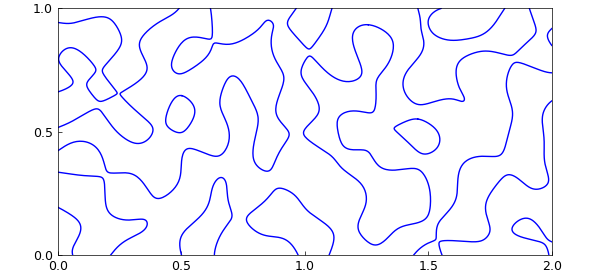
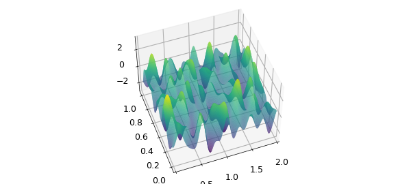
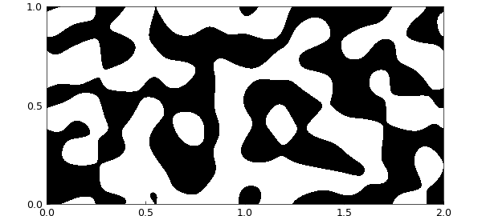
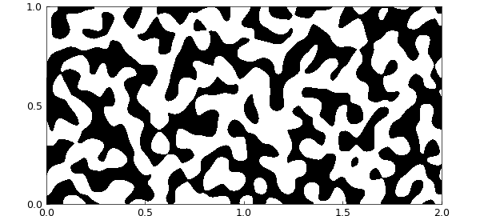
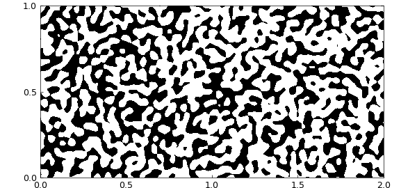

# Random functions in 2D

*Nick Trefethen, April 2017*

[Original MATLAB Chebfun example](https://www.chebfun.org/examples/approx2/Random2D.html)

Python translation: [`examples/approx2/random2d.py`](https://github.com/ma-gilles/chebfunjax/blob/main/examples/approx2/random2d.py)

Recently Chebfun added the command `randnfun` for generating smooth random functions in 1D. In keeping with Chebfun's mission of realizing continuous analogues of the familiar discrete objects, `randnfun` can be regarded as a continuous analogue of the Matlab command `randn`. Chebfun can construct 2D random functions too, with `randnfun2` (and on the sphere with `randnfunsphere`). For details, see [1]. Random functions in 3D have not yet been implemented.

In a word, the idea is that a "smooth random function" is constructed from a finite Fourier series with independent normally distributed random coefficients. A parameter $\lambda$ must be specified that sets the associated space scale. Approximately speaking, a random function contains wave numbers up to about $2\pi/\lambda$.

To illustrate, here is a random function with $\lambda = 0.2$ on a $2\times 1$ rectangle. Negative values are black and positive values are white.

```matlab
lambda = 0.2;
rng(0), f = randnfun2(lambda, [0 2 0 1]);
plot(f), view(0,90), colormap(gray(2))
caxis(norm(caxis,inf)*[-1 1])
axis equal, axis([0 2 0 1])
XT = 'xtick'; YT = 'ytick';
set(gca,XT,0:.5:2,YT,0:.5:1)
```



A contour plot shows more:

```matlab
contour(f), colormap('default')
axis equal, axis([0 2 0 1])
set(gca,XT,0:.5:2,YT,0:.5:1)
```



To isolate the zero contours to high accuracy (though it takes longer), one could use `roots`.

```matlab
c = roots(f);
plot(c)
axis equal, axis([0 2 0 1])
set(gca,XT,0:.5:2,YT,0:.5:1)
```



Here's a 3D plot.

```matlab
plot(f)
view(-20,50), camlight left
```



Here for comparison is a periodic random function.

```matlab
f = randnfun2(lambda, [0 2 0 1], 'trig');
plot(f), view(0,90), colormap(gray(2))
caxis(norm(caxis,inf)*[-1 1])
axis equal, axis([0 2 0 1])
set(gca,XT,0:.5:2,YT,0:.5:1)
```



And here are random functions with $\lambda = 0.1$

```matlab
lambda = 0.1; f = randnfun2(lambda, [0 2 0 1]);
plot(f), view(0,90), colormap(gray(2))
caxis(norm(caxis,inf)*[-1 1])
axis equal, axis([0 2 0 1])
set(gca,XT,0:.5:2,YT,0:.5:1)
```



and with $\lambda = 0.05$

```matlab
lambda = 0.05; f = randnfun2(lambda, [0 2 0 1]);
plot(f), view(0,90), colormap(gray(2))
caxis(norm(caxis,inf)*[-1 1])
axis equal, axis([0 2 0 1])
set(gca,XT,0:.5:2,YT,0:.5:1)
```



[1] S. Filip, A. Javeed, and L. N. Trefethen, Smooth random functions, random ODEs, and Gaussian processes, *SIAM Review*, 61 (2019), 185-205.

---

*Translated with [chebfunjax](https://github.com/ma-gilles/chebfunjax); prose and MATLAB code from the original example, copyright The University of Oxford and The Chebfun Developers.  Printed outputs and figures are chebfunjax's.*
