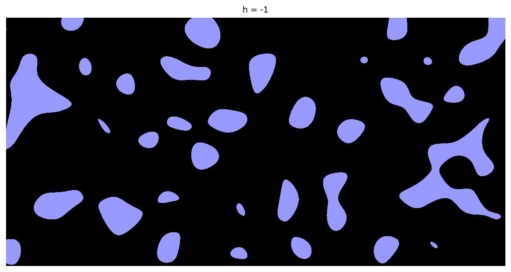
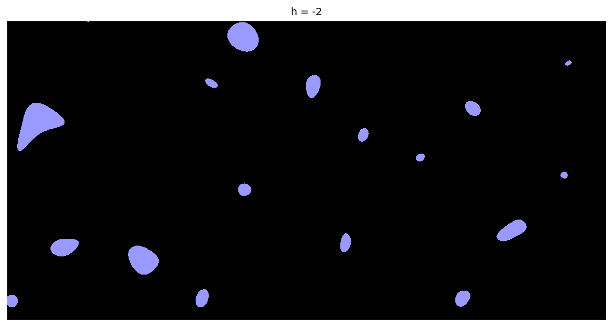
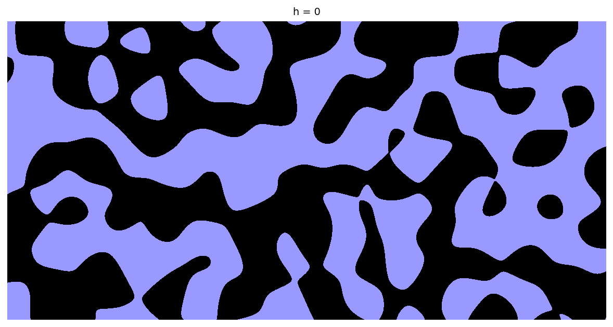
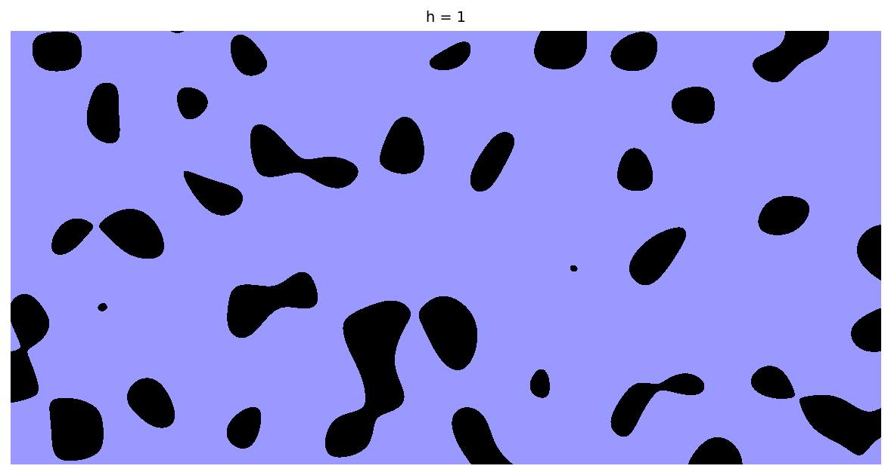
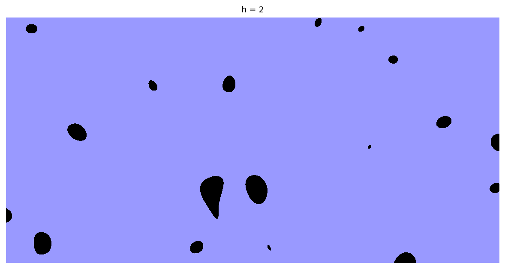
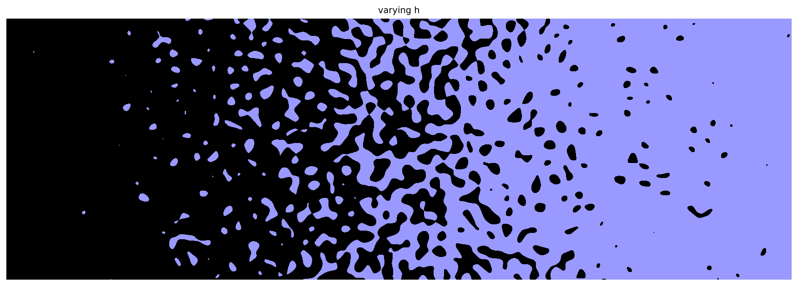

# Random ponds in a 2D landscape

[Original MATLAB Chebfun example](https://www.chebfun.org/examples/approx2/RandomPonds.html)

(Chebfun example approx2/RandomPonds.m — Nick Trefethen, May 2017)

Suppose $f$ is a 2D random function defining a "random landscape",
filled with water up to a level $h$. The water collects into random
ponds — an interpretation from Ken Golden of the University of Utah
[1]. (Draws use a seeded numpy stream; MATLAB's rng state is not
reproducible outside MATLAB.)

For $h = -1$:

If $h$ is lower, the ponds are smaller and more separated:

As $h$ gets bigger, the ponds grow and connect into a giant body of
water — related to percolation theory:

We can also let $h$ vary across the domain; the result is
reminiscent of an engraving by Escher:

## Reference

1. B. Bowen, C. Strong, and K. M. Golden, Modeling the fractal
   geometry of Arctic melt ponds using the level sets of random
   surfaces, _Journal of Fractal Geometry_, 5.2 (2018), 121-142.

---

*Replica script: [`examples/approx2/randomponds_replica.py`](https://github.com/ma-gilles/chebfunjax/blob/main/examples/approx2/randomponds_replica.py).
Original example copyright by The University of Oxford and The Chebfun
Developers.*
