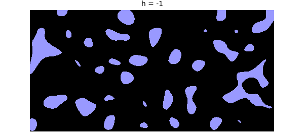
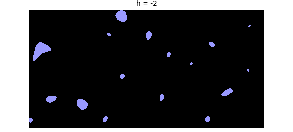
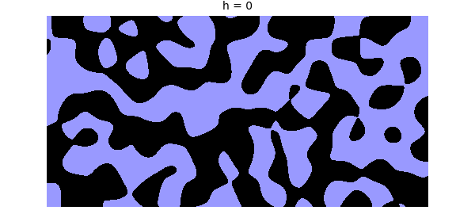
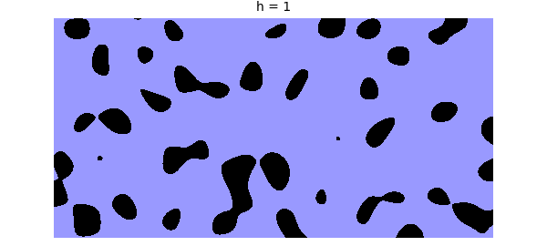
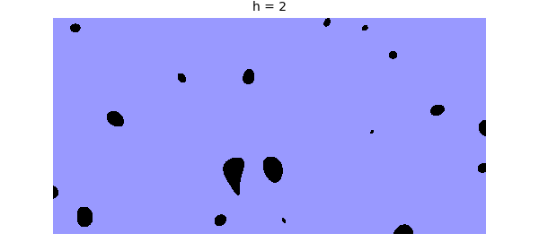
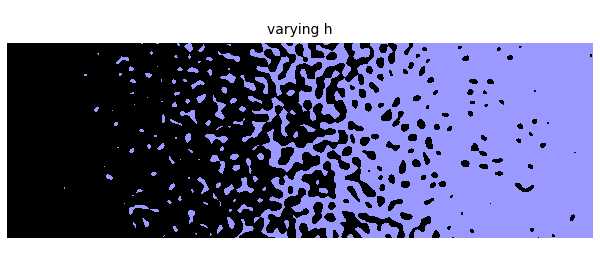

# Random ponds in a 2D landscape

*Nick Trefethen, May 2017*

[Original MATLAB Chebfun example](https://www.chebfun.org/examples/approx2/RandomPonds.html)

Python translation: [`examples/approx2/randomponds.py`](https://github.com/ma-gilles/chebfunjax/blob/main/examples/approx2/randomponds.py)

Suppose $f$ is a 2D random function defining a "random landscape", which is filled with water up to a level $h$. The water collects into random ponds, an interpretation I learned about from Ken Golden of the University of Utah [1].

Here is an illustration for $h=-1$.

```matlab
blueblack = [.6 .6 1; 0 0 0];
CO = 'color';
h = -1;
dom = [-2 2 -1 1];
f = randnfun2(0.3,dom);
plot(f-h, 'zebra'), axis equal off, colormap(blueblack)
title(['h = ' num2str(h)])
```



Of course, the mathematics depends on one's notion of a random function, and Chebfun makes a particular choice defined by certain random Fourier coefficients.

If $h$ is lower, the ponds are smaller and more separated.

```matlab
h = -2;
plot(f-h, 'zebra'), axis equal off, colormap(blueblack)
title(['h = ' num2str(h)])
```



As $h$ gets bigger, the ponds grow and connect into a giant body of water. This is related to the subject of percolation theory.

```matlab
for h = 0:2
   plot(f-h, 'zebra'), axis equal off, colormap(blueblack)
   title(['h = ' num2str(h)])
   snapnow
end
```







We can also let $h$ vary across the domain. The resulting image is reminiscent of an engraving by Escher.

```matlab
dom = [-3 3 -1 1];
f = randnfun2(.1, dom);
h = chebfun2(@(x,y) x, dom);
plot(f-h, 'zebra'), axis equal off, colormap(blueblack)
title('varying h')
```



Reference:

[1] B. Bowen, C. Strong, and K. M. Golden, Modeling the fractal geometry of Arctic melt ponds using the level sets of random surfaces, *Journal of Fractal Geometry*, 5.2 (2018), 121--142.

---

*Translated with [chebfunjax](https://github.com/ma-gilles/chebfunjax); prose and MATLAB code from the original example, copyright The University of Oxford and The Chebfun Developers.  Printed outputs and figures are chebfunjax's.*
