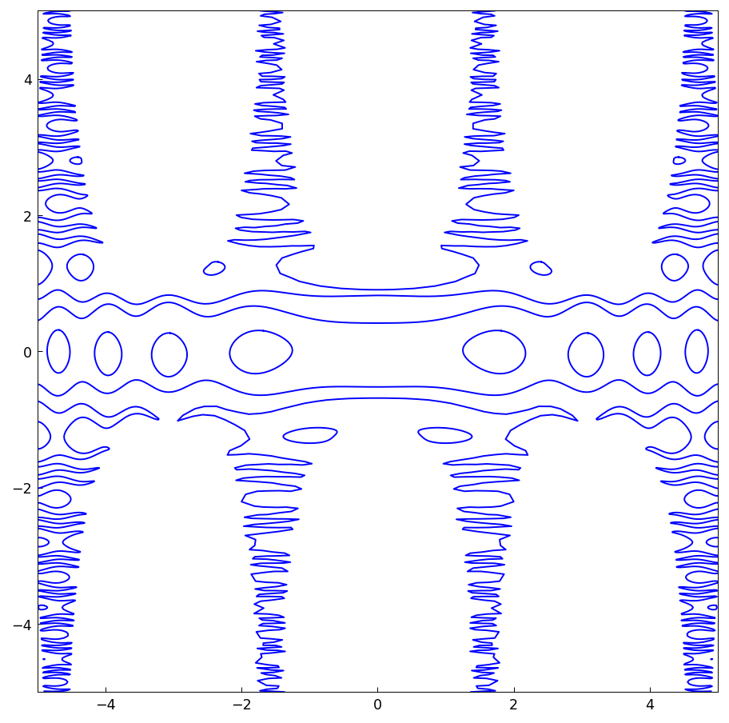
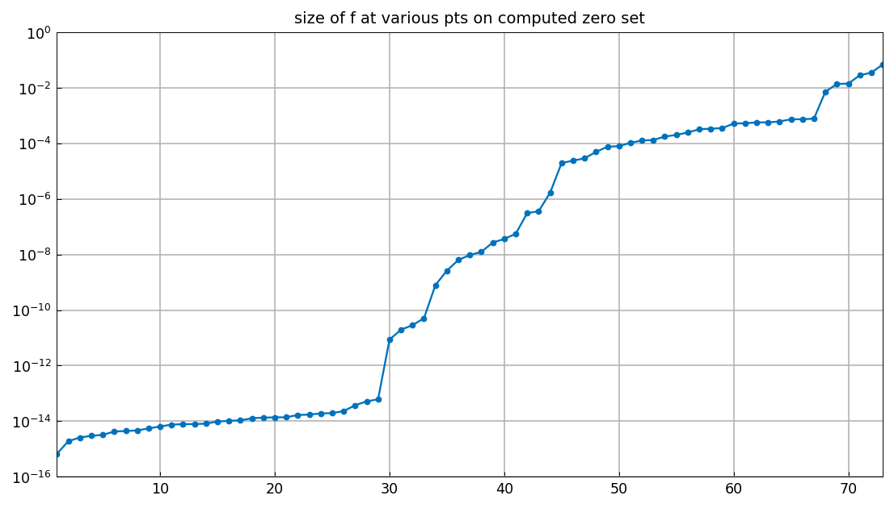
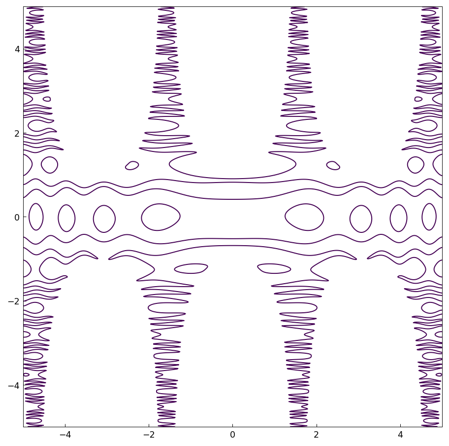

# 2D zero set example of Warwick Tucker

[Original MATLAB Chebfun example](https://www.chebfun.org/examples/approx2/Tucker.html)

(Chebfun example approx2/Tucker.m — Nick Trefethen, November 2017)

Warwick Tucker considers the bivariate function
$$ f(x,y) = \sin(\cos(x^2)+10\sin(y^2)) - y\cos(x) $$
in the square $-5\le x,y\le 5$. What is its zero set?

In Chebfun2 we see that $f$ has rank 3 (display identical to
MATLAB's, including the corner values and vertical scale):

```text
f =
   chebfun2 object
       domain                 rank       corner values
[  -5,   5] x [  -5,   5]        3     [1.1 1.1 -1.7 -1.7]
vertical scale = 6
```

The `roots` command finds the elegant zero set:



```text
Elapsed time is 99.573185 seconds.
ans =
   Inf    73
```

Chebfun (MATLAB) finds 79 components; our marching-squares tracer
finds 73. As the original notes, "the number of components does not
always come out right" — the mathematically exact number would be
even, so both counts are approximations. Each component is
parametrized by $s\in[-1,1]$:

```text
ans =
    -1     1
ans =
        600
```

(MATLAB represents all components at a common painfully high degree
3756; our curves are simplified per-component, topping out at 600.)

The accuracy probe — evaluating $f$ at one point of each computed
component — shows, as in the published example, that many values are
far above machine epsilon:



A much faster way to see the zero set is with a contour plot at
level 0:



```text
Elapsed time is 0.155663 seconds.
```

---

*Replica script: [`examples/approx2/tucker_replica.py`](https://github.com/ma-gilles/chebfunjax/blob/main/examples/approx2/tucker_replica.py).
Original example copyright by The University of Oxford and The Chebfun
Developers.*
