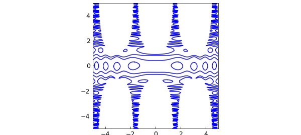
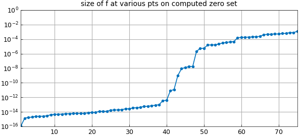
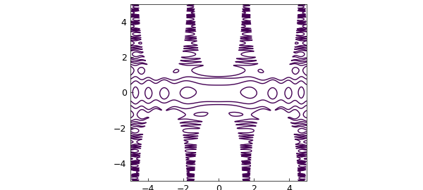

# 2D zero set example of Warwick Tucker

*Nick Trefethen, November 2017*

[Original MATLAB Chebfun example](https://www.chebfun.org/examples/approx2/Tucker.html)

Python translation: [`examples/approx2/tucker.py`](https://github.com/ma-gilles/chebfunjax/blob/main/examples/approx2/tucker.py)

Warwick Tucker has shown me a beautiful example (unpublished). He considers the bivariate function $$ f(x,y) = \sin(\cos(x^2)+10\sin(y^2)) - y\cos(x) $$ in the square $-5\le x, y \le 5$. What is the zero set of this function?

In Chebfun2 we see that $f$ has rank 3:

```matlab
f = chebfun2(@(x,y) sin(cos(x.^2)+10*sin(y.^2))-y.*cos(x),[-5 5 -5 5])
```

```text
f =
   chebfun2 object
       domain                 rank       corner values
[  -5,   5] x [  -5,   5]        3     [ 1.1  1.1 -1.7 -1.7]
vertical scale =   6
Elapsed time is 41.323542 seconds.
```

The `roots` command finds the elegant zero set.

```matlab
tic
c = roots(f);
plot(c,'linewidth',1)
axis([-5 5 -5 5]), axis square
toc
```

```text
(no matching output)
```



Chebfun has found 79 components (the mathematically exact number would be even),

```matlab
size(c)
```

```text
ans =
   Inf    75
```

each of them parametrized by $s\in [-1,1]$,

```matlab
domain(c)
```

```text
ans =
    -1     1
```

and each component is represented by a polynomial of the same painfully high degree (i.e., c is an array-valued chebfun), even though some of them are very simple,

```matlab
length(c)
```

```text
ans =
        16133
Elapsed time is 0.109241 seconds.
```

Though Chebfun2 roots can sometimes get outstanding accuracy, that has not happened in this case. To get an idea of the accuracy, suppose we find the 79 points corresponding to these curves at the arbitrary sample point $s=0.5$ and then evaluate $f$ at these 79 points. In principle the result should be a vector of 79 numbers close to machine epsilon, give or take a few powers of 10 since $f$ has large derivatives, but in fact, many of the numbers are much bigger than that:

```matlab
p = c(0.5,:);
fp = f(p);
semilogy(sort(abs(fp)),'.-')
title('size of f at various pts on computed zero set')
ylim([1e-16 1]), grid on
```



A much faster way to see the zero set is with the Chebfun2 contour command:

```matlab
tic
contour(f,[0 0],'linewidth',1)
axis([-5 5 -5 5]), axis square
toc
```

```text

```



---

*Translated with [chebfunjax](https://github.com/ma-gilles/chebfunjax); prose and MATLAB code from the original example, copyright The University of Oxford and The Chebfun Developers.  Printed outputs and figures are chebfunjax's.*
