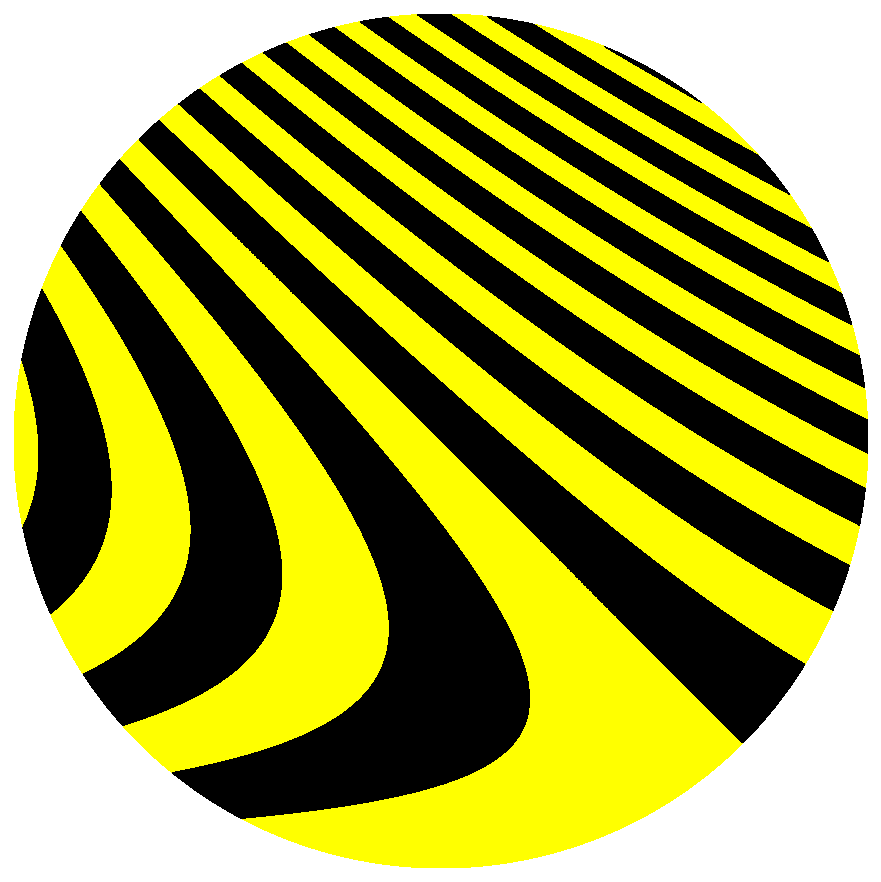
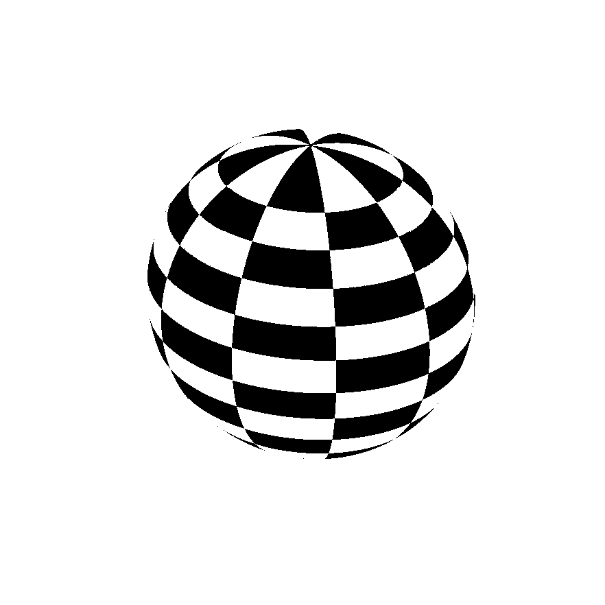
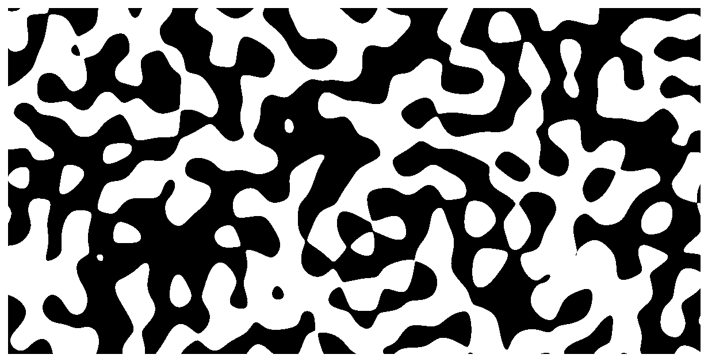
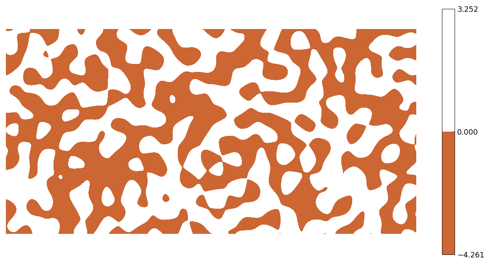
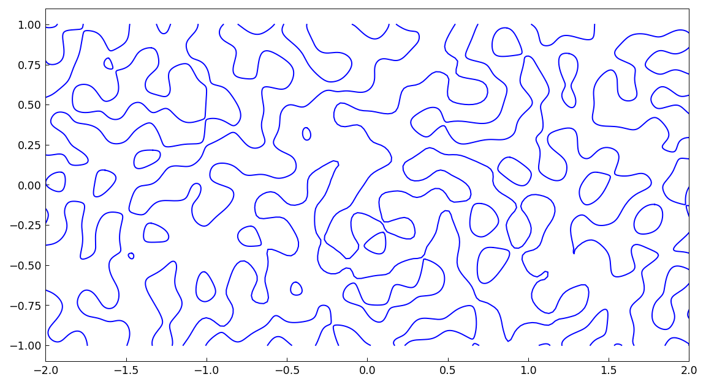

# Zebra plots

[Original MATLAB Chebfun example](https://www.chebfun.org/examples/approx2/Zebra.html)

(Chebfun example approx2/Zebra.m — Nick Trefethen, May 2017)

Instead of a plot showing many function values, sometimes we may wish
to highlight just a plus/minus distinction. For this there is the
`'zebra'` option in Chebfun2, Spherefun, and Diskfun. Here is a zebra
plot of $\sin(20(x+y)(1+y))$ on the disk — with the colors changed
from the usual black/white, for fun:

Normally the plots show zebras rather than bumblebees: negative
values are black and positive values are white. Here is the spherical
harmonic $Y_{15}^5$ on the sphere:

And a random function (`randnfun2(.2,[-2 2 -1 1])`, seeded numpy
stream — MATLAB's rng state is not reproducible outside MATLAB) on a
rectangle:

The same effect can be achieved with `contourf`. In a brownish-orange
color, maybe that makes it a giraffe plot:

Contouring commands are quick and designed for graphical accuracy;
for higher-accuracy resolution of the boundaries one can use `roots`:

---

*Replica script: [`examples/approx2/zebra_replica.py`](https://github.com/ma-gilles/chebfunjax/blob/main/examples/approx2/zebra_replica.py).
Original example copyright by The University of Oxford and The Chebfun
Developers.*
