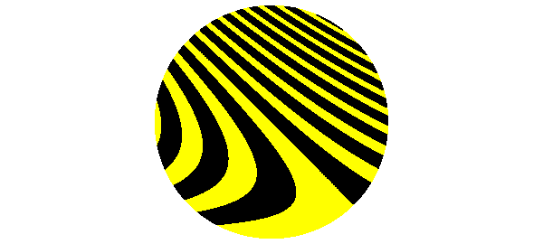
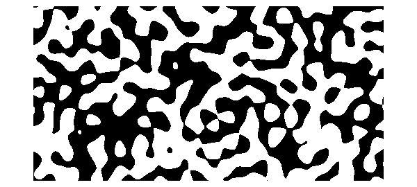
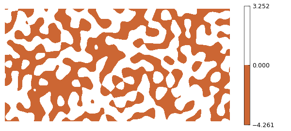
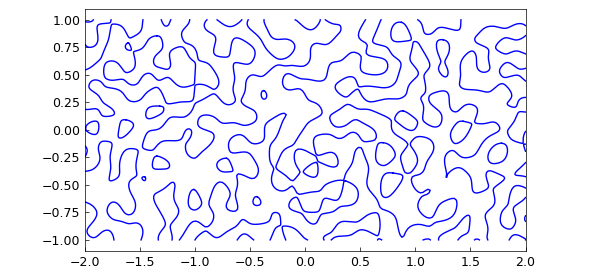

# Zebra plots

*Nick Trefethen, May 2017*

[Original MATLAB Chebfun example](https://www.chebfun.org/examples/approx2/Zebra.html)

Python translation: [`examples/approx2/zebra.py`](https://github.com/ma-gilles/chebfunjax/blob/main/examples/approx2/zebra.py)

Instead of a plot showing many function values, sometime we may wish to highlight just a plus/minus distinction. For this there is the `'zebra'` option in Chebfun2, Spherefun, and Diskfun.

For example, here is zebra plot of a certain function on the disk. For fun we've changed the colors from the usual black/white.

```matlab
cheb.xydisk;
f = sin(20*(x+y).*(1+y));
plot(f, 'zebra')
colormap([1 1 0; 0 0 0])
axis off
```



Normally, however, the plots show zebras rather than bumblebees. Negative values are black and positive values are white. Here is an example on the sphere.

```matlab
f = spherefun.sphharm(15,5);
plot(f,'zebra')
axis off
```


Here is an example on a rectangle.

```matlab
f = randnfun2(.2,[-2 2 -1 1]);
plot(f, 'zebra')
axis equal off
```



It was hardly necessary to give Chebfun a zebra option, merely convenient and memorable. One can achieve the same effect same with the `contourf` command. Here for example is a zebra plot using a brownish-orange color. Maybe that makes it a giraffe plot.

```matlab
clf, contourf(f,[0 0])
colormap([.8 .4 .2; 1 1 1]), colorbar
axis equal off
```



Contouring commands like this are quick and designed for graphical accuracy. If you want higher-accuracy resolution of boundaries (at least if they are not too complicated), you can use `roots`.

```matlab
c = roots(f);
plot(c), axis equal
```



---

*Translated with [chebfunjax](https://github.com/ma-gilles/chebfunjax); prose and MATLAB code from the original example, copyright The University of Oxford and The Chebfun Developers.  Printed outputs and figures are chebfunjax's.*
