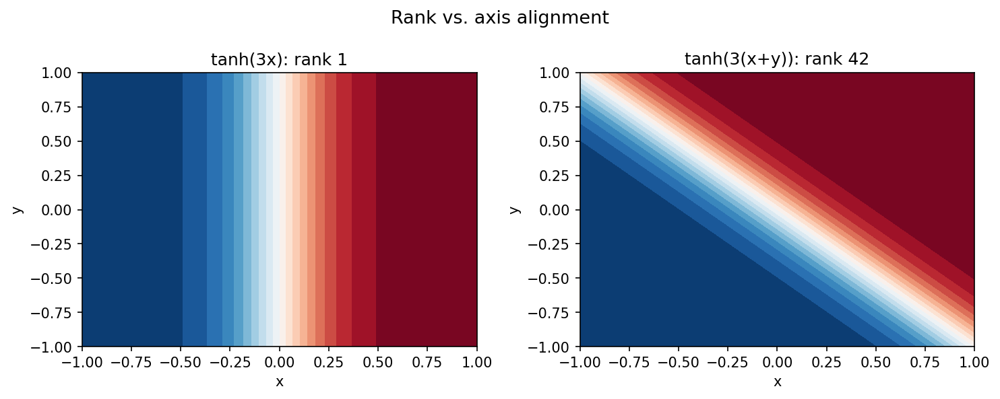
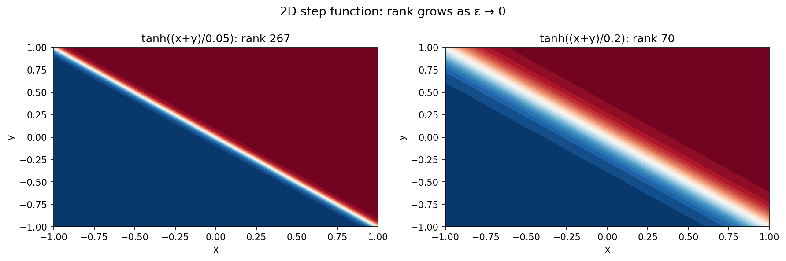
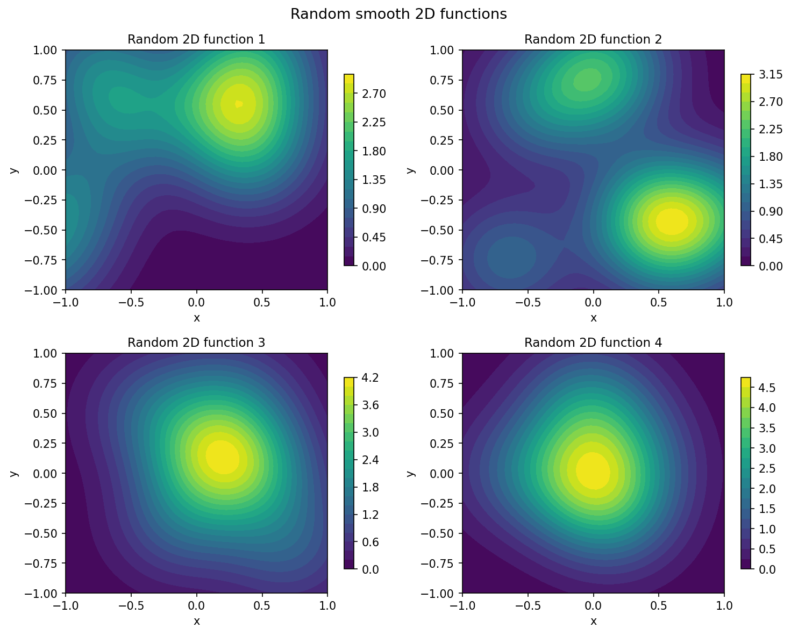
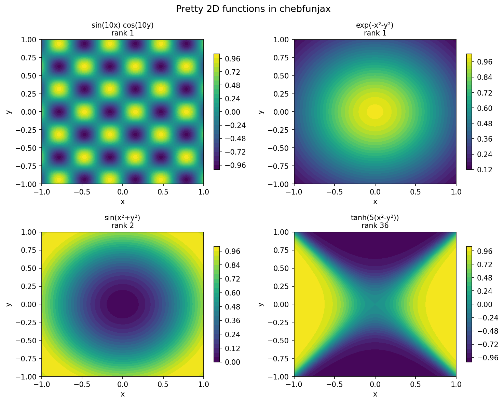

# 2D Approximation Examples (Chebfun2)

Chebfunjax uses a low-rank decomposition to approximate smooth bivariate functions
as sums of rank-1 terms: `f(x,y) ≈ Σ_k u_k(x) v_k(y)`.  This yields compact
representations and fast arithmetic for functions that are well-approximated in
low rank.

---

## Low-rank approximation and axis alignment

**Source:** `approx2/Alignment.m` — Nick Trefethen, April 2016

Functions that depend on only one variable have rank 1.  Rotating by 45° destroys
the separable structure and inflates the rank.

```python
import jax.numpy as jnp
import chebfunjax as cj

# tanh(3x) depends only on x — rank 1
f = cj.chebfun2(lambda x, y: jnp.tanh(3 * x))
print(f.rank)   # 1

# tanh(3(x+y)) mixes both directions — higher rank
g = cj.chebfun2(lambda x, y: jnp.tanh(3 * (x + y)))
print(g.rank)   # >> 1
```



---

## The Gibbs phenomenon in 2D

**Source:** `approx2/Gibbs2D.m` — Andre Uschmajew and Nick Trefethen, February 2017

A sharp transition along the anti-diagonal `x + y = 0` forces many rank-1 terms.
As `ε → 0`, the rank grows like `O(1/ε)`.

```python
eps = 0.05
f = cj.chebfun2(lambda x, y: jnp.tanh((x + y) / eps))
print(f.rank)   # large
```



---

## Random functions in 2D

**Source:** `approx2/Random2D.m` — Nick Trefethen, April 2017

Random smooth functions as sums of localized Gaussian bumps at random centres.

```python
import jax
key = jax.random.PRNGKey(42)
centers = jax.random.normal(key, (8,)) * 0.5
f = cj.chebfun2(lambda x, y: sum(
    jnp.exp(-4*(x - cx)**2 - 4*(y - cy)**2)
    for cx, cy in zip(centers[:4], centers[4:])
))
print(f.rank)
```



---

## Pretty functions in 2D

**Source:** `approx2/PrettyFunctions.m` — Alex Townsend, March 2013

A gallery of visually interesting bivariate functions.

```python
f = cj.chebfun2(lambda x, y: jnp.sin(10*x) * jnp.cos(10*y))
g = cj.chebfun2(lambda x, y: jnp.tanh(5*(x**2 - y**2)))
```


