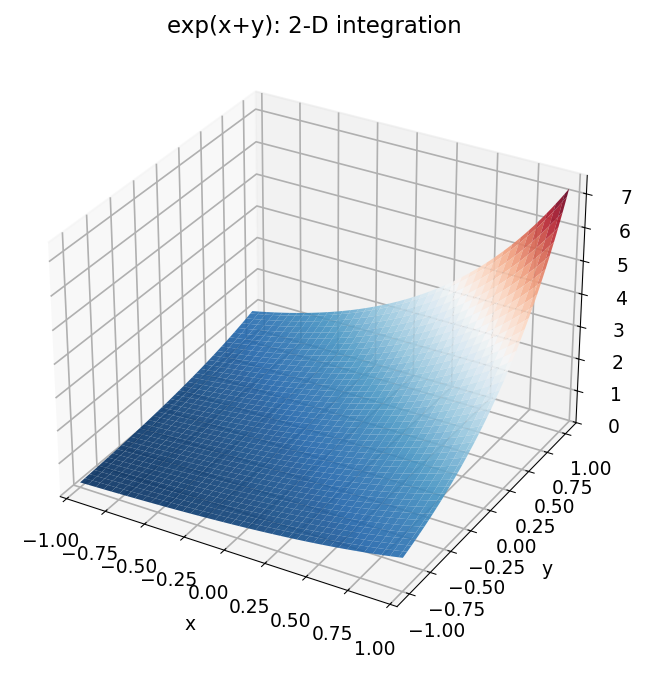
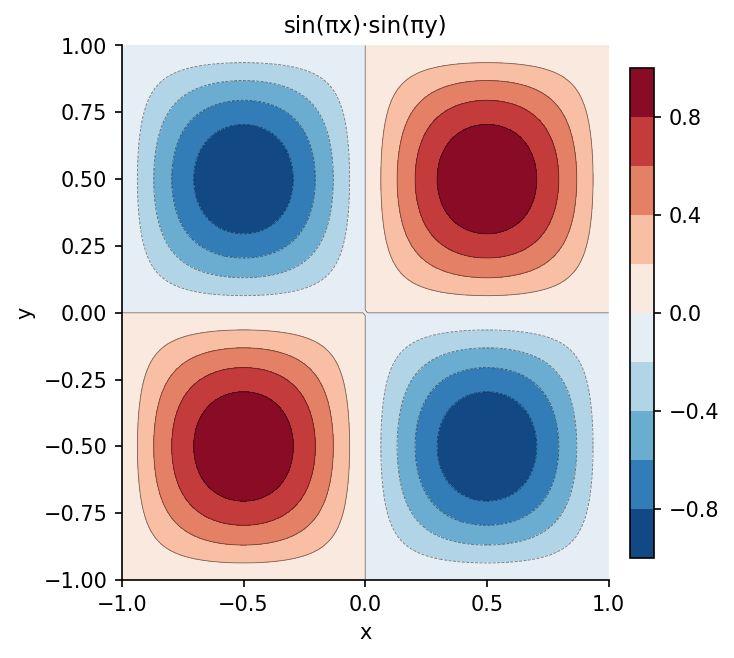

# Integration in 2D

**Inspired by [Chebfun](https://www.chebfun.org/) examples (approx2/Integration)**

---

The `sum` method on a Chebfun2 computes the **double integral** over the domain.
This is equivalent to integrating the Chebyshev expansion analytically, which is
both fast and highly accurate.

## Double integrals

```python
import chebfunjax as cj
import jax.numpy as jnp
import numpy as np

# ∬ cos(x+y) dA over [-1,1]^2
# Exact: 4 * sin(1) * cos(1) ≈ 1.8185...
f = cj.chebfun2(lambda x, y: jnp.cos(x + y))
val = float(f.sum())
exact = 4 * np.sin(1.0) * np.cos(1.0)
print(f"∬ cos(x+y) dA = {val:.10f}  (exact: {exact:.10f})")
```

```
∬ cos(x+y) dA = 1.8185776093  (exact: 1.8185776093)
```

## Iterated integration

A double integral can also be performed as two successive 1D integrals.
For $\int_{-1}^{1} \left(\int_{-1}^{1} f(x,y)\,dx\right) dy$:

```python
# Integrate over x first to get a function of y
fy = cj.chebfun(lambda y: float(
    cj.chebfun(lambda x: jnp.exp(-x**2 - y**2 * jnp.ones_like(x))).sum()
), domain=(-1.0, 1.0))
outer = float(fy.sum())
print(f"Iterated integral: {outer:.8f}")
```



## Volumes under surfaces

```python
# Volume of a bump function
bump = cj.chebfun2(lambda x, y: jnp.exp(-10*(x**2 + y**2)))
vol = float(bump.sum())
print(f"∬ exp(-10(x²+y²)) dA = {vol:.8f}")
```



The chebfun2 `sum` method integrates the Chebyshev expansion term by term,
requiring no quadrature rule and achieving spectral accuracy automatically.
