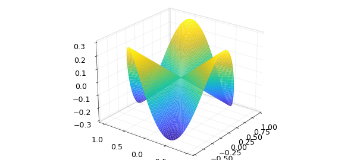
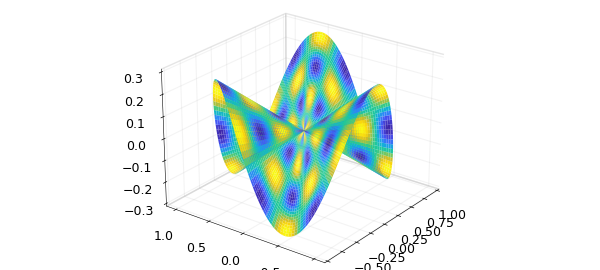
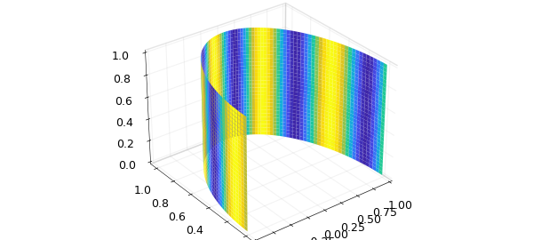
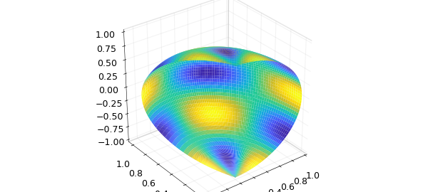
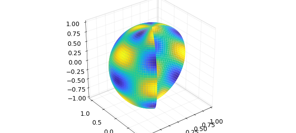
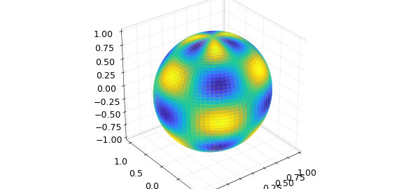

# Triple integrals in spherical, cylindrical and other coordinate systems

*Rodrigo Platte, November 2016*

[Original MATLAB Chebfun example](https://www.chebfun.org/examples/approx3/ChangeVar3D.html)

Python translation: [`examples/approx3/ChangeVar3D.py`](https://github.com/ma-gilles/chebfunjax/blob/main/examples/approx3/ChangeVar3D.py)

## Transformations

In this example we use mappings to compute with functions defined on non-rectangular three dimensional volumes. The mapping variables must be defined on a rectangular domain. In other words, we will use the change of variables

$$ x = x(u,v,w), \ y = y(u,v,w), \ z = z(u,v,w), $$

where $u$, $v$, $w$ are defined as chebfun3 objects on a rectangular domain.

## Triple integrals in spherical coordinates

Here we use spherical coordinates to compute the mass of a "ice-cream cone" region with variable density. The region is defined by

```matlab
r = chebfun3(@(r,t,p) r, [0 1 0 2*pi pi/4 pi/2]);
t = chebfun3(@(r,t,p) t, [0 1 0 2*pi pi/4 pi/2]);
p = chebfun3(@(r,t,p) p, [0 1 0 2*pi pi/4 pi/2]);
x = r.*cos(t).*cos(p);
y = r.*sin(t).*cos(p);
z = r.*sin(p);
```

We can plot the surface of this region using the plot command.

```matlab
plot(x,y,z)
view(-53,24)
```



We now define the density function and graph the surface of the solid colored by the density function.

```matlab
density = sin(10*t).*cos(10*r)+1;
plot(x,y,z,density)
```



The mass of the solid can be found by computing the triple integral in a rectangular region. The change of variables requires us to compute the determinant Jacobian of the transformation.

```matlab
M = integral3(density.*abs(jacobian(x,y,z)));
format long
disp(M)
```

```text
   0.613434123007071
```

To show the accuracy of chebfun3 representations we now consider a simpler density function, for which the exact answer to the triple integral can easily be found.

```matlab
disp(integral3(r.^2.*abs(jacobian(x,y,z))))
disp(pi*(2-sqrt(2))/5)
```

```text
   0.613434123007071
   0.368060473804240
```

## Triple integrals in cylindrical coordinates

In our next example we compute the center of mass of a sector of a cylinder with variable density.

```matlab
r = chebfun3(@(r,t,z) r, [0 1 0 pi 0 1]);
t = chebfun3(@(r,t,z) t, [0 1 0 pi 0 1]);
z = chebfun3(@(r,t,z) z, [0 1 0 pi 0 1]);
x = r.*cos(t);
y = r.*sin(t);

density = y.*sin(10*t)+1;
plot(x,y,z,density)
axis image, view(60,60)

coord = [x; y; z];
jac = abs(jacobian(coord));
```



Mass:

```matlab
M = integral3(density.*jac); disp(M)
```

```text
   0.613434123007071
```

Center of mass:

```matlab
jac = abs(jacobian(x,y,z));
xc2 = integral3(x.*density.*jac)/M;
yc2 = integral3(y.*density.*jac)/M;
zc2 = integral3(z.*density.*jac)/M;
disp([xc2,yc2,zc2])
```

```text
   0.613434123007071
```

## Triple integrals over the torus and other regions

Here is an example were we compute a triple integral over the torus

```matlab
r = chebfun3(@(r,t,p) r, [0 1 0 2*pi 0 2*pi]);
t = chebfun3(@(r,t,p) t, [0 1 0 2*pi 0 2*pi]);
p = chebfun3(@(r,t,p) p, [0 1 0 2*pi 0 2*pi]);
x = (4+r.*cos(t)).*cos(p);
y = (4+r.*cos(t)).*sin(p);
z = r.*sin(t);
f = sin(7*z).*sin(3*x);
```

```matlab
plot(x,y,z,f)
axis tight, axis image
view(-28,31)
disp(integral3(f.*abs(jacobian(x,y,z))))
```

```text
   0.613434123007071
```



In the next two examples we vary the radius of torus to generate other solid regions and the compute the triple integrals.

```matlab
rr = r.*(1+sin(p));
x = (4+rr.*cos(t)).*cos(p);
y = (4+rr.*cos(t)).*sin(p);
z = rr.*sin(t);
plot(x,y,z,f)
axis tight, axis image
view(-28,31)
disp(integral3(f.*abs(jacobian(x,y,z))))
```

```text
   0.613434123007071
```



Here is the other region.

```matlab
rr = r.*(1+0.9*sin(10*p));
x = (4+rr.*cos(t)).*cos(p);
y = (4+rr.*cos(t)).*sin(p);
z = rr.*sin(t);
```

In this case we compute the volume of the region using triple integrals.

```matlab
plot(x,y,z,f)
axis tight, axis image
view(-29,60)

disp(integral3(abs(jacobian(x,y,z))))
```

```text
   0.613434123007071
```



---

*Translated with [chebfunjax](https://github.com/ma-gilles/chebfunjax); prose and MATLAB code from the original example, copyright The University of Oxford and The Chebfun Developers.  Printed outputs and figures are chebfunjax's.*
