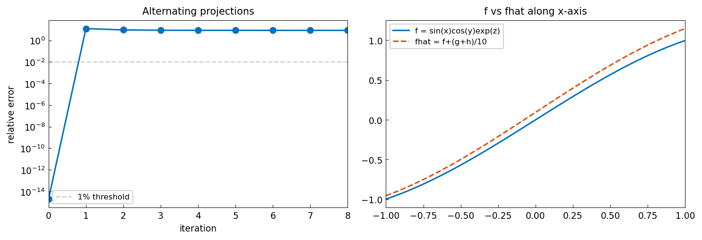

# Finding a Trivariate Basis of Rank-One Functions

*Yuji Nakatsukasa, June 2016*

*Original: [Finding a trivariate basis of rank-one functions — Chebfun](https://www.chebfun.org/examples/approx3/FindingRankOne.html)*

---

## Rank-One Trivariate Functions

A function $f(x,y,z) = f_x(x) f_y(y) f_z(z)$ is called **rank one** in
Tucker format. When a Chebfun3 is constructed from such a function,
it is detected automatically:

```python
from chebfunjax.chebfun3d.chebfun3 import chebfun3
import jax.numpy as jnp

f = chebfun3(lambda x, y, z: jnp.sin(x) * jnp.cos(y) * jnp.exp(z))
g = chebfun3(lambda x, y, z: jnp.cos(x) * jnp.exp(y) * jnp.sin(z))
h = chebfun3(lambda x, y, z: jnp.exp(x) * jnp.sin(y) * jnp.cos(z))

print(f"f rank: {f.rank}")  # (1, 1, 1)
print(f"g rank: {g.rank}")  # (1, 1, 1)
print(f"h rank: {h.rank}")  # (1, 1, 1)
```

A sum of $k \geq 2$ rank-one functions is typically of Tucker rank $k$:

```python
fhat = chebfun3(
    lambda x, y, z: (
        jnp.sin(x)*jnp.cos(y)*jnp.exp(z)
        + (jnp.cos(x)*jnp.exp(y)*jnp.sin(z)
           + jnp.exp(x)*jnp.sin(y)*jnp.cos(z)) / 10
    )
)
print(f"fhat rank: {fhat.rank}")  # (3, 3, 3)
```

## Finding a Basis of Rank-One Functions

Given the rank-3 function $\hat f = f + (g+h)/10$ along with known rank-one
functions $g$ and $h$, we want to recover $f$ such that:

(i) $f$ is rank one, and
(ii) $\hat f, g, h$ and $f, g, h$ span the same subspace.

This is a higher-order continuous analogue of a problem from matrix subspace
analysis [1].

The algorithm uses **alternating projections** between:
- The subspace $\text{span}\{\hat f, g, h\}$ (sampled on a grid), and
- The set of rank-one functions (via truncated SVD).

```python
import numpy as np

n = 10  # grid size
# Sample on Chebyshev grid and form the subspace basis Q
k_arr = np.arange(n)
t = -np.cos(k_arr * np.pi / (n-1))
XX, YY, ZZ = np.meshgrid(t, t, t, indexing="ij")

G_vec = np.array(g(XX, YY, ZZ)).reshape(-1)
H_vec = np.array(h(XX, YY, ZZ)).reshape(-1)
F_hat_vec = np.array(fhat(XX, YY, ZZ)).reshape(-1)

Q, _ = np.linalg.qr(np.column_stack([G_vec, H_vec, F_hat_vec]))

# Alternating projection iterations
Fcur = F_hat_vec.copy()
for it in range(8):
    Fcur = Q @ (Q.T @ Fcur)           # project onto subspace
    Fmat = Fcur.reshape(n, n*n)
    U, s, Vt = np.linalg.svd(Fmat, full_matrices=False)
    Fcur = s[0] * np.outer(U[:,0], Vt[0,:]).reshape(-1)  # rank-1 approx
```



## References

1. D. Drusvyatskiy, A. D. Ioffe, and A. D. Lewis, Transversality and alternating
   projections for nonconvex sets, *Found. Comput. Math.* 15 (2015), 1637–1651.

2. Y. Nakatsukasa, T. Soma, and A. Uschmajew, Finding a low-rank basis in a
   matrix subspace, *Mathematical Programming* (2017).
