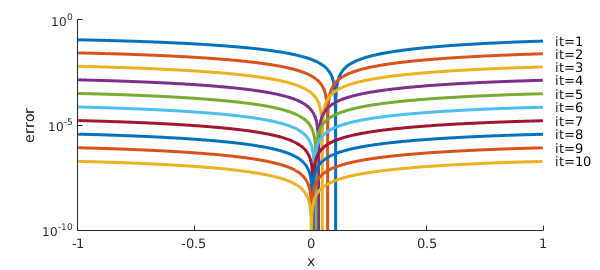
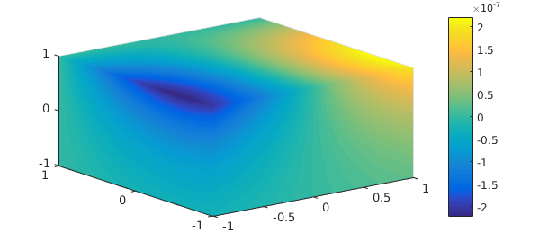
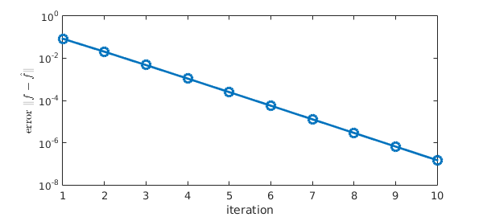

<!-- Generated by scripts/sync_chebfun_examples.py. -->
<!-- Source: https://www.chebfun.org/examples/approx3/FindingRankOne.html -->

<h1>Finding a trivariate basis of rank-one functions</h1>
<h2>Yuji Nakatsukasa, June 2016 in <a href='../'>approx3</a><a href='/examples/approx3/FindingRankOne.m'>download</a>&middot;<a href='//github.com/chebfun/examples/blob/master/approx3/FindingRankOne.m'>view on GitHub</a></h2>

<h3 id="1-rank-one-trivariate-functions">1. Rank-one trivariate functions</h3>

When a chebfun3 is constructed for a rank-one function $f(x,y,z) = f_x(x)f_y(y)f_z(z)$, Chebfun is able to detect its numerical rank for efficient storage and subsequent computation.

<pre class="mcode-input">f = chebfun3(@(x,y,z) sin(x).*cos(y).*exp(z));
rank(f)</pre>

<pre class="mcode-output">ans =
     1
</pre>

A sum of $k\ (\geq 2)$ rank-one functions is usually of rank $k$ (Tucker rank; note that for rank-one functions, the Tucker and CP ranks are the same).  For example,

<pre class="mcode-input">g = chebfun3(@(x,y,z) cos(x).*exp(y).*sin(z));
h = chebfun3(@(x,y,z) exp(x).*sin(y).*cos(z));
fhat = f+(g+h)/10;
rank(fhat)</pre>

<pre class="mcode-output">ans =
     3
</pre>

<h3 id="2-finding-a-basis-of-rank-one-functions">2. Finding a basis of rank-one functions</h3>

Now consider the following problem. Given the rank-three function $\hat f$ along with the rank-one functions $g$ and $h$, we would like to find (or "recover") the function $f$ such that

(i) $f$ is rank one, and

(ii) $\hat f,g,h$ and $f,g,h$ span the same subspace.

Put another way, we are looking for a basis consisting of rank-one functions for the subspace spanned by $\hat f,g,h$. This is a higher-order and continuous analogue of the problem considered in [1] (and simplified to the rank-one case). A convenient way to obtain a rank-one function close to $\hat f$ is to do

<pre class="mcode-input">ftmp = chebfun3(@(x,y,z) fhat(x,y,z),'rank',[1 1 1]);</pre>

(An alternative approach is to do simplify(fhat,'rank',1e0), which is slightly different but gives a similar outcome below) Note that ftmp, although rank-one, does not lie in the span of $\hat f,g,h$, violating (ii). Indeed it is not close to the desired $f$:

<pre class="mcode-input">scale = f(1,1,1)/ftmp(1,1,1); % scalar scaling
norm(f-ftmp*scale)</pre>

<pre class="mcode-output">ans =
   0.304836799578982
</pre>

Here is a simple algorithm, analogous to that in [2], that correctly finds the function $f$. It is based on alternating projection between rank-one functions and the subspace of trivariate functions spanned by $\hat f,g,h$.

<pre class="mcode-input">MS = 'Markersize'; ms = 18;LW = 'linewidth';
LW = 'linewidth'; MS = 'markersize'; FS = 'fontsize';
TEX = 'interpreter';tex = 'latex';
lw = 2; ms = 12; fs = 14; ffs = 12;

n = length(f);
G = reshape(sample(g,n,n,n),[n^3,1]); % form vectors of values at Chebyshev tensor grid
H = reshape(sample(h,n,n,n),[n^3,1]);
F = reshape(sample(fhat,n,n,n),[n^3,1]);
[Q,~] = qr([G H F],0);                % Q is the subspace spanned by $fhat,g,h$

clf, hold on
for it = 1:10
    Ftmp = reshape(sample(ftmp,n,n,n),[n^3,1]);
    Ftmp = Q*(Q'*Ftmp);               % projection onto subspace
    ftmp = chebfun3(reshape(Ftmp,n,n,n),'rank',[1 1 1]); % proj onto rank-1 funs
   %ftmp = simplify(chebfun3(reshape(Ftmp,n,n,n)),'rank',1e0); % alternative to above
    scale = f(1,1,1)/ftmp(1,1,1);     % scalar scaling
    err(it) = norm(f-ftmp*scale);
    e = abs(f.cols-ftmp.cols*scale);
    semilogy(e,LW,lw)
    text(1.05,e(end),['it=',int2str(it)])
end
ylim([1e-10 1])
xlabel('x',FS,fs)
ylabel('error',FS,fs)</pre>

The figure shows the $x$-component $|\hat f_x(x)-f_x(x)|$ of the error in $\hat f$, which is apparently converging to 0. Here is a 3-D plot of the error.

<pre class="mcode-input">hold off
plot(f-ftmp*scale)</pre>

The last plots suggest linear convergence of $\hat f$ to $f$ in the whole unit cube. Indeed, it is known [1] that under mild assumptions and with an initial guess close to an intersection point, alternating projections converges linearly to the intersection. For this example; the convergence of $|f-\hat f|$ is convincingly linear.

<pre class="mcode-input">semilogy(err,'-o',LW,lw)
xlabel('iteration',FS,fs)
ylabel('error $\|f-\hat f\|$',TEX,tex,FS,fs)</pre>

<h3 id="3-references">3. References</h3>

[1] D. Drusvyatskiy, A. D. Ioffe, and A. D. Lewis, Transversality and alternating projections for nonconvex sets, <em>Found. Comput. Math.</em> 15 (2015), 1637-1651.

[2] Y. Nakatsukasa, T. Soma, and A. Uschmajew, Finding a low-rank basis in a matrix subspace, <em>Mathematical Programming</em>, to appear.

        

    

