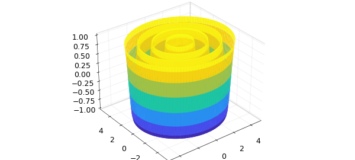
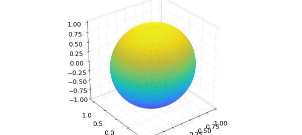

# Integration of a chebfun3v over a 2D surface

*Olivier Sète, June 2016*

[Original MATLAB Chebfun example](https://www.chebfun.org/examples/approx3/FluxIntegral3D.html)

Python translation: [`examples/approx3/FluxIntegral3D.py`](https://github.com/ma-gilles/chebfunjax/blob/main/examples/approx3/FluxIntegral3D.py)

In this example we illustrate the computation of the flux of a vector field through a 2D surface in 3D space with the `integral2` command.

Assume we have a surface given by a parametrization $S = S(u,v)$ defined on $D = [a,b] \times [c,d]$, represented by a 3-component chebfun2v (i.e., each point in the 2D domain $D$ is mapped to a point in 3D).

Let $F(x,y,z) = [F_1(x,y,z); F_2(x,y,z); F_3(x,y,z)]$ be a vector field defined over a box containing the surface (i.e., $S(D)$). We can then compute its flux through the surface by the flux integral $$\int_S F \cdot \vec{dS} = \int_D F(S(u,v)) \cdot \left( \frac{\partial S}{\partial u}(u,v) \times \frac{\partial S}{\partial v}(u,v) \right) \, dudv. $$ When $F$ is represented as a chebfun3v object, this integral can be computed with `integral2`.

Let us consider the vector field $F$:

```matlab
format long
dom = [-5, 5, -5, 5, -1, 1];
F = chebfun3v(@(x,y,z) x+y, @(x,y,z) x.*z + y, @(x,y,z) z, dom);
```

As our first example, let us consider the rippled disk parametrized by

```matlab
S = chebfun2v(@(r, t) r .* cos(t), @(r, t) r.*sin(t), @(r, t) cos(5*r), ...
    [0, 5, 0, 2*pi]);
surf(S), axis equal
```



To compute the flux of $F$ through $S$ we simply type

```matlab
integral2(F, S)
```

```text
integral2(F, S) [rippled disk] = -1.581991782367625e+02
integral2(F, S) [lower hemisphere] = -6.283185307179586
```

As a second example, we take $S$ to be the lower half of the unit sphere, parametrized by

```matlab
S = chebfun2v(@(phi, theta) sin(theta) .* cos(phi), ...
    @(phi, theta) sin(theta) .* sin(phi), @(phi, theta) cos(theta), ...
    [0, 2*pi, pi/2, pi]);
surf(S), axis equal
```



The flux of $F$ through this "bowl" is

```matlab
integral2(F, S)
```

```text
integral2(F, S) [rippled disk] = -1.581991782367625e+02
integral2(F, S) [lower hemisphere] = -6.283185307179586
```

This matches nicely the exact value $-2\pi$

```matlab
-2*pi
```

```text
integral2(F, S) [rippled disk] = -1.581991782367625e+02
integral2(F, S) [lower hemisphere] = -6.283185307179586
```

We can also integrate a scalar function $f = f(x,y,z)$ over a surface with the following surface integral: $$\int_S f \, dS = \int_D f(S(u,v)) \left\Vert \frac{\partial S}{\partial u}(u,v) \times \frac{\partial S}{\partial v}(u,v) \right\Vert \, dudv. $$ Note the difference to the flux integral: here we take the norm of the cross product. When $f$ is represented by a chebfun3 object, this integral can be computed with `integral2`.

Of course we can also integrate over curves in Chebfun3. This is done with `integral`. See [http://www.chebfun.org/examples/approx3/LineIntegral3D.html](LineIntegral3D.md) for integration of a scalar function over a curve and [http://www.chebfun.org/examples/approx3/GaussGreenStokes.html](GaussGreenStokes.md) for integrals of vector fields along a curve.

---

*Translated with [chebfunjax](https://github.com/ma-gilles/chebfunjax); prose and MATLAB code from the original example, copyright The University of Oxford and The Chebfun Developers.  Printed outputs and figures are chebfunjax's.*
