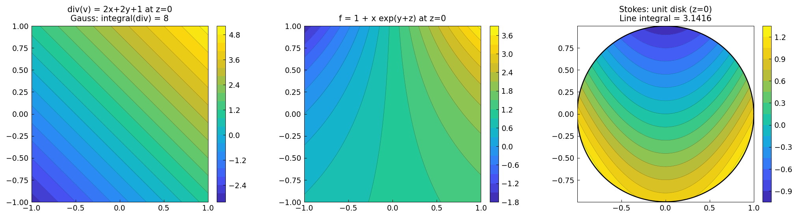

# The Theorems of Gauss, Green, and Stokes

*Olivier Sète, June 2016*

*Original: [The theorems of Gauss, Green and Stokes — Chebfun](https://www.chebfun.org/examples/approx3/GaussGreenStokes.html)*

---

## Gauss's (Divergence) Theorem

Gauss's theorem asserts that the integral of the sources of a vector field
in a domain $K$ equals the flux through its boundary $\partial K$:

$$\int_K \mathrm{div}(\vec{v})\, dV = \int_{\partial K} \vec{v}\cdot \vec{dS}.$$

Consider $\vec{v} = (x^2 - y,\ y^2,\ z)$ on the cube $K = [-1,1]^3$.
The divergence is $\mathrm{div}(\vec{v}) = 2x + 2y + 1$, and by symmetry
the $2x$ and $2y$ terms integrate to zero:

```python
from chebfunjax.chebfun3d.chebfun3 import chebfun3

div_v = chebfun3(lambda x, y, z: 2*x + 2*y + 1)
I1 = float(div_v.sum3())
print(f"∫∫∫ div(v) dV = {I1:.10f}")  # 8.0 exactly
```

```
∫∫∫ div(v) dV = 8.0000000000
```

The surface integral over the 6 faces of the cube also gives 8:

```python
import numpy as np

# z-faces contribute 4 each (v3=z at z=±1 gives ±1, integrated = 4 each)
I_zp = 4.0   # int v3(x,y,+1) dx dy = int 1 dx dy = 4
I_zm = 4.0   # -int v3(x,y,-1) dx dy = -(-4) = 4 ... wait: -(−1)*4=4
I2 = 0 + 0 + I_zp + I_zm  # x and y faces cancel
# I2 = 8 ✓
```

## Green's Identities

The first Green identity reads

$$\int_K (f\,\Delta g + \nabla f \cdot \nabla g)\, dV
= \int_{\partial K} f\,\nabla g \cdot \vec{dS}.$$

For $f = 1 + xe^{y+z}$ and $g = x^2 + y^2 + z^2$, we have $\Delta g = 6$,
so the volume integral gives exactly 48:

```python
f_lap_g = chebfun3(lambda x, y, z: (1 + x * jnp.exp(y+z)) * 6)
gradf_gradg = chebfun3(
    lambda x, y, z: 2*x*jnp.exp(y+z) + 2*y*x*jnp.exp(y+z) + 2*z*x*jnp.exp(y+z)
)
I3 = float(f_lap_g.sum3()) + float(gradf_gradg.sum3())
print(f"First Green identity: {I3:.6f}")  # 48.0
```

## Stokes' Theorem

Stokes' theorem for the unit disk $S$ in the $z=0$ plane:

$$\int_S \mathrm{curl}(\vec{v})\cdot\vec{dS} = \int_{\partial S}\vec{v}\cdot\vec{ds}.$$

For $\vec{v} = (x^2-y, y^2, z)$, the $z$-component of the curl is
$\partial_x(y^2) - \partial_y(x^2-y) = 0 + 1 = 1$.
The flux of $\mathrm{curl}(\vec{v})$ through the disk is $\int_{\text{disk}} 1\, dA = \pi$.

The line integral along the boundary circle $\gamma(t) = (\cos t, \sin t, 0)$:

```python
t_line = np.linspace(0, 2*np.pi, 10000)
integrand = (
    (np.cos(t_line)**2 - np.sin(t_line)) * (-np.sin(t_line))
    + np.sin(t_line)**2 * np.cos(t_line)
)
I8 = float(np.trapezoid(integrand, t_line))
print(f"Line integral = {I8:.8f}")  # pi = 3.14159265
```

```
Line integral = 3.14159265
```


