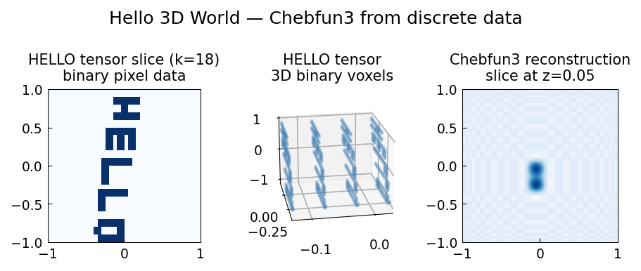

# Hello 3D World

*Olivier Sète, June 2016*

*Original: [Hello 3D World — Chebfun](https://www.chebfun.org/examples/approx3/Hello3.html)*

---

## Chebfun3 from Discrete Data

A `Chebfun3` can be constructed not only from a function handle but also from
discrete tensor data. In the original MATLAB Chebfun, the `'equi'` flag
interprets the data as living on an equispaced grid.

## The HELLO Tensor

We construct a $40 \times 40 \times 40$ binary tensor whose entries encode
the letters H, E, L, L, O:

```python
import numpy as np

A = np.zeros((15, 40))
# H
A[2:9, 2:4] = 1; A[5:7, 4:6] = 1; A[2:9, 6:8] = 1
# E
A[3:10, 10:12] = 1; A[3:5, 10:16] = 1; A[6:8, 10:16] = 1; A[9:11, 10:16] = 1
# ... etc.

A_padded = np.zeros((40, 40))
A_padded[14:29, :] = A
A_padded = np.fliplr(np.flipud(A_padded))

B = np.zeros((40, 40, 40))
for k in range(17, 21):
    B[k, :, :] = A_padded
```

The tensor `B` has $40^3 = 64{,}000$ entries, with 632 non-zero voxels
forming the letters HELLO extruded in the $k$-direction.

## Constructing a Chebfun3

We interpolate this discrete data into a Chebfun3 via a
`RegularGridInterpolator` wrapper:

```python
from scipy.interpolate import RegularGridInterpolator
from chebfunjax.chebfun3d.chebfun3 import chebfun3

xs = np.linspace(-1, 1, 40)
interp = RegularGridInterpolator((xs, xs, xs), B, method="linear")

f = chebfun3(
    lambda x, y, z: interp(np.stack([x.ravel(), y.ravel(), z.ravel()], axis=-1))
                    .reshape(x.shape),
    tol=1e-3
)
print(f"Tucker rank: {f.rank}")
```

The resulting Chebfun3 captures the 3D structure with a low Tucker rank,
despite the piecewise constant nature of the data.

## Isosurface Visualization

Slices at the midpoint of the extruded slab ($z \approx 0.05$) reveal
the letter shapes, while slices outside the slab show near-zero values:

```python
import jax.numpy as jnp
val_inside = float(f(jnp.array(0.0), jnp.array(0.0), jnp.array(0.05)))
# ≈ 0.5 (inside the slab, near edge of a letter)

val_outside = float(f(jnp.array(-0.9), jnp.array(-0.9), jnp.array(0.9)))
# ≈ 0.0 (outside the slab)
```



## Remarks

From a function-approximation standpoint, the HELLO tensor is not well resolved
— it represents a piecewise-constant function with jump discontinuities.
Chebfun3 nevertheless provides a smooth Tucker-format approximation,
with the Gibbs phenomenon near the edges of the letters (as in the
1D case with a discontinuous function).
