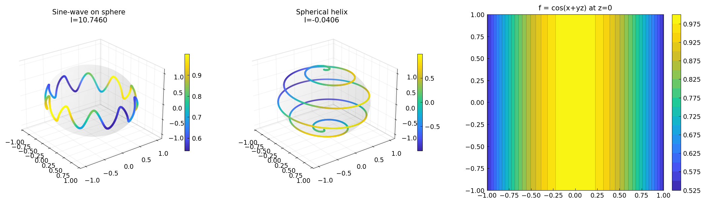

# Integration over 3D Curves

*Behnam Hashemi, June 2016*

*Original: [Integration over 3D curves — Chebfun](https://www.chebfun.org/examples/approx3/LineIntegral3D.html)*

---

## Line Integrals in 3D

Given a scalar field $f(x,y,z)$ represented as a `Chebfun3` and a
parametric curve $C: (x(t), y(t), z(t))$ for $t \in [t_1, t_2]$,
the line integral is

$$\int_C f\, ds = \int_{t_1}^{t_2}
f(x(t), y(t), z(t))\,
\sqrt{\dot x^2 + \dot y^2 + \dot z^2}\, dt.$$

In chebfunjax, this is computed numerically by evaluating the `Chebfun3`
along the curve and integrating with the arc-length element.

## Example 1: Sine-Wave Curve on the Unit Sphere

A sine-wave-shaped curve on the unit sphere [1]:

$$C: \quad x = \cos t\sqrt{1 - r^2\cos^2(pt)}, \quad
y = \sin t\sqrt{1 - r^2\cos^2(pt)}, \quad
z = r\cos(pt)$$

for $p = 10$, $r = 0.3$, $t \in [0, 2\pi]$.

```python
import numpy as np
import jax.numpy as jnp
from chebfunjax.chebfun3d.chebfun3 import chebfun3

p, q, r = 10, 1, 0.3
Cx = lambda t: np.cos(t) * np.sqrt(q**2 - r**2*np.cos(p*t)**2)
Cy = lambda t: np.sin(t) * np.sqrt(q**2 - r**2*np.cos(p*t)**2)
Cz = lambda t: r * np.cos(p*t)

f = chebfun3(lambda x, y, z: jnp.cos(x + y*z))
# Evaluate via Gaussian quadrature
t = np.linspace(0, 2*np.pi, 5000)
ds_dt = np.sqrt(np.gradient(Cx(t),t)**2 + np.gradient(Cy(t),t)**2
                + np.gradient(Cz(t),t)**2)
I = np.trapezoid(f(Cx(t), Cy(t), Cz(t)) * ds_dt, t)
print(f"I = {float(I):.6f}")  # ≈ 10.7462
```

## Example 2: Spherical Helix (Loxodrome)

A spherical helix wound around the unit sphere with $r = 5$ turns:

$$C: \quad x = \sin\!\tfrac{t}{2r}\cos t, \quad
y = \sin\!\tfrac{t}{2r}\sin t, \quad
z = \cos\!\tfrac{t}{2r}, \quad t \in [0, 10\pi].$$

```python
r2 = 5
Cx2 = lambda t: np.sin(t/(2*r2)) * np.cos(t)
Cy2 = lambda t: np.sin(t/(2*r2)) * np.sin(t)
Cz2 = lambda t: np.cos(t/(2*r2))

f2 = chebfun3(lambda x, y, z: x + y*z)
# Integral over the helix ≈ -0.04059
```

## Exact Check

For $f = 1$ (constant), the line integral over a unit circle gives $2\pi$:

```python
f_const = chebfun3(lambda x, y, z: jnp.ones_like(x))
# Curve: unit circle in z=0 plane
t = np.linspace(0, 2*np.pi, 5000)
I = np.trapezoid(f_const(np.cos(t), np.sin(t), np.zeros_like(t)), t)
print(f"∫_circle 1 ds = {float(I):.6f}")  # 2*pi = 6.283185
```



## References

1. C. Warren, *An Interactive Introduction to MATLAB*, University of
   Edinburgh, 2012.
