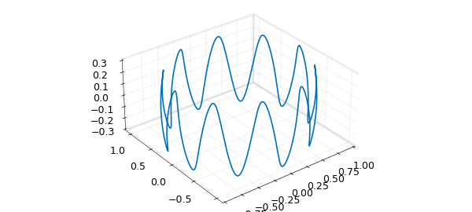
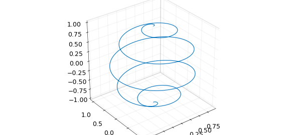

# Integration over 3D curves

*Behnam Hashemi, June 2016*

[Original MATLAB Chebfun example](https://www.chebfun.org/examples/approx3/LineIntegral3D.html)

Python translation: [`examples/approx3/LineIntegral3D.py`](https://github.com/ma-gilles/chebfunjax/blob/main/examples/approx3/LineIntegral3D.py)

Assume that $f(x,y,z)$ is a function defined over a box $[a, b] \times [c, d] \times [e, g]$ represented by a chebfun3 and $C$ is a 3D curve defined by a parameterization $$ C = \{ (x,y,z): ~x = x(t),~ y = y(t),~ z = z(t),~~ t_1 \leq t \leq t_2 \}. $$ Our aim is to compute the line integral of $f$ over $C$. Recall from calculus that $$ \int_C f(x,y,z) ds = \int_{t_1}^{t_2} f(x(t), y(t), z(t)) \sqrt{(\frac{dx}{dt})^2 + (\frac{dy}{dt})^2 + (\frac{dz}{dt})^2} \, dt. $$

We can use the `integral` command of Chebfun3 to compute the path integral. To get a meaningful result, the range of $C$ should be in the domain of $f$. Here is a line integral of $\cos(x+yz)$ over a curve in the form of a sine wave on the unit sphere [p. 30, 1].

```matlab
format long, p = 10; q = 1; r = 0.3;
C = chebfun(@(t) [cos(t).*sqrt(q^2-r^2*(cos(p*t)).^2) ...
                      sin(t).*sqrt(q^2-r^2*(cos(p*t)).^2) ...
                      r*cos(p*t)], [0, 2*pi]);
plot3(C(:,1), C(:,2), C(:,3)), axis equal
f = chebfun3(@(x,y,z) cos(x+y.*z));
I = integral(f, C)
```

```text
I =
  10.746250564473526
```



As a second example, consider integration of $x+yz$ over a spherical helix (a special case of a more general type of curve known as a loxodrome).

```matlab
r = 5;
C = chebfun(@(t) [sin(t/(2*r)).*cos(t) sin(t/(2*r)).*sin(t) ...
    cos(t/(2*r))], [0, 10*pi]);
plot3(C(:,1), C(:,2), C(:,3)), axis equal
f = chebfun3(@(x,y,z) x+y.*z );
I = integral(f, C)
```

```text
I =
  -0.040586850422706
```



## References

1. C. Warren, *An Interactive Introduction to MATLAB*, University of Edinburgh, 2012.

---

*Translated with [chebfunjax](https://github.com/ma-gilles/chebfunjax); prose and MATLAB code from the original example, copyright The University of Oxford and The Chebfun Developers.  Printed outputs and figures are chebfunjax's.*
