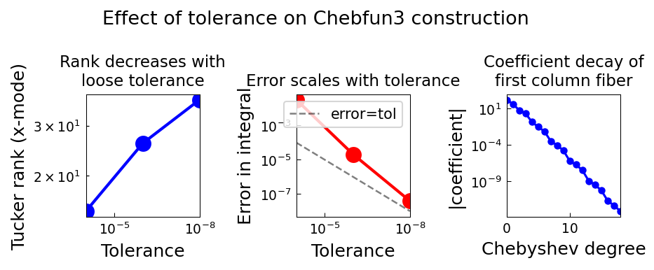

# Loosening the Chebfun3 Tolerance

*Nick Trefethen, June 2016*

*Original: [Loosening the Chebfun3 tolerance — Chebfun](https://www.chebfun.org/examples/approx3/Tolerance.html)*

---

## Tolerances in Chebfun3

Chebfun3's default tolerance is machine precision (~2.2e-16). In 3D,
however, the Tucker construction can be slow for complicated functions,
and often a looser tolerance is entirely adequate.

## Machine Precision: Simple Function

For a function of moderate complexity,
$f(x,y,z) = e^{\sin(xyz + e^{xyz})}$,
machine precision is fast to achieve:

```python
import time
import jax.numpy as jnp
from chebfunjax.chebfun3d.chebfun3 import chebfun3

t0 = time.time()
f = chebfun3(lambda x, y, z: jnp.exp(jnp.sin(x*y*z + jnp.exp(x*y*z))))
print(f"rank={f.rank}, I={float(f.sum3()):.8f}, time={time.time()-t0:.2f}s")
```

```
rank=(25, 25, 25), I=17.88569341, time=5.8s
```

## Loosening the Tolerance for Complicated Functions

For a more complex function $g(x,y,z) = e^{\sin(10xyz + e^{xyz})}$,
using tol=1e-8 instead of machine precision gives a significant speedup
with negligible loss of accuracy:

```python
# Machine precision:
g_full = chebfun3(lambda x, y, z: jnp.exp(jnp.sin(10*x*y*z + jnp.exp(x*y*z))))
# rank=(68,67,67), I=13.58002095, time=11.9s

# Tolerance 1e-8:
g_loose = chebfun3(
    lambda x, y, z: jnp.exp(jnp.sin(10*x*y*z + jnp.exp(x*y*z))),
    tol=1e-8
)
# rank=(37,36,37), I=13.58002099, error=3.9e-08, time=6.0s
```

The Tucker rank drops from 68 to 37, and the error in the integral is
only $3.9 \times 10^{-8}$.

## Effect on Tucker Rank and Accuracy

| Tolerance | Tucker rank | Integral $I$ | Error |
|-----------|-------------|--------------|-------|
| machine   | (68,67,67)  | 13.58002095  | —     |
| 1e-8      | (37,36,37)  | 13.58002099  | 3.9e-8|
| 1e-6      | (26,26,26)  | 13.58004156  | 2.1e-5|
| 1e-4      | (15,16,16)  | 13.54858267  | 3.1e-2|

```python
for tol in [1e-8, 1e-6, 1e-4]:
    g = chebfun3(
        lambda x, y, z, _t=tol: jnp.exp(jnp.sin(10*x*y*z + jnp.exp(x*y*z))),
        tol=tol
    )
    print(f"tol={tol:.0e}: rank={g.rank}, I={float(g.sum3()):.6f}")
```

## Coefficient Decay

The Chebyshev coefficients of each Tucker fiber decay rapidly,
confirming that the approximation is well-resolved:

```python
# Access first column fiber's Chebyshev coefficients
col0_coeffs = abs(f.cols[0].coeffs)
# Coefficients decrease from O(1) to machine precision
```


