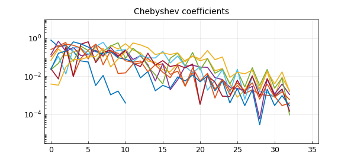

# Loosening the Chebfun3 tolerance

*Nick Trefethen, June 2016*

[Original MATLAB Chebfun example](https://www.chebfun.org/examples/approx3/Tolerance.html)

Python translation: [`examples/approx3/Tolerance.py`](https://github.com/ma-gilles/chebfunjax/blob/main/examples/approx3/Tolerance.py)

## 1. Tolerances in Chebfun

Chebfun's default tolerance is machine precision in 1D, 2D, and 3D:

```matlab
chebfuneps
chebfun2eps
chebfun3eps
```

```text
ans =
     2.220446049250313e-16
ans =
     2.220446049250313e-16
ans =
     2.220446049250313e-16
```

In 1D, there is usually not much to be gained by loosening the tolerance (unless you are working with noisy functions), and we have long recommended that users leave `chebfuneps` at its factory value. (There is an FAQ question at `www.chebfun.org` on this topic.) In 2D and especially 3D, however, loosening the tolerance is often worthwhile. This is discussed in Section 18.10 of the *Chebfun Guide*.

The reason the default tolerance is machine precision is that accurate results are often easily achievable. For example, suppose we want to compute the triple integral $$ I = \int_{-1}^1 \int_{-1}^1 \int_{-1}^1 \exp(\sin(xyz + \exp(xyz))) dz dy dx . $$ We could do it like this,

```matlab
tic
f = chebfun3(@(x,y,z) exp(sin(x.*y.*z + exp(x.*y.*z))));
format long
I = sum3(f)
toc
```

```text
I =
  17.885693411606852
Elapsed time is 6.133717 seconds.
```

We could also do it like this:

```matlab
tic
cheb.xyz
f = exp(sin(x.*y.*z + exp(x.*y.*z)));
I = sum3(f)
toc
```

```text
I =
  17.885693411606852
Elapsed time is 27.919012 seconds.
```

These results are quite satisfactory, because this chebfun3 is of only medium complexity:

```matlab
f
[m,n,p] = length(f)
```

```text
f =
   chebfun3 object
   cols: [Inf x 25 chebfun]
   rows: [Inf x 25 chebfun]
  tubes: [Inf x 25 chebfun]
   core: [25 x 25 x 25 double]
 domain: [-1, 1] x [-1, 1] x [-1, 1]
 vertical scale = 2.7
m =
    91
n =
    91
p =
    91
```

## 2. Slowdown for complicated functions

On the other hand, if we make the function more complicated, things slow down:

```matlab
tic
g = chebfun3(@(x,y,z) exp(sin(10*x.*y.*z + exp(x.*y.*z))));
I = sum3(g)
toc
```

```text
I =
  13.580020953068953
Elapsed time is 11.720950 seconds.
```

Here are the parameters of the more complicated function:

```matlab
g
[m,n,p] = length(g)
```

```text
g =
   chebfun3 object
   cols: [Inf x 67 chebfun]
   rows: [Inf x 67 chebfun]
  tubes: [Inf x 67 chebfun]
   core: [67 x 67 x 67 double]
 domain: [-1, 1] x [-1, 1] x [-1, 1]
 vertical scale = 2.7
m =
    257
n =
    257
p =
    257
```

## 3. Speedup if the tolerance is loosened

A considerable speedup can often be achieved by working with a looser tolerance. One way to construct the chebfun3 with tolerance $10^{-8}$ is like this:

```matlab
tic
g = chebfun3(@(x,y,z) exp(sin(10*x.*y.*z + exp(x.*y.*z))),'eps',1e-8);
I = sum3(g)
toc
```

```text
I =
  13.580021064911215
Elapsed time is 6.702252 seconds.
```

Note that the value of $I$ agrees with the previous result to quite a few digits. Here is the newly constructed chebfun3:

```matlab
g
[m,n,p] = length(g)
```

```text
g =
   chebfun3 object
   cols: [Inf x 37 chebfun]
   rows: [Inf x 37 chebfun]
  tubes: [Inf x 37 chebfun]
   core: [37 x 37 x 37 double]
 domain: [-1, 1] x [-1, 1] x [-1, 1]
 vertical scale = 2.7
m =
    129
n =
    129
p =
    129
```

Sometimes one wants to loosen the tolerance globally, e.g. if there will be further computations, like this:

```matlab
chebfun3eps 1e-8
tic
cheb.xyz
g = exp(sin(10*x.*y.*z + exp(x.*y.*z)));
I = sum3(g)
toc
```

```text
I =
  13.580021064911215
Elapsed time is 6.775263 seconds.
```

Let's try just four digits:

```matlab
chebfun3eps 1e-4
tic
g = exp(sin(10*x.*y.*z + exp(x.*y.*z)));
I = sum3(g)
toc
```

```text
I =
  13.523280550591474
Elapsed time is 3.846092 seconds.
```

The computed integral still has several correct digits.

Here are the Chebyshev coefficients of the rows of $g$. The columns and tubes are similar.

```matlab
plotcoeffs(g.rows), ylim([3e-6 10])
```



As good citizens, we now return the tolerance to its factory value:

```matlab
chebfun3eps factory
```

---

*Translated with [chebfunjax](https://github.com/ma-gilles/chebfunjax); prose and MATLAB code from the original example, copyright The University of Oxford and The Chebfun Developers.  Printed outputs and figures are chebfunjax's.*
