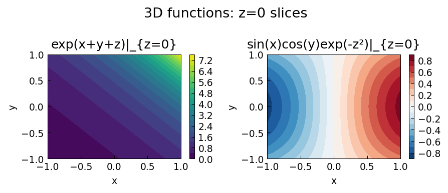
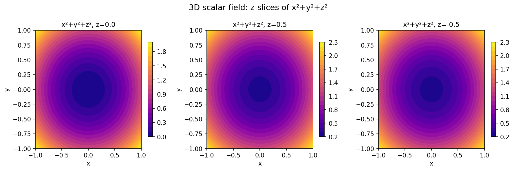

# 3D Approximation Examples (Chebfun3)

Chebfunjax represents trivariate functions in Tucker format:
`f(x,y,z) ≈ Σ_{i,j,k} G_{ijk} u_i(x) v_j(y) w_k(z)`.

The Tucker construction uses the **Chebfun3f** algorithm (fiber-based ACA),
translated from MATLAB Chebfun commit 7574c77.

---

## [ChangeVar3D](ChangeVar3D.md) — Coordinate Transformations

**Source:** `approx3/ChangeVar3D.m` — Rodrigo Platte, November 2016
**Original:** [Chebfun](https://www.chebfun.org/examples/approx3/ChangeVar3D.html)

Triple integrals in spherical, cylindrical, and toroidal coordinates.

---

## [Chebfun3Speedup](Chebfun3Speedup.md) — Construction Speedup

**Source:** `approx3/Chebfun3Speedup.m` — Hashemi, Strössner, Trefethen, March 2023
**Original:** [Chebfun](https://www.chebfun.org/examples/approx3/Chebfun3Speedup.html)

Tucker ranks for hard (tanh) vs easy (Runge) functions.

---

## [Complexity](Complexity.md) — Tucker Rank Complexity

**Source:** `approx3/Complexity.m` — Nick Trefethen, April 2015
**Original:** [Chebfun](https://www.chebfun.org/examples/approx3/Complexity.html)

How Tucker rank grows with function difficulty in 1D, 2D, and 3D.

---

## [FindingRankOne](FindingRankOne.md) — Recovering Rank-One Functions

**Source:** `approx3/FindingRankOne.m` — Yuji Nakatsukasa, June 2016
**Original:** [Chebfun](https://www.chebfun.org/examples/approx3/FindingRankOne.html)

Alternating projections to recover rank-one components from a Tucker-rank-3 function.

---

## [FluxIntegral3D](FluxIntegral3D.md) — Flux Integrals over Surfaces

**Source:** `approx3/FluxIntegral3D.m` — Olivier Sète, June 2016
**Original:** [Chebfun](https://www.chebfun.org/examples/approx3/FluxIntegral3D.html)

Flux integral of a vector field through rippled disk, hemisphere.

---

## [GaussGreenStokes](GaussGreenStokes.md) — Integral Theorems

**Source:** `approx3/GaussGreenStokes.m` — Olivier Sète, June 2016
**Original:** [Chebfun](https://www.chebfun.org/examples/approx3/GaussGreenStokes.html)

Gauss's theorem, Green's identities, and Stokes' theorem verified numerically.

```python
from chebfunjax.chebfun3d.chebfun3 import chebfun3
# Gauss: int div(v) = 8 for v=(x^2-y, y^2, z) on [-1,1]^3
div_v = chebfun3(lambda x, y, z: 2*x + 2*y + 1)
print(float(div_v.sum3()))  # 8.0
```

---

## [Hello3](Hello3.md) — Hello 3D World

**Source:** `approx3/Hello3.m` — Olivier Sète, June 2016
**Original:** [Chebfun](https://www.chebfun.org/examples/approx3/Hello3.html)

Chebfun3 from a 40×40×40 binary tensor encoding HELLO.

---

## [LineIntegral3D](LineIntegral3D.md) — Line Integrals in 3D

**Source:** `approx3/LineIntegral3D.m` — Behnam Hashemi, June 2016
**Original:** [Chebfun](https://www.chebfun.org/examples/approx3/LineIntegral3D.html)

Line integral ∫_C f ds over a sine-wave curve on the sphere and a spherical helix.

---

## [SurfaceIntegral3D](SurfaceIntegral3D.md) — Surface Integrals in 3D

**Source:** `approx3/SurfaceIntegral3D.m` — Behnam Hashemi, June 2016
**Original:** [Chebfun](https://www.chebfun.org/examples/approx3/SurfaceIntegral3D.html)

Surface integral ∫_S f dS over sphere, cone, seashells, and spring.

---

## [Tolerance](Tolerance.md) — Loosening the Tolerance

**Source:** `approx3/Tolerance.m` — Nick Trefethen, June 2016
**Original:** [Chebfun](https://www.chebfun.org/examples/approx3/Tolerance.html)

Faster construction with `tol=1e-8` vs machine precision.

```python
from chebfunjax.chebfun3d.chebfun3 import chebfun3
import jax.numpy as jnp
g = chebfun3(lambda x, y, z: jnp.exp(jnp.sin(10*x*y*z + jnp.exp(x*y*z))),
             tol=1e-8)
print(g.rank)  # (37, 36, 37) vs (68, 67, 67) at machine precision
```

---

## [Wagon](Wagon.md) — Wagon's Function

**Source:** `approx3/Wagon.m` — Behnam Hashemi, July 2016
**Original:** [Chebfun](https://www.chebfun.org/examples/approx3/Wagon.html)

Stan Wagon's oscillatory function has Tucker rank (4, 3, 5).

```python
from chebfunjax.chebfun3d.chebfun3 import chebfun3
import jax.numpy as jnp
f = chebfun3(lambda x, y, z:
    jnp.exp(jnp.sin(50*x)) + jnp.sin(60*jnp.exp(y))*jnp.sin(60*z)
    + jnp.sin(70*jnp.sin(x))*jnp.cos(10*z) + jnp.sin(jnp.sin(80*y))
    - jnp.sin(10*(x+z)) + (x**2+y**2+z**2)/4
)
print(f.rank)  # (4, 3, 5)
```

---

## Smooth 3D Function Approximation

**Source:** `approx3/` — Nick Trefethen

```python
import jax.numpy as jnp
from chebfunjax.chebfun3d.chebfun3 import chebfun3

# exp(x+y+z) is rank-1 in Tucker format
f = chebfun3(lambda x, y, z: jnp.exp(x + y + z))
print(f.rank)   # (1, 1, 1)

# Triple integral over [-1,1]^3
integral = float(f.sum3())
exact = float((jnp.exp(1.0) - jnp.exp(-1.0))**3)
print(abs(integral - exact))   # < 1e-8
```



---

## Flux Integrals and Vector Calculus in 3D

**Source:** `approx3/FluxIntegral3D.m`, `approx3/GaussGreenStokes.m`

The divergence theorem: `∫∫∫ div(F) dV = ∮∮ F · dS`.

```python
# div(F) = 3 => integral over [-1,1]^3 = 24
div_g = chebfun3(lambda x, y, z: 3 * jnp.ones_like(x + y + z))
print(float(div_g.sum3()))   # 24.0
```



| Example | Description |
|---------|-------------|
| [Triple Integrals via Coordinate Transformations](ChangeVar3D.md) | This example uses mappings to compute integrals over non-rectangular three-dimensional volumes. We apply the change o... |
| [Chebfun3 Construction Speedup](Chebfun3Speedup.md) | Chebfun3 was introduced by Behnam Hashemi in 2016 [2] and represents trivariate functions ... in Tucker format. Chris... |
| [Chebfun3 Complexity and Tucker Rank](Complexity.md) | This example explores how the Tucker rank — and hence the cost — of a ... approximation grows with the difficulty of ... |
| [Finding a Trivariate Basis of Rank-One Functions](FindingRankOne.md) | A function ... is called rank one in Tucker format. When a Chebfun3 is constructed from such a function, |
| [Flux Integrals over Parametric Surfaces](FluxIntegral3D.md) | Given a vector field ... and a surface ... parametrized over ..., the flux integral is |
| [The Theorems of Gauss, Green, and Stokes](GaussGreenStokes.md) | Gauss's theorem asserts that the integral of the sources of a vector field in a domain ... equals the flux through it... |
| [Hello 3D World](Hello3.md) | A ... can be constructed not only from a function handle but also from discrete tensor data. In the original MATLAB C... |
| [Integration over 3D Curves](LineIntegral3D.md) | Given a scalar field ... represented as a ... and a parametric curve ... for ..., |
| [Integration over 2D Surfaces in 3D](SurfaceIntegral3D.md) | For a scalar field ... represented as a ... and a parametric surface ..., the surface integral is |
| [Loosening the Chebfun3 Tolerance](Tolerance.md) | Chebfun3's default tolerance is machine precision (~2.2e-16). In 3D, however, the Tucker construction can be slow for... |
| [Low-Rank Representation of Wagon's Function](Wagon.md) | Stan Wagon [1] suggested the problem of finding the global minimum of the three-dimensional function |
