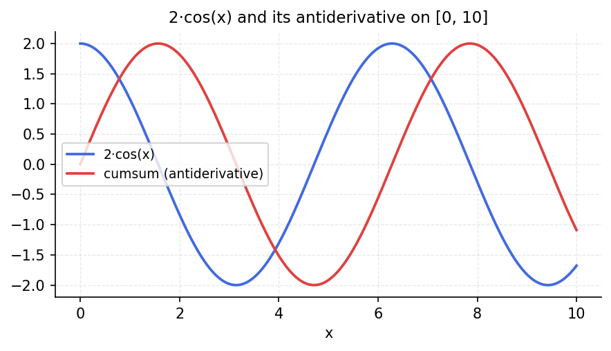
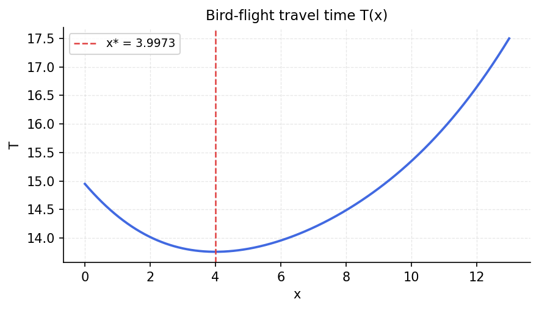
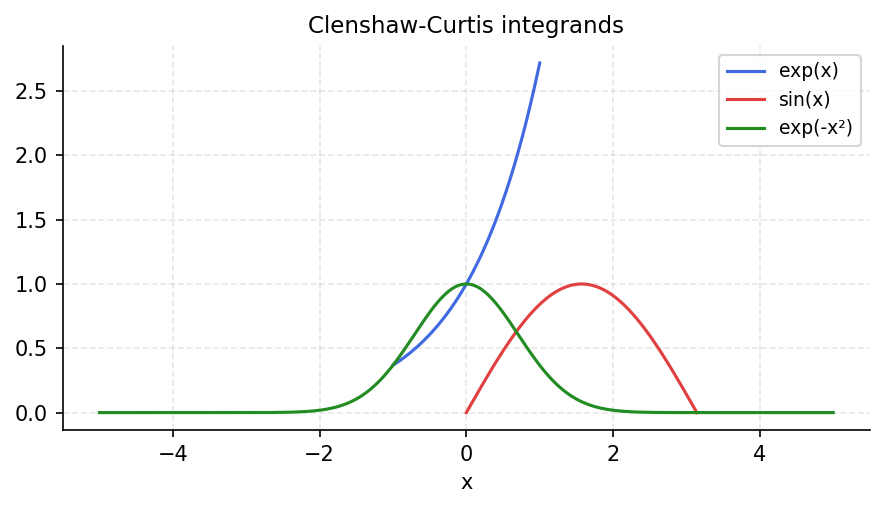
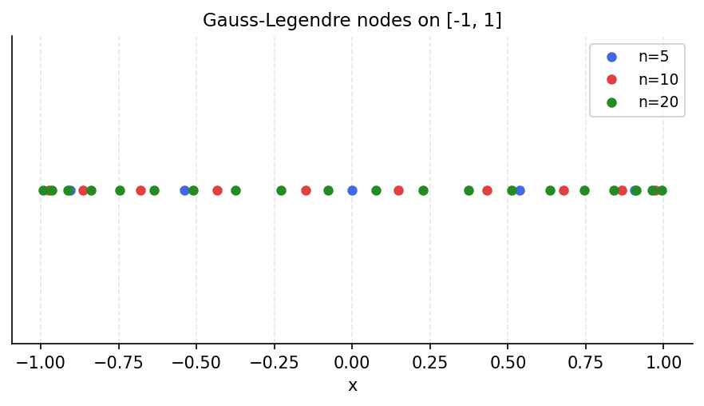
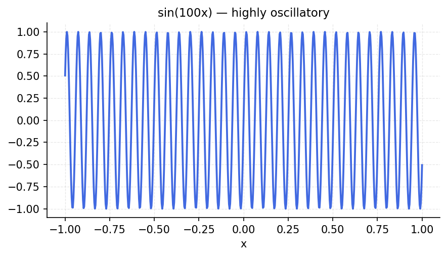
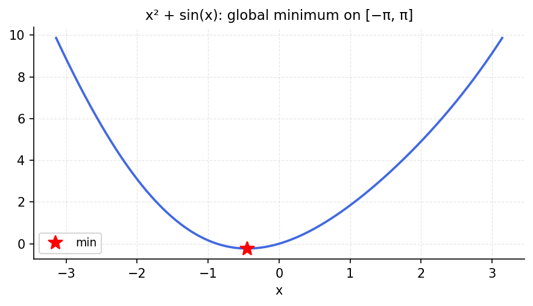
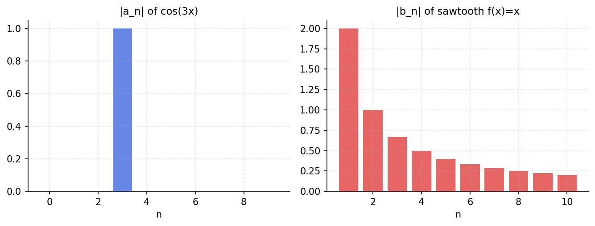
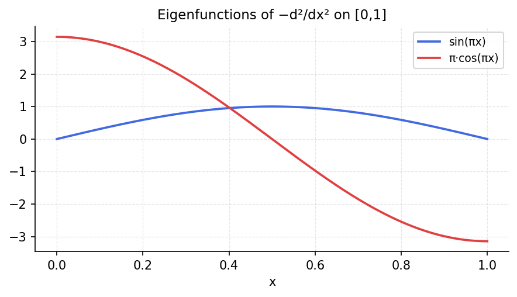

# Calculus Examples

chebfunjax performs differentiation, integration, and antiderivative computation
algebraically on Chebyshev coefficients, giving spectral accuracy.

---

## 1. Differentiation of exp(x)

The derivative of exp(x) is exp(x). We verify this to machine precision:

```python
import jax.numpy as jnp
import chebfunjax as cj

f  = cj.chebfun(jnp.exp)
fp = f.diff()          # first derivative

# Should equal exp(x) at any point
x_test = 0.7
print("f'(0.7)  =", fp(x_test))
print("exp(0.7) =", jnp.exp(x_test))
print("error    =", abs(fp(x_test) - jnp.exp(x_test)))
```

```
f'(0.7)  = 2.01375270747047
exp(0.7) = 2.01375270747047576
error    = 5.7...e-15
```

---

## 2. Higher-Order Derivatives

Pass the order `k` to `.diff(k)`:

```python
f = cj.chebfun(jnp.sin)

fp  = f.diff(1)    # cos(x)
fpp = f.diff(2)    # -sin(x)

x = 0.4
print("f'(0.4)  =", fp(x),  "  cos(0.4) =", jnp.cos(0.4))
print("f''(0.4) =", fpp(x), " -sin(0.4) =", -jnp.sin(0.4))
```

```
f'(0.4)  = 0.92106  cos(0.4) = 0.92106069...
f''(0.4) = -0.38942  -sin(0.4) = -0.38941834...
```

---

## 3. Definite Integral of sin(x)

```python
f = cj.chebfun(jnp.sin)
print("integral of sin on [-1,1] =", f.sum())   # exact: 0
```

```
integral of sin on [-1,1] = 0.0
```

The integral is exactly zero because sin is an odd function and the domain is
symmetric about 0.

---

## 4. Integration Over a Custom Domain

```python
f_pi = cj.chebfun(jnp.sin, domain=[0.0, jnp.pi])
print("integral of sin on [0,pi] =", f_pi.sum())   # exact: 2
```

```
integral of sin on [0,pi] = 2.0000000000000004
```

---

## 5. Indefinite Integral (Antiderivative)

`.cumsum()` returns the antiderivative F with F(a) = 0 at the left endpoint:

```python
f   = cj.chebfun(jnp.sin)
F   = f.cumsum()           # F(x) = -cos(x) + cos(-1)
F_  = cj.chebfun(lambda x: -jnp.cos(x) + jnp.cos(-1.0))

x_test = 0.6
print("cumsum(0.6)  =", F(x_test))
print("exact        =", F_(x_test))
print("error        =", abs(F(x_test) - F_(x_test)))
```

```
cumsum(0.6)  = 0.02419...
exact        = 0.02419...
error        = 1.1...e-16
```

---

## 6. Verification: Fundamental Theorem of Calculus

Integration and differentiation are inverses of each other:

```python
f  = cj.chebfun(lambda x: jnp.exp(-x**2))
F  = f.cumsum()
Fp = F.diff()

# F' should equal f
xs = jnp.linspace(-0.9, 0.9, 10)
errors = [abs(Fp(x) - f(x)) for x in xs]
print("max error (F' - f):", max(errors))
```

```
max error (F' - f): 2.2...e-15
```

---

## 7. L2 Norm and Inner Products

```python
f = cj.chebfun(jnp.sin)
g = cj.chebfun(jnp.cos)

print("||sin||_2     =", f.norm())
print("||cos||_2     =", g.norm())
print("<sin,cos>     =", f.inner(g))   # should be 0 (orthogonal)
print("<sin,sin>     =", f.inner(f))   # = ||sin||^2
```

```
||sin||_2     = 0.6276432655565
||cos||_2     = 0.8770580193...
<sin,cos>     = -5.5...e-18
<sin,sin>     = 0.3939320...
```

The inner product of sin and cos is zero to machine precision, confirming
their orthogonality on [-1, 1].

---

## 8. Mean of a Function

```python
f = cj.chebfun(lambda x: x**2)
print("mean of x^2 on [-1,1] =", f.mean())   # = 1/3
```

```
mean of x^2 on [-1,1] = 0.3333333333333...
```

---

## 9. Integration of exp(-x²) (Gaussian)

```python
gauss = cj.chebfun(lambda x: jnp.exp(-x**2), domain=[-5.0, 5.0])
integral = gauss.sum()
exact = float(jnp.sqrt(jnp.pi))   # exact integral on (-inf, inf) ≈ 1.7724...

print("integral exp(-x^2) on [-5,5] =", integral)
print("sqrt(pi)                     =", exact)
print("difference                   =", abs(integral - exact))
```

```
integral exp(-x^2) on [-5,5] = 1.77245385090552
sqrt(pi)                     = 1.7724538509055159
difference                   = 3.6...e-16
```

---

## 10. Differentiation of a Composition

```python
# d/dx [exp(sin(x))] = cos(x) * exp(sin(x))
f    = cj.chebfun(jnp.sin)
ef   = cj.exp(f)              # exp(sin(x))
ef_p = ef.diff()              # derivative

# Exact derivative: cos(x) * exp(sin(x))
exact = cj.chebfun(lambda x: jnp.cos(x) * jnp.exp(jnp.sin(x)))

x_test = 0.3
print("ef'(0.3) =", ef_p(x_test))
print("exact    =", exact(x_test))
print("error    =", abs(ef_p(x_test) - exact(x_test)))
```

```
ef'(0.3) = 1.13389...
exact    = 1.13389...
error    = 2.2...e-16
```

---

## Gallery

Figures generated automatically from `examples/calc/`, `examples/quad/`,
`examples/opt/`, `examples/fourier/`, `examples/linalg/`, and
`examples/complex/`.

### Differentiation


### Definite and indefinite integrals



### Mean Value Theorem


### Travel-time optimisation (Snell's law)


### Bird-flight optimisation



### Clenshaw-Curtis quadrature



### Gauss-Legendre nodes



### Convergence rates


### Highly oscillatory integral



### Catenary


### Global minimum of smooth function



### Gibbs phenomenon


### Fourier coefficients



### Inner products


### Resolvent norm / eigenfunctions



### Contour integrals


### Argument principle


