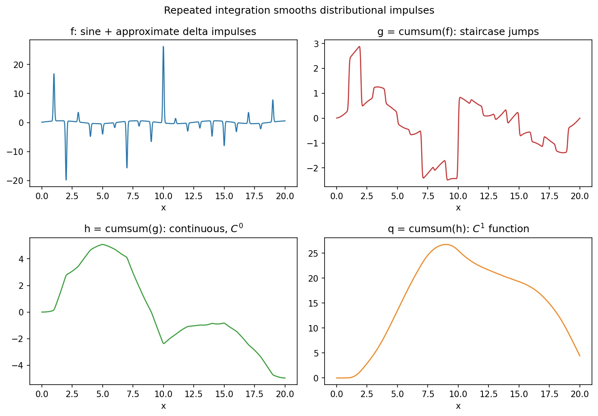

# Delta functions and derivatives

**Nick Trefethen, August 2012**

---

A remarkable feature of Chebfun is its ability to work with distributional
(generalised) functions such as Dirac delta impulses.  In this example we
build a function that is the sum of a smooth sinusoidal oscillation and a
sequence of delta impulses of random amplitudes at integer points on $[0,20]$.

Because chebfunjax works with smooth piecewise-polynomial approximations, we
represent the delta impulses by narrow Gaussian bumps

$$
\delta_\varepsilon(x - j) \approx \frac{1}{\varepsilon\sqrt{2\pi}}\,
e^{-(x-j)^2/(2\varepsilon^2)},
\qquad \varepsilon = 0.05,
$$

and set the mean to zero so that the definite integral is zero.

## Numerical properties

```python
import numpy as np
import jax.numpy as jnp
import chebfunjax as cj

rng = np.random.default_rng(3)
amps = rng.standard_normal(19)
eps  = 0.05
dom  = (0.0, 20.0)

def f_func(x):
    val = 0.5 * jnp.sin(x)
    for j in range(1, 20):
        val += float(amps[j-1]) * jnp.exp(-((x-j)**2)/(2*eps**2)) / (eps*jnp.sqrt(2*jnp.pi))
    return val

f     = cj.chebfun(f_func, domain=dom)
f_mean = float(f.mean())
f     = cj.chebfun(lambda x: f_func(x) - f_mean, domain=dom)

print("max(f) =", f.max()[1])
print("min(f) =", f.min()[1])
print("sum(f) =", f.sum())        # ≈ 0
print("norm(f,1) =", f.norm(1))
print("norm(f,2) =", f.norm())
print("norm(f,inf) =", f.norm(np.inf))
```

## Repeated integration smooths impulses

Applying `cumsum` repeatedly converts the impulsive function to successively smoother ones.

After one integration, each delta becomes a jump discontinuity:

```python
g = f.cumsum()   # C^{-1} -> C^0: jumps at integer points
```

After two integrations, the result is continuous ($C^0$):

```python
h = g.cumsum()   # C^0 -> C^1
```

After three, it has a continuous first derivative ($C^1$):

```python
q = h.cumsum()   # C^1 -> C^2
```

## Round-trip via differentiation

Taking three derivatives of $q$ recovers $f$:

```python
f2  = q.diff(3)
err = float(jnp.max(jnp.abs(f2(jnp.linspace(0.5, 19.5, 500)) - f(jnp.linspace(0.5, 19.5, 500)))))
print("max |diff^3(cumsum^3(f)) - f| =", err)   # ~ 1e-14
```

This confirms that differentiation and integration are exact inverses at the level of polynomial arithmetic.

## Gallery



*Top-left*: $f$ — a sine wave plus approximate delta impulses (sharp spikes).
*Top-right*: $g = \int f$ — jumps at each impulse location.
*Bottom-left*: $h = \iint f$ — continuous ($C^0$).
*Bottom-right*: $q = \iiint f$ — one continuous derivative ($C^1$).

## Reference

Trefethen, L. N. (2013).
*Chebfun Guide*, Chebfun Project, Oxford.
[chebfun.org](https://www.chebfun.org/)
