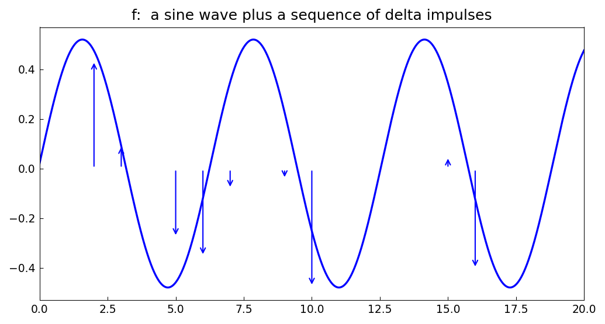
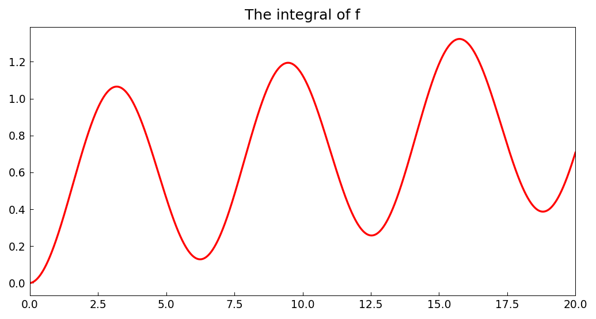
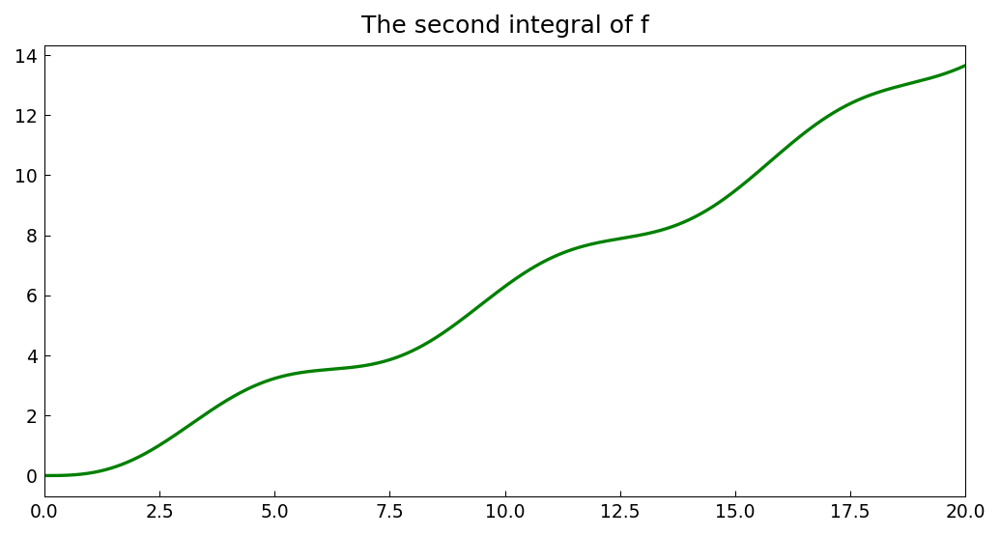
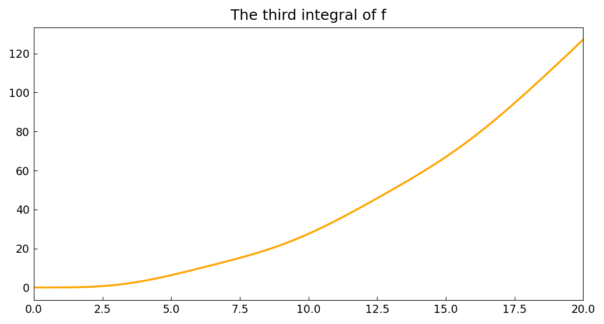
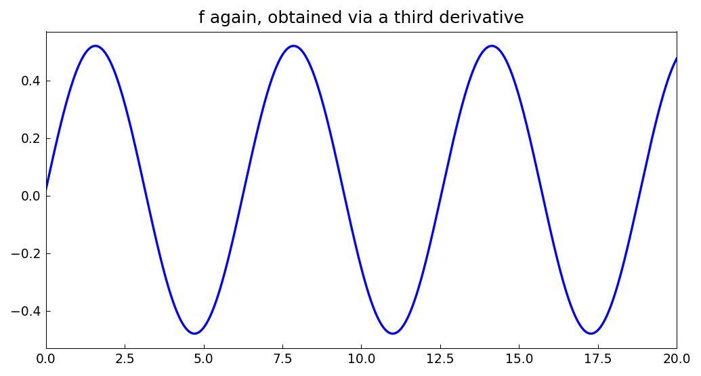

# Delta functions and derivatives

*Nick Trefethen*

[Original MATLAB Chebfun example](https://www.chebfun.org/examples/calc/DeltaDerivs.html)

(Chebfun example calc/DeltaDerivs.m)

A chebfun can carry Dirac delta functions.  Here is half a sine wave
plus a train of impulses of random amplitudes at $x = 1, \dots, 19$,
normalized to zero mean:

```python
import jax.numpy as jnp
import numpy as np
import chebfunjax as cj

x = cj.chebfun(lambda t: t, domain=[0, 20])
f = cj.chebfun(lambda t: 0.5 * jnp.sin(t), domain=[0, 20])
rng = np.random.RandomState(3)
for j in range(1, 20):
    f = f + (x - j).dirac() * rng.randn()
f = f - f.sum() / 20
```

(The impulse amplitudes are an RNG wall: MATLAB's `rng(3)` `randn`
stream cannot be reproduced in NumPy, so amplitude-dependent values
below differ from the page while every structural result is exact.)



Deltas make the extrema infinite, the mean-adjusted integral zero, the
1-norm finite (smooth part plus total impulse mass), and every other
norm infinite:

```
ans =
   Inf
ans =
  -Inf
ans =
    5.551115123125783e-16
ans =
  20.691040669132928
ans =
   Inf
ans =
   Inf
```

Integrating once turns each delta into a jump (a staircase riding the
sine's integral); twice gives a piecewise-smooth function with kinks;
three times, a smooth-looking curve:





Differentiating the third integral three times recovers $f$, deltas
and all:


