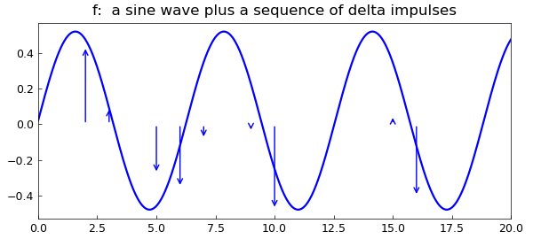
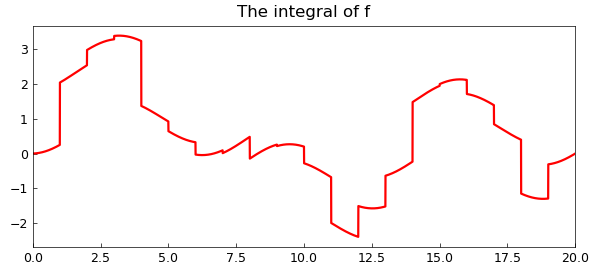
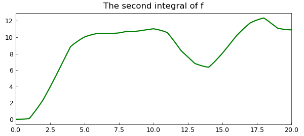
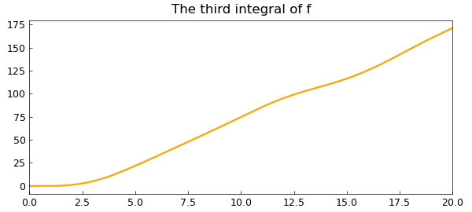
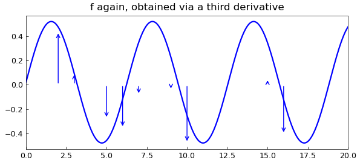

# Delta functions and derivatives

*Nick Trefethen, August 2012*

[Original MATLAB Chebfun example](https://www.chebfun.org/examples/calc/DeltaDerivs.html)

Python translation: [`examples/calc/delta_derivs.py`](https://github.com/ma-gilles/chebfunjax/blob/main/examples/calc/delta_derivs.py)

Here is a sine wave on the interval $[0,20]$ to which have been added a sequence of Dirac delta functions of random amplitudes, with a constant function then subtracted to make the mean zero:

```matlab
x = chebfun('x',[0 20]);
f = 0.5*sin(x);
rng(3)
for j = 1:19
  f = f + randn*dirac(x-j);
end
f = f - mean(f);
LW = 'linewidth'; lw = 1.6; FS = 'fontsize'; fs = 12;
plot(f,LW,1.6)
title('f:  a sine wave plus a sequence of delta impulses',FS,fs)
```



Can you explain each of these numbers?

```matlab
max(f)
```

```text
ans =
   Inf
```

```matlab
min(f)
```

```text
ans =
  -Inf
```

```matlab
sum(f)
```

```text
ans =
    5.551115123125783e-16
```

```matlab
norm(f,1)
```

```text
ans =
  20.691040669132928
```

```matlab
norm(f,2)
```

```text
ans =
   Inf
```

```matlab
norm(f,inf)
```

```text
ans =
   Inf
```

If we integrate $f$ with `cumsum`, each delta function becomes a jump. The value at the left is $0$ because `cumsum` always does that, and the value at the right is $0$ because $f$ has zero mean.

```matlab
g = cumsum(f);
plot(g,'r',LW,1.6)
title('The integral of f',FS,fs)
```



If we integrate a second time, we get a continuous function, that is, a function of class $C^0$:

```matlab
h = cumsum(g);
plot(h,LW,1.6,'color',[0 .7 0])
title('The second integral of f',FS,fs)
```



Our eye is good at detecting this degree of non-smoothness. One final integration gives a $C^1$ function whose lack of smoothness is not so obvious:

```matlab
q = cumsum(h);
plot(q,LW,1.6,'color',[1 .5 0])
title('The third integral of f',FS,fs)
```



Taking the third derivative of this last function brings us back where we started:

```matlab
f2 = diff(q,3);
plot(f2,LW,1.6)
title('f again, obtained via a third derivative')
```



---

*Translated with [chebfunjax](https://github.com/ma-gilles/chebfunjax); prose and MATLAB code from the original example, copyright The University of Oxford and The Chebfun Developers.  Printed outputs and figures are chebfunjax's.*
