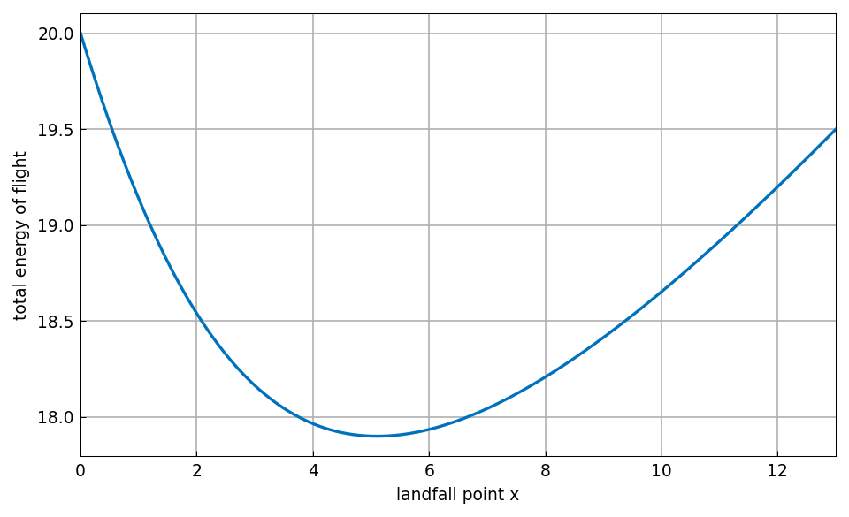
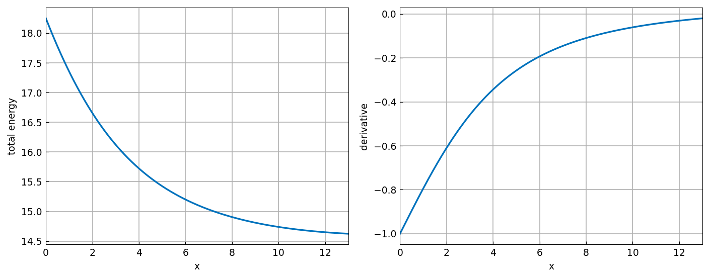
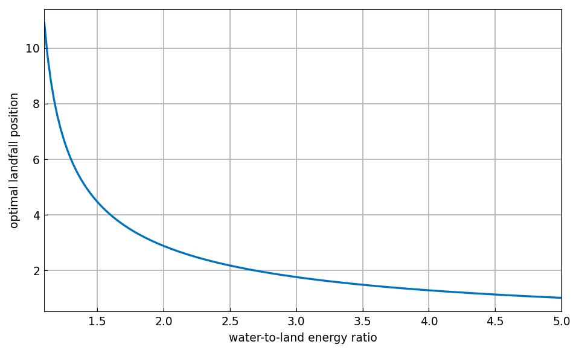

# Optimizing a bird's flight path

*Toby Driscoll*

[Original MATLAB Chebfun example](https://www.chebfun.org/examples/calc/ForTheBirds.html)

(Chebfun example calc/ForTheBirds.m)

A bird on an island 5 km offshore must fly to its nest 13 km down the
shoreline.  Flying over water costs more energy than over land; where
should it make landfall?  With water-to-land energy ratio 1.4:

```python
import jax.numpy as jnp
import chebfunjax as cj

water_length = cj.chebfun(lambda x: jnp.sqrt(x**2 + 25), domain=[0, 13])
land_length = cj.chebfun(lambda x: 13 - x, domain=[0, 13])
total = land_length + 1.4 * water_length
(x_opt, e_opt), _ = total.minandmax()
```
```
energy_optimal =
   17.8990
x_optimal =
    5.1031
```



The same optimum arises as the root of the derivative:

```
ans =
    5.1031
```

For a ratio barely above 1 the bird flies straight to the nest
(boundary optimum); for large ratios it crosses the water nearly
perpendicularly:

```
energy_optimal =
   14.6248
x_optimal =
    13
energy_optimal =
   37.4949
x_optimal =
    1.0206
energy_optimal =
  262.9500
x_optimal =
    0.1000
```



The optimal landfall as a function of the energy ratio is itself a
smooth function, and asking where it equals 4.5 answers "at what ratio
does the bird land 4.5 km from the perpendicular?":

```
ans =
    5.1031
ans =
    1.4948
```


