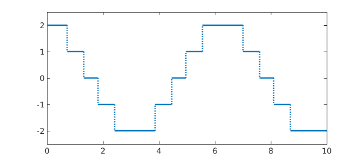
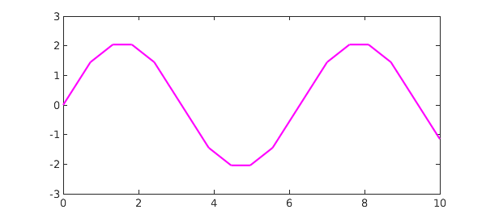
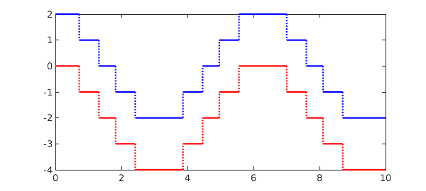

<!-- Generated by scripts/sync_chebfun_examples.py. -->
<!-- Source: https://www.chebfun.org/examples/calc/Integrals.html -->

<h1>Definite and indefinite integrals</h1>
<h2>Nick Trefethen, October 2012 in <a href='../'>calc</a><a href='/examples/calc/Integrals.m'>download</a>&middot;<a href='//github.com/chebfun/examples/blob/master/calc/Integrals.m'>view on GitHub</a></h2>

Suppose we have a function, like this one:

<pre class="mcode-input">x = chebfun('x',[0 10]);
f = round(2*cos(x));
plot(f), ylim(2.5*[-1 1])</pre>

The Chebfun command <code>sum</code> returns the definite integral over the prescribed interval, which is just a number:

<pre class="mcode-input">format long, sum(f)</pre>

<pre class="mcode-output">ans =
  -1.150444078461245
</pre>

You can also calculate the definite interval over a subinterval by giving two additional arguments, like this:

<pre class="mcode-input">sum(f,3,4)</pre>

<pre class="mcode-output">ans =
  -1.864326901403210
</pre>

To compute an indefinite integral, use the Chebfun command <code>cumsum</code>. This returns a chebfun defined over the given interval:

<pre class="mcode-input">g = cumsum(f);
plot(g,'m')</pre>

Thus another way to compute the integral over a subinterval would be to take the difference of two values of the cumsum:

<pre class="mcode-input">g(4) - g(3)</pre>

<pre class="mcode-output">ans =
  -1.864326901403210
</pre>

As always in calculus, when working with indefinite integrals you must be careful to remember the arbitrary constant that may be added.  Thus for example, if you integrate $f$ and then differentiate it, you get $f$ back again:

<pre class="mcode-input">norm( diff(cumsum(f)) - f )</pre>

<pre class="mcode-output">ans =
     0
</pre>

If you differentiate $f$ and then integrate it, on the other hand, you get something different:

<pre class="mcode-input">norm( cumsum(diff(f)) - f )</pre>

<pre class="mcode-output">ans =
   6.324555320336759
</pre>

Plotting the two instantly alerts us that we forgot to add back in the value at the left endpoint, namely $f(0) = 2$:

<pre class="mcode-input">plot(f,'b',cumsum(diff(f)),'r')</pre>

Sure enough, adding this number makes the two functions agree:

<pre class="mcode-input">norm( f(0)+cumsum(diff(f)) - f)</pre>

<pre class="mcode-output">ans =
     0
</pre>

        

    

