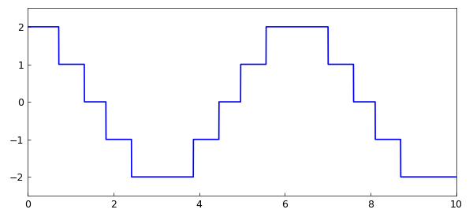
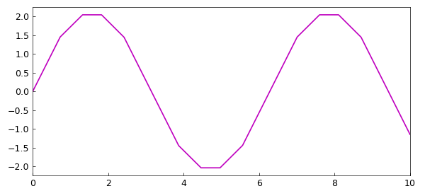
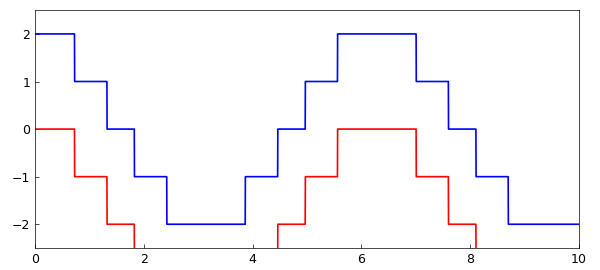

# Definite and indefinite integrals

*Nick Trefethen, October 2012*

[Original MATLAB Chebfun example](https://www.chebfun.org/examples/calc/Integrals.html)

Python translation: [`examples/calc/integrals.py`](https://github.com/ma-gilles/chebfunjax/blob/main/examples/calc/integrals.py)

Suppose we have a function, like this one:

```matlab
x = chebfun('x',[0 10]);
f = round(2*cos(x));
plot(f), ylim(2.5*[-1 1])
```



The Chebfun command `sum` returns the definite integral over the prescribed interval, which is just a number:

```matlab
format long, sum(f)
```

```text
ans =
  -1.150444078461235
```

You can also calculate the definite interval over a subinterval by giving two additional arguments, like this:

```matlab
sum(f,3,4)
```

```text
ans =
  -1.864326901403211
```

To compute an indefinite integral, use the Chebfun command `cumsum`. This returns a chebfun defined over the given interval:

```matlab
g = cumsum(f);
plot(g,'m')
```



Thus another way to compute the integral over a subinterval would be to take the difference of two values of the cumsum:

```matlab
g(4) - g(3)
```

```text
ans =
  -1.864326901403210
```

As always in calculus, when working with indefinite integrals you must be careful to remember the arbitrary constant that may be added. Thus for example, if you integrate $f$ and then differentiate it, you get $f$ back again:

```matlab
norm( diff(cumsum(f)) - f )
```

```text
ans =
     0
```

If you differentiate $f$ and then integrate it, on the other hand, you get something different:

```matlab
norm( cumsum(diff(f)) - f )
```

```text
ans =
   6.324555320336759
```

Plotting the two instantly alerts us that we forgot to add back in the value at the left endpoint, namely $f(0) = 2$:

```matlab
plot(f,'b',cumsum(diff(f)),'r')
```



Sure enough, adding this number makes the two functions agree:

```matlab
norm( f(0)+cumsum(diff(f)) - f)
```

```text
ans =
     0
```

---

*Translated with [chebfunjax](https://github.com/ma-gilles/chebfunjax); prose and MATLAB code from the original example, copyright The University of Oxford and The Chebfun Developers.  Printed outputs and figures are chebfunjax's.*
