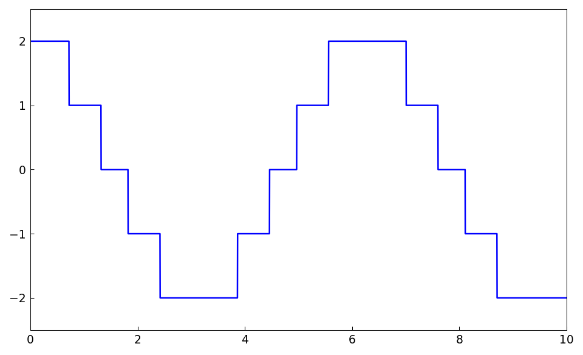
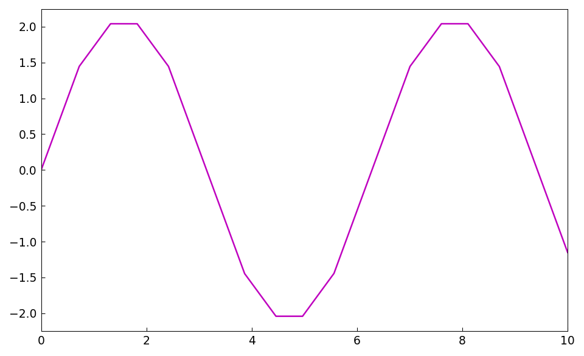
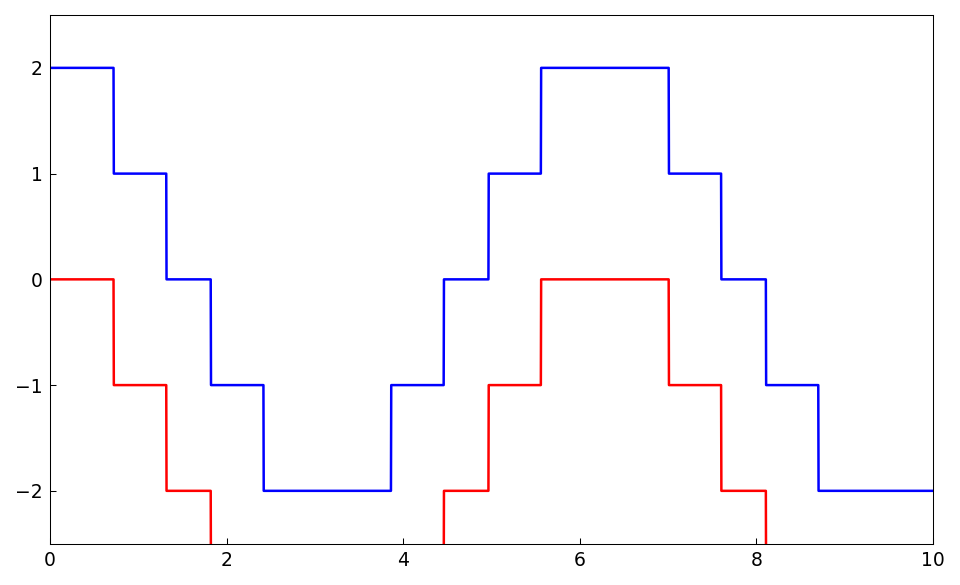

# Definite and indefinite integrals

*Nick Trefethen*

[Original MATLAB Chebfun example](https://www.chebfun.org/examples/calc/Integrals.html)

(Chebfun example calc/Integrals.m)

Here is a piecewise-constant function obtained by rounding
$2\cos(x)$ on $[0, 10]$:

```python
import jax.numpy as jnp
import chebfunjax as cj

f = cj.chebfun(lambda t: 2 * jnp.cos(t), domain=[0, 10]).round()
```



Its definite integral over the whole interval, and over $[3, 4]$:

```python
f.sum()
f.restrict(3, 4).sum()
```
```
ans =
  -1.150444078461235
ans =
  -1.864326901403211
```

The indefinite integral `g = cumsum(f)` satisfies
$g(4) - g(3) = \int_3^4 f$:



```
ans =
  -1.864326901403210
```

The fundamental theorem of calculus: differentiating the indefinite
integral recovers the function exactly,

```python
(g.diff() - f).norm()
```
```
ans =
     0
```

The reverse composition is subtler: `diff(f)` of a function with jumps
produces Dirac deltas at the jump locations, and `cumsum` integrates
them back into the jumps — but the constant $f(0)$ is lost:

```python
(f.diff().cumsum() - f).norm()
```
```
ans =
   6.324555320336759
```



The missing piece is exactly $f(0) = 2$ (note
$2\sqrt{10} = 6.3245\ldots$); adding it recovers $f$ exactly:

```python
(f(0) + f.diff().cumsum() - f).norm()
```
```
ans =
     0
```
