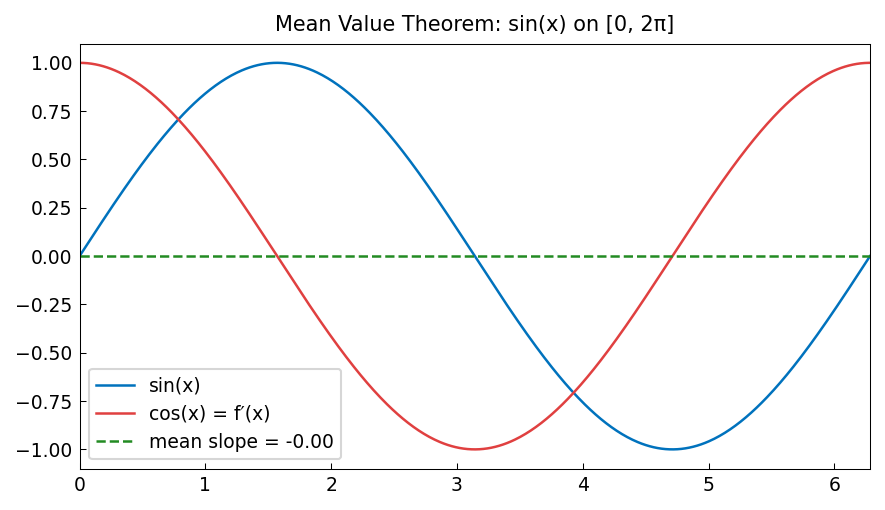

# Mean Value Theorem

**Kuan Xu, October 2012**

[Original MATLAB Chebfun example](https://www.chebfun.org/examples/calc/MeanValueTheorem.html)

---

The Mean Value Theorem states that for a differentiable function $f$ on
$[a, b]$, there exists $c \in (a, b)$ such that

$$
f'(c) = \frac{f(b) - f(a)}{b - a}.
$$

Geometrically, the tangent at $c$ is parallel to the chord from $(a, f(a))$ to
$(b, f(b))$.

## chebfunjax computation

```python
import jax.numpy as jnp
import chebfunjax as cj

a, b = 0.0, 2.0 * float(jnp.pi)
f  = cj.chebfun(lambda x: jnp.sin(x) + 0.3*x, domain=(a, b))
fp = f.diff()

slope = (float(f(b)) - float(f(a))) / (b - a)
g     = fp - slope          # g(c) = 0 ↔ MVT point
c_pts = g.roots()
print("MVT points:", c_pts)
```

## Verifying the theorem

For any smooth function, chebfunjax finds all the MVT points numerically by
computing roots of $f'(x) - \text{slope}$:

```python
# Test with f(x) = x^3 - 3x on [-2, 2]
f2  = cj.chebfun(lambda x: x**3 - 3*x, domain=(-2.0, 2.0))
slope2 = (float(f2(2.0)) - float(f2(-2.0))) / 4.0
c2 = (f2.diff() - slope2).roots()
print("MVT c values:", c2, "  must lie in (-2, 2)")
assert all(-2 < ci < 2 for ci in c2), "MVT violated!"
```

## Gallery



The function (blue), the chord (dashed), and the tangent lines at the MVT
points (red dots).
