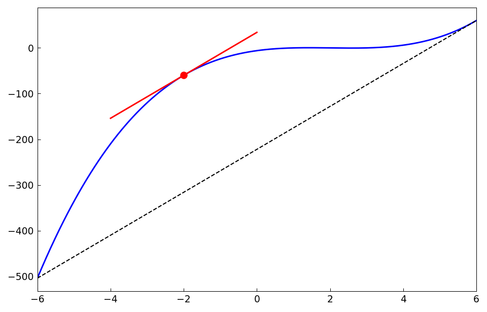

# Mean Value Theorem

*Kuan Xu, October 2012*

[Original MATLAB Chebfun example](https://www.chebfun.org/examples/calc/MeanValueTheorem.html)

(Chebfun example calc/MeanValueTheorem.m)

The Mean Value Theorem states that for a function $f$ continuous on
$[a,b]$ and differentiable on $(a,b)$, there is a point $c \in (a,b)$
where the tangent is parallel to the chord:

$$ f'(c) = \frac{f(b) - f(a)}{b - a}. $$

With chebfunjax such points are found directly, by computing the roots
of $f' - s$ where $s$ is the chord slope.  Take the cubic
$f(x) = (x-1)(x-2)(x-3)$ on $[-6, 6]$:

```python
import jax.numpy as jnp
import numpy as np
import chebfunjax as cj

a, b = -6, 6
f = cj.chebfun(lambda x: (x - 1) * (x - 2) * (x - 3), domain=[a, b])
sl = (f(b) - f(a)) / (b - a)
c = (f.diff() - sl).roots()
```
```
c =
    -2
    6
```

The point $c = -2$ lies in the interior; the tangent there is parallel
to the chord:


