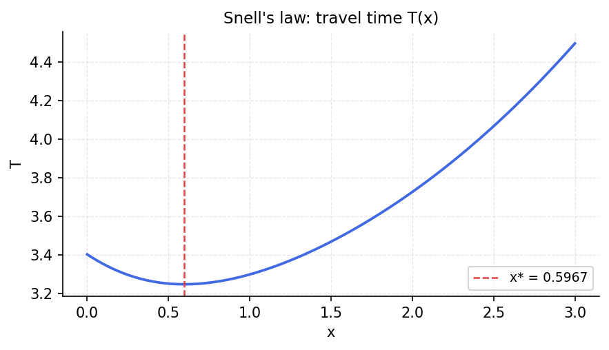

# A drowning man and Snell's Law

**Mohsin Javed, October 2013**

[Original MATLAB Chebfun example](https://www.chebfun.org/examples/calc/SnellsLaw.html)

---

A lifeguard on the beach needs to reach a drowning swimmer as quickly as
possible. The lifeguard can run at speed $v_1$ on sand and swim at speed $v_2 <
v_1$. What is the optimal entry point on the water's edge?

## Snell's Law of refraction

The total travel time as a function of the entry angle $\theta_1$ on land is

$$
T(\theta_1) = \frac{d_1}{v_1 \cos\theta_1} + \frac{d_2}{v_2 \cos\theta_2},
$$

where $\theta_2$ satisfies the geometric constraint. Minimising $T$ gives
Snell's Law:

$$
\frac{\sin\theta_1}{v_1} = \frac{\sin\theta_2}{v_2}.
$$

## chebfunjax computation

```python
import jax.numpy as jnp
import chebfunjax as cj
import numpy as np

v1, v2  = 3.0, 1.0    # speeds on land and water
y1, y2  = 2.0, 1.5    # distances from shore
D       = 4.0          # horizontal separation

def time(x):
    """Total time as function of entry position x."""
    return jnp.sqrt((x)**2 + y1**2)/v1 + jnp.sqrt((D - x)**2 + y2**2)/v2

f = cj.chebfun(time, domain=(0.0, D))
x_opt, t_min = f.min()
print(f"Optimal entry at x = {float(x_opt):.6f}")
print(f"Minimum time      = {float(t_min):.6f}")

# Snell's law check
theta1 = float(jnp.arctan(float(x_opt) / y1))
theta2 = float(jnp.arctan((D - float(x_opt)) / y2))
print(f"sin(θ1)/v1 = {np.sin(theta1)/v1:.8f}")
print(f"sin(θ2)/v2 = {np.sin(theta2)/v2:.8f}")
```

## Gallery



*Left*: Total travel time vs entry position, with minimum marked.
*Right*: Geometric diagram showing the refracted path.
