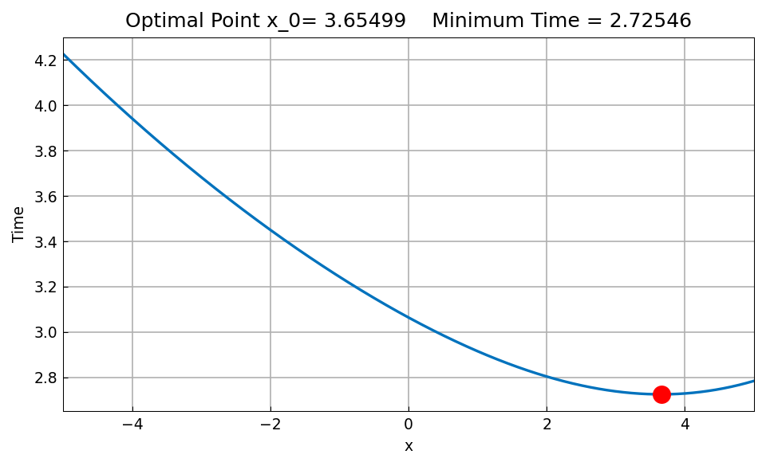
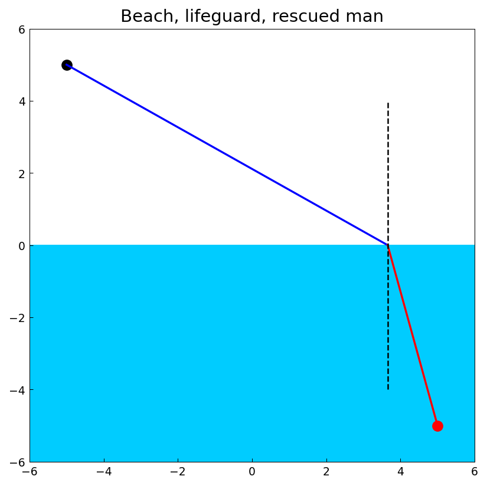

# A drowning man and Snell's Law

*Mohsin Javed*

[Original MATLAB Chebfun example](https://www.chebfun.org/examples/calc/SnellsLaw.html)

(Chebfun example calc/SnellsLaw.m)

A lifeguard at $(-5, 5)$ must reach a drowning man at $(5, -5)$.  She
runs at speed 10 on land and swims at speed 3.  Where should she enter
the water?  The total travel time as a function of the entry point $x$
is a chebfun, and its minimum is found directly:

```python
import jax.numpy as jnp
import chebfunjax as cj

sMan, dMan = -5 + 5j, 5 - 5j
vLand, vWater = 10, 3
T = cj.chebfun(
    lambda x: jnp.abs(x - sMan) / vLand + jnp.abs(x - dMan) / vWater,
    domain=[-5, 5])
(x0, Tmin), _ = T.minandmax()
```
```
Tmin =
   2.725459432914104
x0 =
   3.654986635087152
```





At the optimal entry point, the angles of incidence and refraction
satisfy Snell's law $\sin\theta_1 / v_1 = \sin\theta_2 / v_2$:

```python
sinTh1 / vLand - sinTh2 / vWater
```
```
ans =
    -4.163336342344337e-16
```
